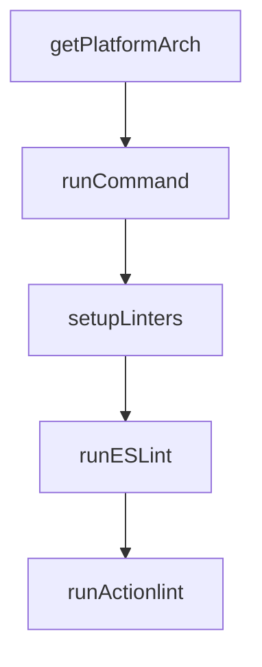

# Chapter 1: Getting Started

Welcome to **Chapter 1: Getting Started**. In this part of **Gemini CLI Tutorial: Terminal-First Agent Workflows with Google Gemini**, you will build an intuitive mental model first, then move into concrete implementation details and practical production tradeoffs.


This chapter gets Gemini CLI running quickly and validates first successful interactions.

## Learning Goals

- install Gemini CLI with the fastest path for your environment
- launch the CLI and complete initial auth
- run first interactive and headless prompts
- confirm baseline command and model behavior

## Quick Install Paths

```bash
npx @google/gemini-cli
# or
npm install -g @google/gemini-cli
# or
brew install gemini-cli
```

Minimum prerequisites:

- Node.js 20+
- macOS, Linux, or Windows

## First-Run Validation

1. Start interactive mode:

```bash
gemini
```

2. Run a simple headless prompt:

```bash
gemini -p "Summarize this repository architecture"
```

3. Run structured output mode:

```bash
gemini -p "List top risks in this codebase" --output-format json
```

## Baseline Checks

- auth prompt completes successfully
- tool-enabled response includes actionable output
- no startup errors in current working directory

## Source References

- [README Installation](https://github.com/google-gemini/gemini-cli/blob/main/README.md#-installation)
- [Get Started Installation Docs](https://github.com/google-gemini/gemini-cli/blob/main/docs/get-started/installation.md)
- [Headless Mode Docs](https://github.com/google-gemini/gemini-cli/blob/main/docs/cli/headless.md)

## Summary

You now have a working Gemini CLI baseline for both interactive and scripted usage.

Next: [Chapter 2: Architecture, Tools, and Agent Loop](02-architecture-tools-and-agent-loop.md)

## Depth Expansion Playbook

## Source Code Walkthrough

### `scripts/lint.js`

The `getPlatformArch` function in [`scripts/lint.js`](https://github.com/google-gemini/gemini-cli/blob/HEAD/scripts/lint.js) handles a key part of this chapter's functionality:

```js
  process.env.GEMINI_LINT_TEMP_DIR || join(tmpdir(), 'gemini-cli-linters');

function getPlatformArch() {
  const platform = process.platform;
  const arch = process.arch;
  if (platform === 'linux' && arch === 'x64') {
    return {
      actionlint: 'linux_amd64',
      shellcheck: 'linux.x86_64',
    };
  }
  if (platform === 'darwin' && arch === 'x64') {
    return {
      actionlint: 'darwin_amd64',
      shellcheck: 'darwin.x86_64',
    };
  }
  if (platform === 'darwin' && arch === 'arm64') {
    return {
      actionlint: 'darwin_arm64',
      shellcheck: 'darwin.aarch64',
    };
  }
  if (platform === 'win32' && arch === 'x64') {
    return {
      actionlint: 'windows_amd64',
      // shellcheck is not used for Windows since it uses the .zip release
      // which has a consistent name across architectures
    };
  }
  throw new Error(`Unsupported platform/architecture: ${platform}/${arch}`);
}
```

This function is important because it defines how Gemini CLI Tutorial: Terminal-First Agent Workflows with Google Gemini implements the patterns covered in this chapter.

### `scripts/lint.js`

The `runCommand` function in [`scripts/lint.js`](https://github.com/google-gemini/gemini-cli/blob/HEAD/scripts/lint.js) handles a key part of this chapter's functionality:

```js
};

function runCommand(command, stdio = 'inherit') {
  try {
    const env = { ...process.env };
    const nodeBin = join(process.cwd(), 'node_modules', '.bin');
    const sep = isWindows ? ';' : ':';
    const pythonBin = isWindows
      ? join(PYTHON_VENV_PATH, 'Scripts')
      : join(PYTHON_VENV_PATH, 'bin');
    // Windows sometimes uses 'Path' instead of 'PATH'
    const pathKey = 'Path' in env ? 'Path' : 'PATH';
    env[pathKey] = [
      nodeBin,
      join(TEMP_DIR, 'actionlint'),
      join(TEMP_DIR, 'shellcheck'),
      pythonBin,
      env[pathKey],
    ].join(sep);
    execSync(command, { stdio, env, shell: true });
    return true;
  } catch (_e) {
    return false;
  }
}

export function setupLinters() {
  console.log('Setting up linters...');
  if (!process.env.GEMINI_LINT_TEMP_DIR) {
    rmSync(TEMP_DIR, { recursive: true, force: true });
  }
  mkdirSync(TEMP_DIR, { recursive: true });
```

This function is important because it defines how Gemini CLI Tutorial: Terminal-First Agent Workflows with Google Gemini implements the patterns covered in this chapter.

### `scripts/lint.js`

The `setupLinters` function in [`scripts/lint.js`](https://github.com/google-gemini/gemini-cli/blob/HEAD/scripts/lint.js) handles a key part of this chapter's functionality:

```js
}

export function setupLinters() {
  console.log('Setting up linters...');
  if (!process.env.GEMINI_LINT_TEMP_DIR) {
    rmSync(TEMP_DIR, { recursive: true, force: true });
  }
  mkdirSync(TEMP_DIR, { recursive: true });

  for (const linter in LINTERS) {
    const { check, installer } = LINTERS[linter];
    if (!runCommand(check, 'ignore')) {
      console.log(`Installing ${linter}...`);
      if (!runCommand(installer)) {
        console.error(
          `Failed to install ${linter}. Please install it manually.`,
        );
        process.exit(1);
      }
    }
  }
  console.log('All required linters are available.');
}

export function runESLint() {
  console.log('\nRunning ESLint...');
  if (!runCommand('npm run lint')) {
    process.exit(1);
  }
}

export function runActionlint() {
```

This function is important because it defines how Gemini CLI Tutorial: Terminal-First Agent Workflows with Google Gemini implements the patterns covered in this chapter.

### `scripts/lint.js`

The `runESLint` function in [`scripts/lint.js`](https://github.com/google-gemini/gemini-cli/blob/HEAD/scripts/lint.js) handles a key part of this chapter's functionality:

```js
}

export function runESLint() {
  console.log('\nRunning ESLint...');
  if (!runCommand('npm run lint')) {
    process.exit(1);
  }
}

export function runActionlint() {
  console.log('\nRunning actionlint...');
  if (!runCommand(LINTERS.actionlint.run)) {
    process.exit(1);
  }
}

export function runShellcheck() {
  console.log('\nRunning shellcheck...');
  if (!runCommand(LINTERS.shellcheck.run)) {
    process.exit(1);
  }
}

export function runYamllint() {
  console.log('\nRunning yamllint...');
  if (!runCommand(LINTERS.yamllint.run)) {
    process.exit(1);
  }
}

export function runPrettier() {
  console.log('\nRunning Prettier...');
```

This function is important because it defines how Gemini CLI Tutorial: Terminal-First Agent Workflows with Google Gemini implements the patterns covered in this chapter.


## How These Components Connect


