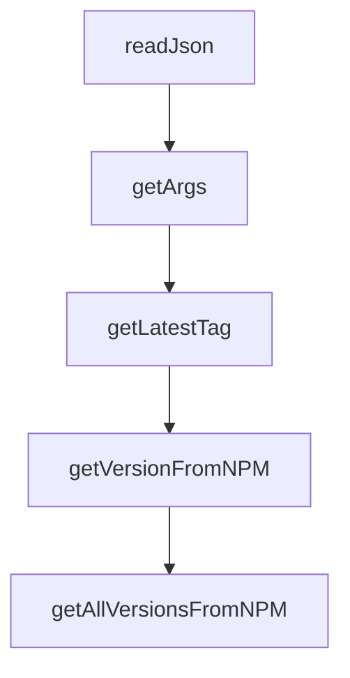

# Chapter 1: Getting Started

Welcome to **Chapter 1: Getting Started**. In this part of **Gemini CLI Tutorial: Terminal-First Agent Workflows with Google Gemini**, you will build an intuitive mental model first, then move into concrete implementation details and practical production tradeoffs.


This chapter gets Gemini CLI running quickly and validates first successful interactions.

## Learning Goals

- install Gemini CLI with the fastest path for your environment
- launch the CLI and complete initial auth
- run first interactive and headless prompts
- confirm baseline command and model behavior

## Quick Install Paths

```bash
npx @google/gemini-cli
# or
npm install -g @google/gemini-cli
# or
brew install gemini-cli
```

Minimum prerequisites:

- Node.js 20+
- macOS, Linux, or Windows

## First-Run Validation

1. Start interactive mode:

```bash
gemini
```

2. Run a simple headless prompt:

```bash
gemini -p "Summarize this repository architecture"
```

3. Run structured output mode:

```bash
gemini -p "List top risks in this codebase" --output-format json
```

## Baseline Checks

- auth prompt completes successfully
- tool-enabled response includes actionable output
- no startup errors in current working directory

## Source References

- [README Installation](https://github.com/google-gemini/gemini-cli/blob/main/README.md#-installation)
- [Get Started Installation Docs](https://github.com/google-gemini/gemini-cli/blob/main/docs/get-started/installation.md)
- [Headless Mode Docs](https://github.com/google-gemini/gemini-cli/blob/main/docs/cli/headless.md)

## Summary

You now have a working Gemini CLI baseline for both interactive and scripted usage.

Next: [Chapter 2: Architecture, Tools, and Agent Loop](02-architecture-tools-and-agent-loop.md)

## Source Code Walkthrough

### `scripts/get-release-version.js`

The `readJson` function in [`scripts/get-release-version.js`](https://github.com/google-gemini/gemini-cli/blob/HEAD/scripts/get-release-version.js) handles a key part of this chapter's functionality:

```js
const TAG_PREVIEW = 'preview';

function readJson(filePath) {
  return JSON.parse(readFileSync(filePath, 'utf-8'));
}

function getArgs() {
  return yargs(hideBin(process.argv))
    .option('type', {
      description: 'The type of release to generate a version for.',
      choices: [TAG_NIGHTLY, 'promote-nightly', 'stable', TAG_PREVIEW, 'patch'],
      default: TAG_NIGHTLY,
    })
    .option('patch-from', {
      description: 'When type is "patch", specifies the source branch.',
      choices: ['stable', TAG_PREVIEW],
      string: true,
    })
    .option('stable_version_override', {
      description: 'Override the calculated stable version.',
      string: true,
    })
    .option('cli-package-name', {
      description:
        'fully qualified package name with scope (e.g @google/gemini-cli)',
      string: true,
      default: '@google/gemini-cli',
    })
    .option('preview_version_override', {
      description: 'Override the calculated preview version.',
      string: true,
    })
```

This function is important because it defines how Gemini CLI Tutorial: Terminal-First Agent Workflows with Google Gemini implements the patterns covered in this chapter.

### `scripts/get-release-version.js`

The `getArgs` function in [`scripts/get-release-version.js`](https://github.com/google-gemini/gemini-cli/blob/HEAD/scripts/get-release-version.js) handles a key part of this chapter's functionality:

```js
}

function getArgs() {
  return yargs(hideBin(process.argv))
    .option('type', {
      description: 'The type of release to generate a version for.',
      choices: [TAG_NIGHTLY, 'promote-nightly', 'stable', TAG_PREVIEW, 'patch'],
      default: TAG_NIGHTLY,
    })
    .option('patch-from', {
      description: 'When type is "patch", specifies the source branch.',
      choices: ['stable', TAG_PREVIEW],
      string: true,
    })
    .option('stable_version_override', {
      description: 'Override the calculated stable version.',
      string: true,
    })
    .option('cli-package-name', {
      description:
        'fully qualified package name with scope (e.g @google/gemini-cli)',
      string: true,
      default: '@google/gemini-cli',
    })
    .option('preview_version_override', {
      description: 'Override the calculated preview version.',
      string: true,
    })
    .option('stable-base-version', {
      description: 'Base version to use for calculating next preview/nightly.',
      string: true,
    })
```

This function is important because it defines how Gemini CLI Tutorial: Terminal-First Agent Workflows with Google Gemini implements the patterns covered in this chapter.

### `scripts/get-release-version.js`

The `getLatestTag` function in [`scripts/get-release-version.js`](https://github.com/google-gemini/gemini-cli/blob/HEAD/scripts/get-release-version.js) handles a key part of this chapter's functionality:

```js
}

function getLatestTag(pattern) {
  const command = `git tag -l '${pattern}'`;
  try {
    const tags = execSync(command)
      .toString()
      .trim()
      .split('\n')
      .filter(Boolean);
    if (tags.length === 0) return '';

    // Convert tags to versions (remove 'v' prefix) and sort by semver
    const versions = tags
      .map((tag) => tag.replace(/^v/, ''))
      .filter((version) => semver.valid(version))
      .sort((a, b) => semver.rcompare(a, b)); // rcompare for descending order

    if (versions.length === 0) return '';

    // Return the latest version with 'v' prefix restored
    return `v${versions[0]}`;
  } catch (error) {
    console.error(
      `Failed to get latest git tag for pattern "${pattern}": ${error.message}`,
    );
    return '';
  }
}

function getVersionFromNPM({ args, npmDistTag } = {}) {
  const command = `npm view ${args['cli-package-name']} version --tag=${npmDistTag}`;
```

This function is important because it defines how Gemini CLI Tutorial: Terminal-First Agent Workflows with Google Gemini implements the patterns covered in this chapter.

### `scripts/get-release-version.js`

The `getVersionFromNPM` function in [`scripts/get-release-version.js`](https://github.com/google-gemini/gemini-cli/blob/HEAD/scripts/get-release-version.js) handles a key part of this chapter's functionality:

```js
}

function getVersionFromNPM({ args, npmDistTag } = {}) {
  const command = `npm view ${args['cli-package-name']} version --tag=${npmDistTag}`;
  try {
    return execSync(command).toString().trim();
  } catch (error) {
    console.error(
      `Failed to get NPM version for dist-tag "${npmDistTag}": ${error.message}`,
    );
    return '';
  }
}

function getAllVersionsFromNPM({ args } = {}) {
  const command = `npm view ${args['cli-package-name']} versions --json`;
  try {
    const versionsJson = execSync(command).toString().trim();
    return JSON.parse(versionsJson);
  } catch (error) {
    console.error(`Failed to get all NPM versions: ${error.message}`);
    return [];
  }
}

function isVersionDeprecated({ args, version } = {}) {
  const command = `npm view ${args['cli-package-name']}@${version} deprecated`;
  try {
    const output = execSync(command).toString().trim();
    return output.length > 0;
  } catch (error) {
    // This command shouldn't fail for existing versions, but as a safeguard:
```

This function is important because it defines how Gemini CLI Tutorial: Terminal-First Agent Workflows with Google Gemini implements the patterns covered in this chapter.


## How These Components Connect


