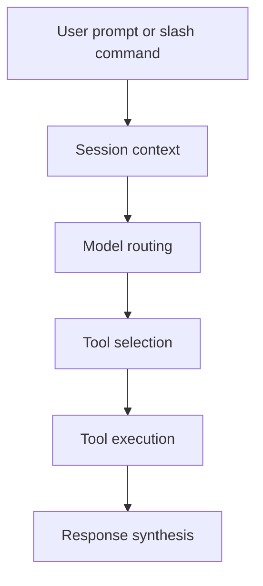

# Chapter 2: Architecture, Tools, and Agent Loop

This chapter explains the core runtime model that turns prompts into tool-backed outputs.

## Learning Goals

- understand high-level runtime architecture
- map built-in tool categories to practical use cases
- reason about execution flow from input to response
- identify where routing and extension hooks fit

## Core Runtime Layers

- CLI entry and session management
- model and routing subsystem
- built-in tools (filesystem, shell, web, planning, memory)
- MCP tool gateway and extension surfaces

## Execution Flow

## Why This Matters

- architecture clarity reduces debugging time
- tool boundaries help enforce safe operations
- extension/MCP integration becomes easier with clear flow model

## Source References

- [Architecture Docs](https://github.com/google-gemini/gemini-cli/blob/main/docs/architecture.md)
- [CLI Overview](https://github.com/google-gemini/gemini-cli/blob/main/docs/cli/index.md)
- [Tools Overview](https://github.com/google-gemini/gemini-cli/blob/main/docs/tools/index.md)

## Summary

You now have a strong mental model of Gemini CLI execution internals.

Next: [Chapter 3: Authentication and Model Access Strategy](03-authentication-and-model-access-strategy.md)
