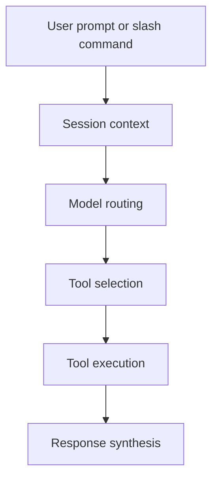
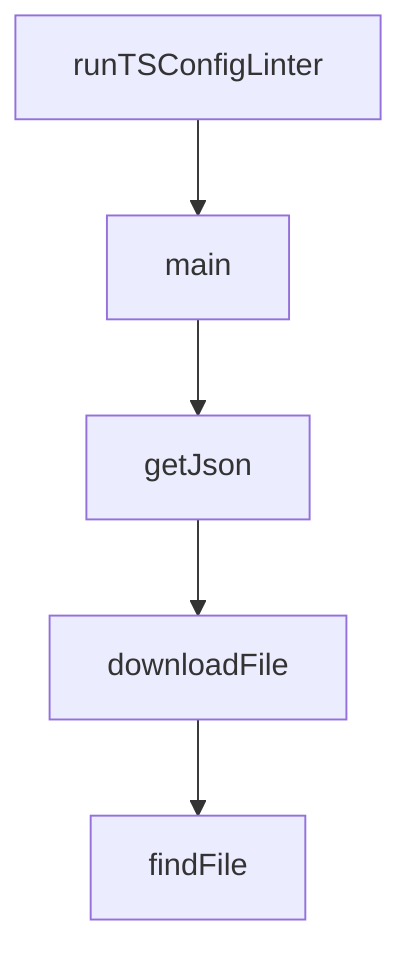

# Chapter 2: Architecture, Tools, and Agent Loop

Welcome to **Chapter 2: Architecture, Tools, and Agent Loop**. In this part of **Gemini CLI Tutorial: Terminal-First Agent Workflows with Google Gemini**, you will build an intuitive mental model first, then move into concrete implementation details and practical production tradeoffs.


This chapter explains the core runtime model that turns prompts into tool-backed outputs.

## Learning Goals

- understand high-level runtime architecture
- map built-in tool categories to practical use cases
- reason about execution flow from input to response
- identify where routing and extension hooks fit

## Core Runtime Layers

- CLI entry and session management
- model and routing subsystem
- built-in tools (filesystem, shell, web, planning, memory)
- MCP tool gateway and extension surfaces

## Execution Flow


```mermaid
flowchart TD
    A[User prompt or slash command] --> B[Session context]
    B --> C[Model routing]
    C --> D[Tool selection]
    D --> E[Tool execution]
    E --> F[Response synthesis]
```

## Why This Matters

- architecture clarity reduces debugging time
- tool boundaries help enforce safe operations
- extension/MCP integration becomes easier with clear flow model

## Source References

- [Architecture Docs](https://github.com/google-gemini/gemini-cli/blob/main/docs/architecture.md)
- [CLI Overview](https://github.com/google-gemini/gemini-cli/blob/main/docs/cli/index.md)
- [Tools Overview](https://github.com/google-gemini/gemini-cli/blob/main/docs/tools/index.md)

## Summary

You now have a strong mental model of Gemini CLI execution internals.

Next: [Chapter 3: Authentication and Model Access Strategy](03-authentication-and-model-access-strategy.md)

## Depth Expansion Playbook

## Source Code Walkthrough

### `scripts/lint.js`

The `runTSConfigLinter` function in [`scripts/lint.js`](https://github.com/google-gemini/gemini-cli/blob/HEAD/scripts/lint.js) handles a key part of this chapter's functionality:

```js
}

export function runTSConfigLinter() {
  console.log('\nRunning tsconfig linter...');

  let files = [];
  try {
    // Find all tsconfig.json files under packages/ using a git pathspec
    files = execSync("git ls-files 'packages/**/tsconfig.json'")
      .toString()
      .trim()
      .split('\n')
      .filter(Boolean);
  } catch (e) {
    console.error('Error finding tsconfig.json files:', e.message);
    process.exit(1);
  }

  let hasError = false;

  for (const file of files) {
    const tsconfigPath = join(process.cwd(), file);
    if (!existsSync(tsconfigPath)) {
      console.error(`Error: ${tsconfigPath} does not exist.`);
      hasError = true;
      continue;
    }

    try {
      const content = readFileSync(tsconfigPath, 'utf-8');
      const config = JSON.parse(stripJSONComments(content));

```

This function is important because it defines how Gemini CLI Tutorial: Terminal-First Agent Workflows with Google Gemini implements the patterns covered in this chapter.

### `scripts/lint.js`

The `main` function in [`scripts/lint.js`](https://github.com/google-gemini/gemini-cli/blob/HEAD/scripts/lint.js) handles a key part of this chapter's functionality:

```js

  function getChangedFiles() {
    const baseRef = process.env.GITHUB_BASE_REF || 'main';
    try {
      execSync(`git fetch origin ${baseRef}`);
      const mergeBase = execSync(`git merge-base HEAD origin/${baseRef}`)
        .toString()
        .trim();
      return execSync(`git diff --name-only ${mergeBase}..HEAD`)
        .toString()
        .trim()
        .split('\n')
        .filter(Boolean);
    } catch (_error) {
      console.error(`Could not get changed files against origin/${baseRef}.`);
      try {
        console.log('Falling back to diff against HEAD~1');
        return execSync(`git diff --name-only HEAD~1..HEAD`)
          .toString()
          .trim()
          .split('\n')
          .filter(Boolean);
      } catch (_fallbackError) {
        console.error('Could not get changed files against HEAD~1 either.');
        process.exit(1);
      }
    }
  }

  const changedFiles = getChangedFiles();
  let violationsFound = false;

```

This function is important because it defines how Gemini CLI Tutorial: Terminal-First Agent Workflows with Google Gemini implements the patterns covered in this chapter.

### `scripts/telemetry_utils.js`

The `getJson` function in [`scripts/telemetry_utils.js`](https://github.com/google-gemini/gemini-cli/blob/HEAD/scripts/telemetry_utils.js) handles a key part of this chapter's functionality:

```js
);

export function getJson(url) {
  const tmpFile = path.join(
    os.tmpdir(),
    `gemini-cli-releases-${Date.now()}.json`,
  );
  try {
    const result = spawnSync(
      'curl',
      ['-sL', '-H', 'User-Agent: gemini-cli-dev-script', '-o', tmpFile, url],
      { stdio: 'pipe', encoding: 'utf-8' },
    );
    if (result.status !== 0) {
      throw new Error(result.stderr);
    }
    const content = fs.readFileSync(tmpFile, 'utf-8');
    return JSON.parse(content);
  } catch (e) {
    console.error(`Failed to fetch or parse JSON from ${url}`);
    throw e;
  } finally {
    if (fs.existsSync(tmpFile)) {
      fs.unlinkSync(tmpFile);
    }
  }
}

export function downloadFile(url, dest) {
  try {
    const result = spawnSync('curl', ['-fL', '-sS', '-o', dest, url], {
      stdio: 'pipe',
```

This function is important because it defines how Gemini CLI Tutorial: Terminal-First Agent Workflows with Google Gemini implements the patterns covered in this chapter.

### `scripts/telemetry_utils.js`

The `downloadFile` function in [`scripts/telemetry_utils.js`](https://github.com/google-gemini/gemini-cli/blob/HEAD/scripts/telemetry_utils.js) handles a key part of this chapter's functionality:

```js
}

export function downloadFile(url, dest) {
  try {
    const result = spawnSync('curl', ['-fL', '-sS', '-o', dest, url], {
      stdio: 'pipe',
      encoding: 'utf-8',
    });
    if (result.status !== 0) {
      throw new Error(result.stderr);
    }
    return dest;
  } catch (e) {
    console.error(`Failed to download file from ${url}`);
    throw e;
  }
}

export function findFile(startPath, filter) {
  if (!fs.existsSync(startPath)) {
    return null;
  }
  const files = fs.readdirSync(startPath);
  for (const file of files) {
    const filename = path.join(startPath, file);
    const stat = fs.lstatSync(filename);
    if (stat.isDirectory()) {
      const result = findFile(filename, filter);
      if (result) return result;
    } else if (filter(file)) {
      return filename;
    }
```

This function is important because it defines how Gemini CLI Tutorial: Terminal-First Agent Workflows with Google Gemini implements the patterns covered in this chapter.


## How These Components Connect


```mermaid
flowchart TD
    A[runTSConfigLinter]
    B[main]
    C[getJson]
    D[downloadFile]
    E[findFile]
    A --> B
    B --> C
    C --> D
    D --> E
```
