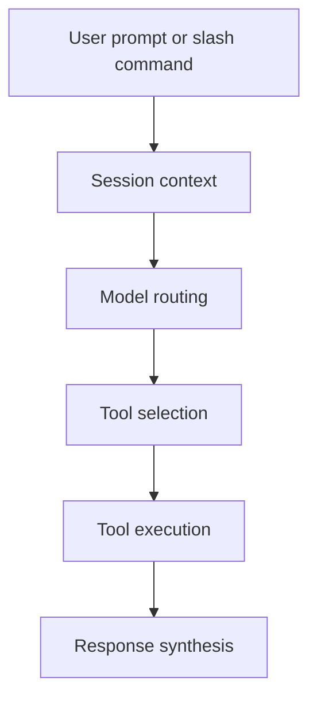
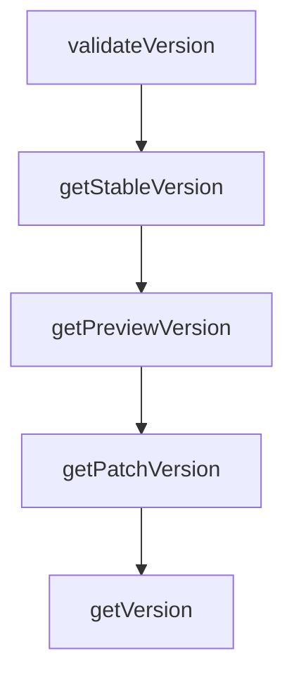

# Chapter 2: Architecture, Tools, and Agent Loop

Welcome to **Chapter 2: Architecture, Tools, and Agent Loop**. In this part of **Gemini CLI Tutorial: Terminal-First Agent Workflows with Google Gemini**, you will build an intuitive mental model first, then move into concrete implementation details and practical production tradeoffs.


This chapter explains the core runtime model that turns prompts into tool-backed outputs.

## Learning Goals

- understand high-level runtime architecture
- map built-in tool categories to practical use cases
- reason about execution flow from input to response
- identify where routing and extension hooks fit

## Core Runtime Layers

- CLI entry and session management
- model and routing subsystem
- built-in tools (filesystem, shell, web, planning, memory)
- MCP tool gateway and extension surfaces

## Execution Flow


```mermaid
flowchart TD
    A[User prompt or slash command] --> B[Session context]
    B --> C[Model routing]
    C --> D[Tool selection]
    D --> E[Tool execution]
    E --> F[Response synthesis]
```

## Why This Matters

- architecture clarity reduces debugging time
- tool boundaries help enforce safe operations
- extension/MCP integration becomes easier with clear flow model

## Source References

- [Architecture Docs](https://github.com/google-gemini/gemini-cli/blob/main/docs/architecture.md)
- [CLI Overview](https://github.com/google-gemini/gemini-cli/blob/main/docs/cli/index.md)
- [Tools Overview](https://github.com/google-gemini/gemini-cli/blob/main/docs/tools/index.md)

## Summary

You now have a strong mental model of Gemini CLI execution internals.

Next: [Chapter 3: Authentication and Model Access Strategy](03-authentication-and-model-access-strategy.md)

## Source Code Walkthrough

### `scripts/get-release-version.js`

The `validateVersion` function in [`scripts/get-release-version.js`](https://github.com/google-gemini/gemini-cli/blob/HEAD/scripts/get-release-version.js) handles a key part of this chapter's functionality:

```js
}

function validateVersion(version, format, name) {
  const versionRegex = {
    'X.Y.Z': /^\d+\.\d+\.\d+$/,
    'X.Y.Z-preview.N': /^\d+\.\d+\.\d+-preview\.\d+$/,
  };

  if (!versionRegex[format] || !versionRegex[format].test(version)) {
    throw new Error(
      `Invalid ${name}: ${version}. Must be in ${format} format.`,
    );
  }
}

function getStableVersion(args) {
  const { latestVersion: latestPreviewVersion } = getAndVerifyTags({
    npmDistTag: TAG_PREVIEW,
    args,
  });
  let releaseVersion;
  if (args['stable_version_override']) {
    const overrideVersion = args['stable_version_override'].replace(/^v/, '');
    validateVersion(overrideVersion, 'X.Y.Z', 'stable_version_override');
    releaseVersion = overrideVersion;
  } else {
    releaseVersion = latestPreviewVersion.replace(/-preview.*/, '');
  }

  const { latestTag: previousStableTag } = getAndVerifyTags({
    npmDistTag: TAG_LATEST,
    args,
```

This function is important because it defines how Gemini CLI Tutorial: Terminal-First Agent Workflows with Google Gemini implements the patterns covered in this chapter.

### `scripts/get-release-version.js`

The `getStableVersion` function in [`scripts/get-release-version.js`](https://github.com/google-gemini/gemini-cli/blob/HEAD/scripts/get-release-version.js) handles a key part of this chapter's functionality:

```js
}

function getStableVersion(args) {
  const { latestVersion: latestPreviewVersion } = getAndVerifyTags({
    npmDistTag: TAG_PREVIEW,
    args,
  });
  let releaseVersion;
  if (args['stable_version_override']) {
    const overrideVersion = args['stable_version_override'].replace(/^v/, '');
    validateVersion(overrideVersion, 'X.Y.Z', 'stable_version_override');
    releaseVersion = overrideVersion;
  } else {
    releaseVersion = latestPreviewVersion.replace(/-preview.*/, '');
  }

  const { latestTag: previousStableTag } = getAndVerifyTags({
    npmDistTag: TAG_LATEST,
    args,
  });

  return {
    releaseVersion,
    npmTag: TAG_LATEST,
    previousReleaseTag: previousStableTag,
  };
}

function getPreviewVersion(args) {
  const latestStableVersion = getStableBaseVersion(args);

  let releaseVersion;
```

This function is important because it defines how Gemini CLI Tutorial: Terminal-First Agent Workflows with Google Gemini implements the patterns covered in this chapter.

### `scripts/get-release-version.js`

The `getPreviewVersion` function in [`scripts/get-release-version.js`](https://github.com/google-gemini/gemini-cli/blob/HEAD/scripts/get-release-version.js) handles a key part of this chapter's functionality:

```js
}

function getPreviewVersion(args) {
  const latestStableVersion = getStableBaseVersion(args);

  let releaseVersion;
  if (args['preview_version_override']) {
    const overrideVersion = args['preview_version_override'].replace(/^v/, '');
    validateVersion(
      overrideVersion,
      'X.Y.Z-preview.N',
      'preview_version_override',
    );
    releaseVersion = overrideVersion;
  } else {
    const major = semver.major(latestStableVersion);
    const minor = semver.minor(latestStableVersion);
    const nextMinor = minor + 1;
    releaseVersion = `${major}.${nextMinor}.0-preview.0`;
  }

  const { latestTag: previousPreviewTag } = getAndVerifyTags({
    npmDistTag: TAG_PREVIEW,
    args,
  });

  return {
    releaseVersion,
    npmTag: TAG_PREVIEW,
    previousReleaseTag: previousPreviewTag,
  };
}
```

This function is important because it defines how Gemini CLI Tutorial: Terminal-First Agent Workflows with Google Gemini implements the patterns covered in this chapter.

### `scripts/get-release-version.js`

The `getPatchVersion` function in [`scripts/get-release-version.js`](https://github.com/google-gemini/gemini-cli/blob/HEAD/scripts/get-release-version.js) handles a key part of this chapter's functionality:

```js
}

function getPatchVersion(args) {
  const patchFrom = args['patch-from'];
  if (!patchFrom || (patchFrom !== 'stable' && patchFrom !== TAG_PREVIEW)) {
    throw new Error(
      'Patch type must be specified with --patch-from=stable or --patch-from=preview',
    );
  }
  const distTag = patchFrom === 'stable' ? TAG_LATEST : TAG_PREVIEW;
  const { latestVersion, latestTag } = getAndVerifyTags({
    npmDistTag: distTag,
    args,
  });

  if (patchFrom === 'stable') {
    // For stable versions, increment the patch number: 0.5.4 -> 0.5.5
    const versionParts = latestVersion.split('.');
    const major = versionParts[0];
    const minor = versionParts[1];
    const patch = versionParts[2] ? parseInt(versionParts[2]) : 0;
    const releaseVersion = `${major}.${minor}.${patch + 1}`;
    return {
      releaseVersion,
      npmTag: distTag,
      previousReleaseTag: latestTag,
    };
  } else {
    // For preview versions, increment the preview number: 0.6.0-preview.2 -> 0.6.0-preview.3
    const [version, prereleasePart] = latestVersion.split('-');
    if (!prereleasePart || !prereleasePart.startsWith('preview.')) {
      throw new Error(
```

This function is important because it defines how Gemini CLI Tutorial: Terminal-First Agent Workflows with Google Gemini implements the patterns covered in this chapter.


## How These Components Connect


```mermaid
flowchart TD
    A[validateVersion]
    B[getStableVersion]
    C[getPreviewVersion]
    D[getPatchVersion]
    E[getVersion]
    A --> B
    B --> C
    C --> D
    D --> E
```
