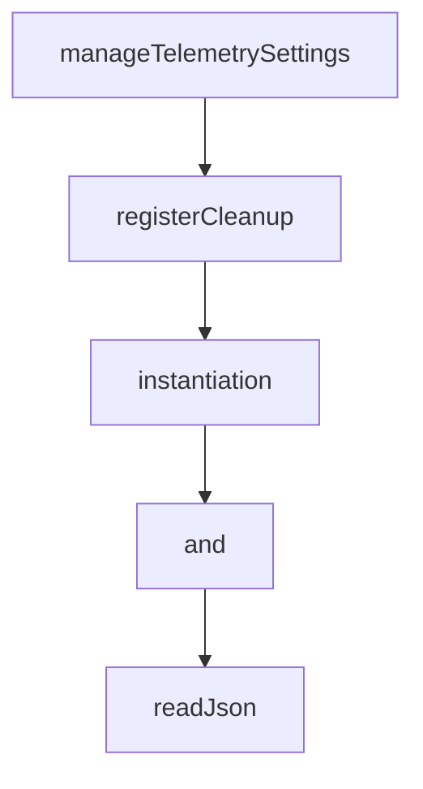

# Chapter 3: Authentication and Model Access Strategy

Welcome to **Chapter 3: Authentication and Model Access Strategy**. In this part of **Gemini CLI Tutorial: Terminal-First Agent Workflows with Google Gemini**, you will build an intuitive mental model first, then move into concrete implementation details and practical production tradeoffs.


This chapter compares available auth paths and helps you choose model-access strategy by team constraints.

## Learning Goals

- choose OAuth, API key, or Vertex AI auth path correctly
- understand model-routing precedence and controls
- avoid common enterprise auth misconfiguration
- align auth choice with usage, compliance, and quota needs

## Authentication Paths

### Google OAuth

Best for individual developers and fast setup.

```bash
gemini
```

### Gemini API Key

Best for explicit key-based control.

```bash
export GEMINI_API_KEY="YOUR_API_KEY"
gemini
```

### Vertex AI

Best for enterprise billing/compliance integration.

```bash
export GOOGLE_API_KEY="YOUR_API_KEY"
export GOOGLE_GENAI_USE_VERTEXAI=true
gemini
```

## Model Strategy Notes

- set default model for predictable behavior
- override per run for targeted cost/performance decisions
- verify routing precedence when multiple settings sources exist

## Source References

- [README Authentication Options](https://github.com/google-gemini/gemini-cli/blob/main/README.md#-authentication-options)
- [Authentication Docs](https://github.com/google-gemini/gemini-cli/blob/main/docs/get-started/authentication.md)
- [Model Routing Docs](https://github.com/google-gemini/gemini-cli/blob/main/docs/cli/model-routing.md)

## Summary

You now have a clear and repeatable auth/model-access strategy.

Next: [Chapter 4: Settings, Context, and Custom Commands](04-settings-context-and-custom-commands.md)

## Depth Expansion Playbook

## Source Code Walkthrough

### `scripts/telemetry_utils.js`

The `manageTelemetrySettings` function in [`scripts/telemetry_utils.js`](https://github.com/google-gemini/gemini-cli/blob/HEAD/scripts/telemetry_utils.js) handles a key part of this chapter's functionality:

```js
}

export function manageTelemetrySettings(
  enable,
  oTelEndpoint = 'http://localhost:4317',
  target = 'local',
  originalSandboxSettingToRestore,
  otlpProtocol = 'grpc',
) {
  const workspaceSettings = readJsonFile(WORKSPACE_SETTINGS_FILE);
  const currentSandboxSetting = workspaceSettings.sandbox;
  let settingsModified = false;

  if (typeof workspaceSettings.telemetry !== 'object') {
    workspaceSettings.telemetry = {};
  }

  if (enable) {
    if (workspaceSettings.telemetry.enabled !== true) {
      workspaceSettings.telemetry.enabled = true;
      settingsModified = true;
      console.log('⚙️  Enabled telemetry in workspace settings.');
    }
    if (workspaceSettings.sandbox !== false) {
      workspaceSettings.sandbox = false;
      settingsModified = true;
      console.log('✅ Disabled sandbox mode for telemetry.');
    }
    if (workspaceSettings.telemetry.otlpEndpoint !== oTelEndpoint) {
      workspaceSettings.telemetry.otlpEndpoint = oTelEndpoint;
      settingsModified = true;
      console.log(`🔧 Set telemetry OTLP endpoint to ${oTelEndpoint}.`);
```

This function is important because it defines how Gemini CLI Tutorial: Terminal-First Agent Workflows with Google Gemini implements the patterns covered in this chapter.

### `scripts/telemetry_utils.js`

The `registerCleanup` function in [`scripts/telemetry_utils.js`](https://github.com/google-gemini/gemini-cli/blob/HEAD/scripts/telemetry_utils.js) handles a key part of this chapter's functionality:

```js
}

export function registerCleanup(
  getProcesses,
  getLogFileDescriptors,
  originalSandboxSetting,
) {
  let cleanedUp = false;
  const cleanup = () => {
    if (cleanedUp) return;
    cleanedUp = true;

    console.log('\n👋 Shutting down...');

    manageTelemetrySettings(false, null, null, originalSandboxSetting);

    const processes = getProcesses ? getProcesses() : [];
    processes.forEach((proc) => {
      if (proc && proc.pid) {
        const name = path.basename(proc.spawnfile);
        try {
          console.log(`🛑 Stopping ${name} (PID: ${proc.pid})...`);
          process.kill(proc.pid, 'SIGTERM');
          console.log(`✅ ${name} stopped.`);
        } catch (e) {
          if (e.code !== 'ESRCH') {
            console.error(`Error stopping ${name}: ${e.message}`);
          }
        }
      }
    });

```

This function is important because it defines how Gemini CLI Tutorial: Terminal-First Agent Workflows with Google Gemini implements the patterns covered in this chapter.

### `eslint.config.js`

The `instantiation` class in [`eslint.config.js`](https://github.com/google-gemini/gemini-cli/blob/HEAD/eslint.config.js) handles a key part of this chapter's functionality:

```js
            'CallExpression[callee.object.name="Object"][callee.property.name="create"]',
          message:
            'Avoid using Object.create() in product code. Use object spread {...obj}, explicit class instantiation, structuredClone(), or copy constructors instead.',
        },
        {
          selector: 'Identifier[name="Reflect"]',
          message:
            'Avoid using Reflect namespace in product code. Do not use reflection to make copies. Instead, use explicit object copying or cloning (structuredClone() for values, new instance/clone function for classes).',
        },
      ],
    },
  },
  {
    // Allow os.homedir() in tests and paths.ts where it is used to implement the helper
    files: [
      '**/*.test.ts',
      '**/*.test.tsx',
      'packages/core/src/utils/paths.ts',
      'packages/test-utils/src/**/*.ts',
      'scripts/**/*.js',
    ],
    rules: {
      'no-restricted-imports': 'off',
    },
  },
  {
    // Prevent self-imports in packages
    files: ['packages/core/src/**/*.{ts,tsx}'],
    rules: {
      'no-restricted-imports': [
        'error',
        {
```

This class is important because it defines how Gemini CLI Tutorial: Terminal-First Agent Workflows with Google Gemini implements the patterns covered in this chapter.

### `eslint.config.js`

The `and` interface in [`eslint.config.js`](https://github.com/google-gemini/gemini-cli/blob/HEAD/eslint.config.js) handles a key part of this chapter's functionality:

```js
      'UnaryExpression[operator="typeof"] > MemberExpression[computed=true][property.type="Literal"]',
    message:
      'Do not use typeof to check object properties. Define a TypeScript interface and a type guard function instead.',
  },
];

export default tseslint.config(
  {
    // Global ignores
    ignores: [
      '**/node_modules/**',
      'eslint.config.js',
      'packages/**/dist/**',
      'bundle/**',
      'package/bundle/**',
      '.integration-tests/**',
      'dist/**',
      'evals/**',
      'packages/test-utils/**',
      '.gemini/**',
      '**/*.d.ts',
    ],
  },
  eslint.configs.recommended,
  ...tseslint.configs.recommended,
  reactHooks.configs['recommended-latest'],
  reactPlugin.configs.flat.recommended,
  reactPlugin.configs.flat['jsx-runtime'], // Add this if you are using React 17+
  {
    // Settings for eslint-plugin-react
    settings: {
      react: {
```

This interface is important because it defines how Gemini CLI Tutorial: Terminal-First Agent Workflows with Google Gemini implements the patterns covered in this chapter.


## How These Components Connect


