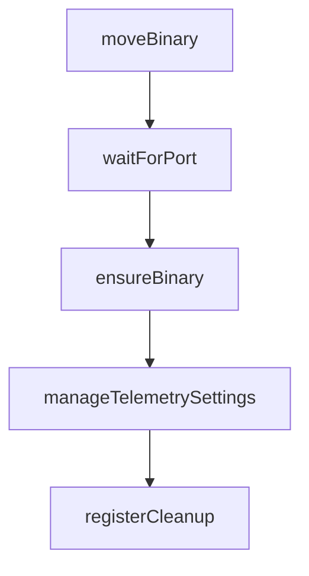

# Chapter 3: Authentication and Model Access Strategy

Welcome to **Chapter 3: Authentication and Model Access Strategy**. In this part of **Gemini CLI Tutorial: Terminal-First Agent Workflows with Google Gemini**, you will build an intuitive mental model first, then move into concrete implementation details and practical production tradeoffs.


This chapter compares available auth paths and helps you choose model-access strategy by team constraints.

## Learning Goals

- choose OAuth, API key, or Vertex AI auth path correctly
- understand model-routing precedence and controls
- avoid common enterprise auth misconfiguration
- align auth choice with usage, compliance, and quota needs

## Authentication Paths

### Google OAuth

Best for individual developers and fast setup.

```bash
gemini
```

### Gemini API Key

Best for explicit key-based control.

```bash
export GEMINI_API_KEY="YOUR_API_KEY"
gemini
```

### Vertex AI

Best for enterprise billing/compliance integration.

```bash
export GOOGLE_API_KEY="YOUR_API_KEY"
export GOOGLE_GENAI_USE_VERTEXAI=true
gemini
```

## Model Strategy Notes

- set default model for predictable behavior
- override per run for targeted cost/performance decisions
- verify routing precedence when multiple settings sources exist

## Source References

- [README Authentication Options](https://github.com/google-gemini/gemini-cli/blob/main/README.md#-authentication-options)
- [Authentication Docs](https://github.com/google-gemini/gemini-cli/blob/main/docs/get-started/authentication.md)
- [Model Routing Docs](https://github.com/google-gemini/gemini-cli/blob/main/docs/cli/model-routing.md)

## Summary

You now have a clear and repeatable auth/model-access strategy.

Next: [Chapter 4: Settings, Context, and Custom Commands](04-settings-context-and-custom-commands.md)

## Source Code Walkthrough

### `scripts/telemetry_utils.js`

The `moveBinary` function in [`scripts/telemetry_utils.js`](https://github.com/google-gemini/gemini-cli/blob/HEAD/scripts/telemetry_utils.js) handles a key part of this chapter's functionality:

```js
}

export function moveBinary(source, destination) {
  try {
    fs.renameSync(source, destination);
  } catch (error) {
    if (error.code !== 'EXDEV') {
      throw error;
    }
    // Handle a cross-device error: copy-to-temp-then-rename.
    const destDir = path.dirname(destination);
    const destFile = path.basename(destination);
    const tempDest = path.join(destDir, `${destFile}.tmp`);

    try {
      fs.copyFileSync(source, tempDest);
      fs.renameSync(tempDest, destination);
    } catch (moveError) {
      // If copy or rename fails, clean up the intermediate temp file.
      if (fs.existsSync(tempDest)) {
        fs.unlinkSync(tempDest);
      }
      throw moveError;
    }
    fs.unlinkSync(source);
  }
}

export function waitForPort(port, timeout = 10000) {
  return new Promise((resolve, reject) => {
    const startTime = Date.now();
    const tryConnect = () => {
```

This function is important because it defines how Gemini CLI Tutorial: Terminal-First Agent Workflows with Google Gemini implements the patterns covered in this chapter.

### `scripts/telemetry_utils.js`

The `waitForPort` function in [`scripts/telemetry_utils.js`](https://github.com/google-gemini/gemini-cli/blob/HEAD/scripts/telemetry_utils.js) handles a key part of this chapter's functionality:

```js
}

export function waitForPort(port, timeout = 10000) {
  return new Promise((resolve, reject) => {
    const startTime = Date.now();
    const tryConnect = () => {
      const socket = new net.Socket();
      socket.once('connect', () => {
        socket.end();
        resolve();
      });
      socket.once('error', (_) => {
        if (Date.now() - startTime > timeout) {
          reject(new Error(`Timeout waiting for port ${port} to open.`));
        } else {
          setTimeout(tryConnect, 500);
        }
      });
      socket.connect(port, 'localhost');
    };
    tryConnect();
  });
}

export async function ensureBinary(
  executableName,
  repo,
  assetNameCallback,
  binaryNameInArchive,
  isJaeger = false,
) {
  const executablePath = path.join(BIN_DIR, executableName);
```

This function is important because it defines how Gemini CLI Tutorial: Terminal-First Agent Workflows with Google Gemini implements the patterns covered in this chapter.

### `scripts/telemetry_utils.js`

The `ensureBinary` function in [`scripts/telemetry_utils.js`](https://github.com/google-gemini/gemini-cli/blob/HEAD/scripts/telemetry_utils.js) handles a key part of this chapter's functionality:

```js
}

export async function ensureBinary(
  executableName,
  repo,
  assetNameCallback,
  binaryNameInArchive,
  isJaeger = false,
) {
  const executablePath = path.join(BIN_DIR, executableName);
  if (fileExists(executablePath)) {
    console.log(`✅ ${executableName} already exists at ${executablePath}`);
    return executablePath;
  }

  console.log(`🔍 ${executableName} not found. Downloading from ${repo}...`);

  const platform = process.platform === 'win32' ? 'windows' : process.platform;
  const arch = process.arch === 'x64' ? 'amd64' : process.arch;
  const ext = platform === 'windows' ? 'zip' : 'tar.gz';

  if (isJaeger && platform === 'windows' && arch === 'arm64') {
    console.warn(
      `⚠️ Jaeger does not have a release for Windows on ARM64. Skipping.`,
    );
    return null;
  }

  let release;
  let asset;

  if (isJaeger) {
```

This function is important because it defines how Gemini CLI Tutorial: Terminal-First Agent Workflows with Google Gemini implements the patterns covered in this chapter.

### `scripts/telemetry_utils.js`

The `manageTelemetrySettings` function in [`scripts/telemetry_utils.js`](https://github.com/google-gemini/gemini-cli/blob/HEAD/scripts/telemetry_utils.js) handles a key part of this chapter's functionality:

```js
}

export function manageTelemetrySettings(
  enable,
  oTelEndpoint = 'http://localhost:4317',
  target = 'local',
  originalSandboxSettingToRestore,
  otlpProtocol = 'grpc',
) {
  const workspaceSettings = readJsonFile(WORKSPACE_SETTINGS_FILE);
  const currentSandboxSetting = workspaceSettings.sandbox;
  let settingsModified = false;

  if (typeof workspaceSettings.telemetry !== 'object') {
    workspaceSettings.telemetry = {};
  }

  if (enable) {
    if (workspaceSettings.telemetry.enabled !== true) {
      workspaceSettings.telemetry.enabled = true;
      settingsModified = true;
      console.log('⚙️  Enabled telemetry in workspace settings.');
    }
    if (workspaceSettings.sandbox !== false) {
      workspaceSettings.sandbox = false;
      settingsModified = true;
      console.log('✅ Disabled sandbox mode for telemetry.');
    }
    if (workspaceSettings.telemetry.otlpEndpoint !== oTelEndpoint) {
      workspaceSettings.telemetry.otlpEndpoint = oTelEndpoint;
      settingsModified = true;
      console.log(`🔧 Set telemetry OTLP endpoint to ${oTelEndpoint}.`);
```

This function is important because it defines how Gemini CLI Tutorial: Terminal-First Agent Workflows with Google Gemini implements the patterns covered in this chapter.


## How These Components Connect


