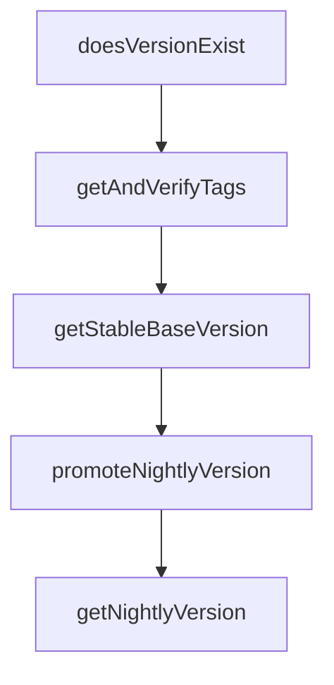

# Chapter 4: Settings, Context, and Custom Commands

Welcome to **Chapter 4: Settings, Context, and Custom Commands**. In this part of **Gemini CLI Tutorial: Terminal-First Agent Workflows with Google Gemini**, you will build an intuitive mental model first, then move into concrete implementation details and practical production tradeoffs.


This chapter focuses on the highest-leverage configuration surfaces for consistent team behavior.

## Learning Goals

- manage runtime configuration through settings and CLI controls
- use context files effectively for persistent project guidance
- create reusable custom slash commands
- avoid configuration drift across user and workspace scopes

## Configuration Surfaces

- `~/.gemini/settings.json` for user-level defaults
- workspace `.gemini/settings.json` for project-local controls
- `GEMINI.md` for persistent context and operating rules

## Custom Command Pattern

Gemini CLI supports TOML-defined custom commands that can live in user or workspace scopes.

Benefits:

- reusable operation runbooks
- standardized prompt injection patterns
- better team consistency in frequent workflows

## Operational Checklist

- keep shared command namespaced by function
- version-control workspace command definitions
- review settings precedence when debugging behavior

## Source References

- [Settings Docs](https://github.com/google-gemini/gemini-cli/blob/main/docs/cli/settings.md)
- [Context Files (GEMINI.md)](https://github.com/google-gemini/gemini-cli/blob/main/docs/cli/gemini-md.md)
- [Custom Commands Docs](https://github.com/google-gemini/gemini-cli/blob/main/docs/cli/custom-commands.md)

## Summary

You now know how to codify Gemini CLI behavior with durable settings and commands.

Next: [Chapter 5: MCP, Extensions, and Skills](05-mcp-extensions-and-skills.md)

## Depth Expansion Playbook

## Source Code Walkthrough

### `scripts/get-release-version.js`

The `doesVersionExist` function in [`scripts/get-release-version.js`](https://github.com/google-gemini/gemini-cli/blob/HEAD/scripts/get-release-version.js) handles a key part of this chapter's functionality:

```js
}

function doesVersionExist({ args, version } = {}) {
  // Check NPM
  try {
    const command = `npm view ${args['cli-package-name']}@${version} version 2>/dev/null`;
    const output = execSync(command).toString().trim();
    if (output === version) {
      console.error(`Version ${version} already exists on NPM.`);
      return true;
    }
  } catch (_error) {
    // This is expected if the version doesn't exist.
  }

  // Check Git tags
  try {
    const command = `git tag -l 'v${version}'`;
    const tagOutput = execSync(command).toString().trim();
    if (tagOutput === `v${version}`) {
      console.error(`Git tag v${version} already exists.`);
      return true;
    }
  } catch (error) {
    console.error(`Failed to check git tags for conflicts: ${error.message}`);
  }

  // Check GitHub releases
  try {
    const command = `gh release view "v${version}" --json tagName --jq .tagName 2>/dev/null`;
    const output = execSync(command).toString().trim();
    if (output === `v${version}`) {
```

This function is important because it defines how Gemini CLI Tutorial: Terminal-First Agent Workflows with Google Gemini implements the patterns covered in this chapter.

### `scripts/get-release-version.js`

The `getAndVerifyTags` function in [`scripts/get-release-version.js`](https://github.com/google-gemini/gemini-cli/blob/HEAD/scripts/get-release-version.js) handles a key part of this chapter's functionality:

```js
}

function getAndVerifyTags({ npmDistTag, args } = {}) {
  // Detect rollback scenarios and get the correct baseline
  const rollbackInfo = detectRollbackAndGetBaseline({ args, npmDistTag });
  const baselineVersion = rollbackInfo.baseline;

  if (!baselineVersion) {
    throw new Error(`Unable to determine baseline version for ${npmDistTag}`);
  }

  if (rollbackInfo.isRollback) {
    // Rollback scenario: warn about the rollback but don't fail
    console.error(
      `Rollback detected! NPM ${npmDistTag} tag is ${rollbackInfo.distTagVersion}, but using ${baselineVersion} as baseline for next version calculation (highest existing version).`,
    );
  }

  // Not verifying against git tags or GitHub releases as per user request.

  return {
    latestVersion: baselineVersion,
    latestTag: `v${baselineVersion}`,
  };
}

function getStableBaseVersion(args) {
  let latestStableVersion = args['stable-base-version'];
  if (!latestStableVersion) {
    const { latestVersion } = getAndVerifyTags({
      npmDistTag: TAG_LATEST,
      args,
```

This function is important because it defines how Gemini CLI Tutorial: Terminal-First Agent Workflows with Google Gemini implements the patterns covered in this chapter.

### `scripts/get-release-version.js`

The `getStableBaseVersion` function in [`scripts/get-release-version.js`](https://github.com/google-gemini/gemini-cli/blob/HEAD/scripts/get-release-version.js) handles a key part of this chapter's functionality:

```js
}

function getStableBaseVersion(args) {
  let latestStableVersion = args['stable-base-version'];
  if (!latestStableVersion) {
    const { latestVersion } = getAndVerifyTags({
      npmDistTag: TAG_LATEST,
      args,
    });
    latestStableVersion = latestVersion;
  }
  return latestStableVersion;
}

function promoteNightlyVersion({ args } = {}) {
  const latestStableVersion = getStableBaseVersion(args);

  const { latestTag: previousNightlyTag } = getAndVerifyTags({
    npmDistTag: TAG_NIGHTLY,
    args,
  });

  const major = semver.major(latestStableVersion);
  const minor = semver.minor(latestStableVersion);
  const nextMinor = minor + 2;
  const date = new Date().toISOString().slice(0, 10).replace(/-/g, '');
  const gitShortHash = execSync('git rev-parse --short HEAD').toString().trim();
  return {
    releaseVersion: `${major}.${nextMinor}.0-nightly.${date}.${gitShortHash}`,
    npmTag: TAG_NIGHTLY,
    previousReleaseTag: previousNightlyTag,
  };
```

This function is important because it defines how Gemini CLI Tutorial: Terminal-First Agent Workflows with Google Gemini implements the patterns covered in this chapter.

### `scripts/get-release-version.js`

The `promoteNightlyVersion` function in [`scripts/get-release-version.js`](https://github.com/google-gemini/gemini-cli/blob/HEAD/scripts/get-release-version.js) handles a key part of this chapter's functionality:

```js
}

function promoteNightlyVersion({ args } = {}) {
  const latestStableVersion = getStableBaseVersion(args);

  const { latestTag: previousNightlyTag } = getAndVerifyTags({
    npmDistTag: TAG_NIGHTLY,
    args,
  });

  const major = semver.major(latestStableVersion);
  const minor = semver.minor(latestStableVersion);
  const nextMinor = minor + 2;
  const date = new Date().toISOString().slice(0, 10).replace(/-/g, '');
  const gitShortHash = execSync('git rev-parse --short HEAD').toString().trim();
  return {
    releaseVersion: `${major}.${nextMinor}.0-nightly.${date}.${gitShortHash}`,
    npmTag: TAG_NIGHTLY,
    previousReleaseTag: previousNightlyTag,
  };
}

function getNightlyVersion() {
  const packageJson = readJson('package.json');
  const baseVersion = packageJson.version.split('-')[0];
  const date = new Date().toISOString().slice(0, 10).replace(/-/g, '');
  const gitShortHash = execSync('git rev-parse --short HEAD').toString().trim();
  const releaseVersion = `${baseVersion}-nightly.${date}.${gitShortHash}`;
  const previousReleaseTag = getLatestTag('v*-nightly*');

  return {
    releaseVersion,
```

This function is important because it defines how Gemini CLI Tutorial: Terminal-First Agent Workflows with Google Gemini implements the patterns covered in this chapter.


## How These Components Connect


