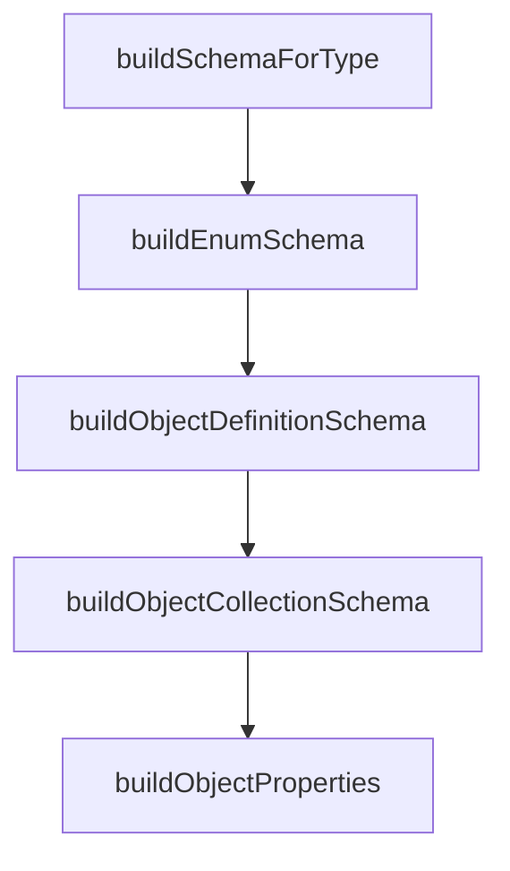

# Chapter 4: Settings, Context, and Custom Commands

Welcome to **Chapter 4: Settings, Context, and Custom Commands**. In this part of **Gemini CLI Tutorial: Terminal-First Agent Workflows with Google Gemini**, you will build an intuitive mental model first, then move into concrete implementation details and practical production tradeoffs.


This chapter focuses on the highest-leverage configuration surfaces for consistent team behavior.

## Learning Goals

- manage runtime configuration through settings and CLI controls
- use context files effectively for persistent project guidance
- create reusable custom slash commands
- avoid configuration drift across user and workspace scopes

## Configuration Surfaces

- `~/.gemini/settings.json` for user-level defaults
- workspace `.gemini/settings.json` for project-local controls
- `GEMINI.md` for persistent context and operating rules

## Custom Command Pattern

Gemini CLI supports TOML-defined custom commands that can live in user or workspace scopes.

Benefits:

- reusable operation runbooks
- standardized prompt injection patterns
- better team consistency in frequent workflows

## Operational Checklist

- keep shared command namespaced by function
- version-control workspace command definitions
- review settings precedence when debugging behavior

## Source References

- [Settings Docs](https://github.com/google-gemini/gemini-cli/blob/main/docs/cli/settings.md)
- [Context Files (GEMINI.md)](https://github.com/google-gemini/gemini-cli/blob/main/docs/cli/gemini-md.md)
- [Custom Commands Docs](https://github.com/google-gemini/gemini-cli/blob/main/docs/cli/custom-commands.md)

## Summary

You now know how to codify Gemini CLI behavior with durable settings and commands.

Next: [Chapter 5: MCP, Extensions, and Skills](05-mcp-extensions-and-skills.md)

## Source Code Walkthrough

### `scripts/generate-settings-schema.ts`

The `buildSchemaForType` function in [`scripts/generate-settings-schema.ts`](https://github.com/google-gemini/gemini-cli/blob/HEAD/scripts/generate-settings-schema.ts) handles a key part of this chapter's functionality:

```ts
  const schemaShape = definition.ref
    ? buildRefSchema(definition.ref, defs)
    : buildSchemaForType(definition, pathSegments, defs);

  return { ...base, ...schemaShape };
}

function buildCollectionSchema(
  collection: SettingCollectionDefinition,
  pathSegments: string[],
  defs: Map<string, JsonSchema>,
): JsonSchema {
  if (collection.ref) {
    return buildRefSchema(collection.ref, defs);
  }
  return buildSchemaForType(collection, pathSegments, defs);
}

function buildSchemaForType(
  source: SettingDefinition | SettingCollectionDefinition,
  pathSegments: string[],
  defs: Map<string, JsonSchema>,
): JsonSchema {
  switch (source.type) {
    case 'boolean':
    case 'string':
    case 'number':
      return { type: source.type };
    case 'enum':
      return buildEnumSchema(source.options);
    case 'array': {
      const itemPath = [...pathSegments, '<items>'];
```

This function is important because it defines how Gemini CLI Tutorial: Terminal-First Agent Workflows with Google Gemini implements the patterns covered in this chapter.

### `scripts/generate-settings-schema.ts`

The `buildEnumSchema` function in [`scripts/generate-settings-schema.ts`](https://github.com/google-gemini/gemini-cli/blob/HEAD/scripts/generate-settings-schema.ts) handles a key part of this chapter's functionality:

```ts
      return { type: source.type };
    case 'enum':
      return buildEnumSchema(source.options);
    case 'array': {
      const itemPath = [...pathSegments, '<items>'];
      const items = isSettingDefinition(source)
        ? source.items
          ? buildCollectionSchema(source.items, itemPath, defs)
          : {}
        : source.properties
          ? buildInlineObjectSchema(source.properties, itemPath, defs)
          : {};
      return { type: 'array', items };
    }
    case 'object':
      return isSettingDefinition(source)
        ? buildObjectDefinitionSchema(source, pathSegments, defs)
        : buildObjectCollectionSchema(source, pathSegments, defs);
    default:
      return {};
  }
}

function buildEnumSchema(
  options:
    | SettingDefinition['options']
    | SettingCollectionDefinition['options'],
): JsonSchema {
  const values = options?.map((option) => option.value) ?? [];
  const inferred = inferTypeFromValues(values);
  return {
    type: inferred ?? undefined,
```

This function is important because it defines how Gemini CLI Tutorial: Terminal-First Agent Workflows with Google Gemini implements the patterns covered in this chapter.

### `scripts/generate-settings-schema.ts`

The `buildObjectDefinitionSchema` function in [`scripts/generate-settings-schema.ts`](https://github.com/google-gemini/gemini-cli/blob/HEAD/scripts/generate-settings-schema.ts) handles a key part of this chapter's functionality:

```ts
    case 'object':
      return isSettingDefinition(source)
        ? buildObjectDefinitionSchema(source, pathSegments, defs)
        : buildObjectCollectionSchema(source, pathSegments, defs);
    default:
      return {};
  }
}

function buildEnumSchema(
  options:
    | SettingDefinition['options']
    | SettingCollectionDefinition['options'],
): JsonSchema {
  const values = options?.map((option) => option.value) ?? [];
  const inferred = inferTypeFromValues(values);
  return {
    type: inferred ?? undefined,
    enum: values,
  };
}

function buildObjectDefinitionSchema(
  definition: SettingDefinition,
  pathSegments: string[],
  defs: Map<string, JsonSchema>,
): JsonSchema {
  const properties = definition.properties
    ? buildObjectProperties(definition.properties, pathSegments, defs)
    : undefined;

  const schema: JsonSchema = {
```

This function is important because it defines how Gemini CLI Tutorial: Terminal-First Agent Workflows with Google Gemini implements the patterns covered in this chapter.

### `scripts/generate-settings-schema.ts`

The `buildObjectCollectionSchema` function in [`scripts/generate-settings-schema.ts`](https://github.com/google-gemini/gemini-cli/blob/HEAD/scripts/generate-settings-schema.ts) handles a key part of this chapter's functionality:

```ts
      return isSettingDefinition(source)
        ? buildObjectDefinitionSchema(source, pathSegments, defs)
        : buildObjectCollectionSchema(source, pathSegments, defs);
    default:
      return {};
  }
}

function buildEnumSchema(
  options:
    | SettingDefinition['options']
    | SettingCollectionDefinition['options'],
): JsonSchema {
  const values = options?.map((option) => option.value) ?? [];
  const inferred = inferTypeFromValues(values);
  return {
    type: inferred ?? undefined,
    enum: values,
  };
}

function buildObjectDefinitionSchema(
  definition: SettingDefinition,
  pathSegments: string[],
  defs: Map<string, JsonSchema>,
): JsonSchema {
  const properties = definition.properties
    ? buildObjectProperties(definition.properties, pathSegments, defs)
    : undefined;

  const schema: JsonSchema = {
    type: 'object',
```

This function is important because it defines how Gemini CLI Tutorial: Terminal-First Agent Workflows with Google Gemini implements the patterns covered in this chapter.


## How These Components Connect


