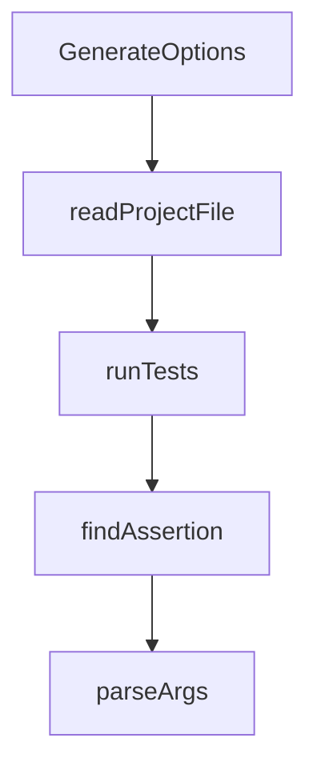

# Chapter 5: MCP, Extensions, and Skills

Welcome to **Chapter 5: MCP, Extensions, and Skills**. In this part of **Gemini CLI Tutorial: Terminal-First Agent Workflows with Google Gemini**, you will build an intuitive mental model first, then move into concrete implementation details and practical production tradeoffs.


This chapter covers extensibility through MCP servers, extension packs, and skills.

## Learning Goals

- configure and validate MCP server connections
- understand extension packaging and lifecycle controls
- install and manage skills across scopes
- apply safe defaults for third-party extension surfaces

## MCP Integration Basics

Configure MCP servers in Gemini settings and verify discovery:

- use `/mcp` for runtime visibility
- validate authentication and connection state per server
- test tool execution with low-risk read-only tasks first

## Extensions and Skills

- extensions package commands, hooks, MCP configs, and assets
- skills provide structured domain guidance with controlled activation
- both can be managed from CLI command surfaces

## Security Baseline

- install only trusted sources
- keep extension inventory minimal and reviewed
- isolate experimental integrations from critical workflows

## Source References

- [MCP Server Docs](https://github.com/google-gemini/gemini-cli/blob/main/docs/tools/mcp-server.md)
- [Extensions Docs](https://github.com/google-gemini/gemini-cli/blob/main/docs/extensions/index.md)
- [Skills Docs](https://github.com/google-gemini/gemini-cli/blob/main/docs/cli/skills.md)

## Summary

You now have an extensibility model that balances capability and control.

Next: [Chapter 6: Headless Mode and CI Automation](06-headless-mode-and-ci-automation.md)

## Source Code Walkthrough

### `scripts/generate-settings-schema.ts`

The `GenerateOptions` interface in [`scripts/generate-settings-schema.ts`](https://github.com/google-gemini/gemini-cli/blob/HEAD/scripts/generate-settings-schema.ts) handles a key part of this chapter's functionality:

```ts
}

interface GenerateOptions {
  checkOnly: boolean;
}

export async function generateSettingsSchema(
  options: GenerateOptions,
): Promise<void> {
  const repoRoot = path.resolve(
    path.dirname(fileURLToPath(import.meta.url)),
    '..',
  );
  const outputPath = path.join(repoRoot, ...OUTPUT_RELATIVE_PATH);
  await mkdir(path.dirname(outputPath), { recursive: true });

  const schemaObject = buildSchemaObject(getSettingsSchema());
  const formatted = await formatWithPrettier(
    JSON.stringify(schemaObject, null, 2),
    outputPath,
  );

  let existing: string | undefined;
  try {
    existing = await readFile(outputPath, 'utf8');
  } catch (error) {
    if ((error as NodeJS.ErrnoException).code !== 'ENOENT') {
      throw error;
    }
  }

  if (
```

This interface is important because it defines how Gemini CLI Tutorial: Terminal-First Agent Workflows with Google Gemini implements the patterns covered in this chapter.

### `evals/subagents.eval.ts`

The `readProjectFile` function in [`evals/subagents.eval.ts`](https://github.com/google-gemini/gemini-cli/blob/HEAD/evals/subagents.eval.ts) handles a key part of this chapter's functionality:

```ts
);

function readProjectFile(
  rig: { testDir: string | null },
  relativePath: string,
): string {
  return fs.readFileSync(path.join(rig.testDir!, relativePath), 'utf8');
}

describe('subagent eval test cases', () => {
  /**
   * Checks whether the outer agent reliably utilizes an expert subagent to
   * accomplish a task when one is available.
   *
   * Note that the test is intentionally crafted to avoid the word "document"
   * or "docs". We want to see the outer agent make the connection even when
   * the prompt indirectly implies need of expertise.
   *
   * This tests the system prompt's subagent specific clauses.
   */
  evalTest('USUALLY_PASSES', {
    name: 'should delegate to user provided agent with relevant expertise',
    params: {
      settings: {
        experimental: {
          enableAgents: true,
        },
      },
    },
    prompt: 'Please update README.md with a description of this library.',
    files: {
      ...TEST_AGENTS.DOCS_AGENT.asFile(),
```

This function is important because it defines how Gemini CLI Tutorial: Terminal-First Agent Workflows with Google Gemini implements the patterns covered in this chapter.

### `scripts/run_regression_check.js`

The `runTests` function in [`scripts/run_regression_check.js`](https://github.com/google-gemini/gemini-cli/blob/HEAD/scripts/run_regression_check.js) handles a key part of this chapter's functionality:

```js
 * Runs a set of tests using Vitest and returns the results.
 */
function runTests(files, pattern, model) {
  const outputDir = path.resolve(
    process.cwd(),
    `evals/logs/pr-run-${Date.now()}`,
  );
  fs.mkdirSync(outputDir, { recursive: true });

  const filesToRun = files || 'evals/';
  console.log(
    `🚀 Running tests in ${filesToRun} with pattern: ${pattern?.slice(0, 100)}...`,
  );

  try {
    const cmd = `npx vitest run --config evals/vitest.config.ts ${filesToRun} -t "${pattern}" --reporter=json --reporter=default --outputFile="${path.join(outputDir, 'report.json')}"`;
    execSync(cmd, {
      stdio: 'inherit',
      env: { ...process.env, RUN_EVALS: '1', GEMINI_MODEL: model },
    });
  } catch {
    // Vitest returns a non-zero exit code when tests fail. This is expected.
    // We continue execution and handle the failures by parsing the JSON report.
  }

  const reportPath = path.join(outputDir, 'report.json');
  return fs.existsSync(reportPath)
    ? JSON.parse(fs.readFileSync(reportPath, 'utf-8'))
    : null;
}

/**
```

This function is important because it defines how Gemini CLI Tutorial: Terminal-First Agent Workflows with Google Gemini implements the patterns covered in this chapter.

### `scripts/run_regression_check.js`

The `findAssertion` function in [`scripts/run_regression_check.js`](https://github.com/google-gemini/gemini-cli/blob/HEAD/scripts/run_regression_check.js) handles a key part of this chapter's functionality:

```js
 * Helper to find a specific assertion by name across all test files.
 */
function findAssertion(report, testName) {
  if (!report?.testResults) return null;
  for (const fileResult of report.testResults) {
    const assertion = fileResult.assertionResults.find(
      (a) => a.title === testName,
    );
    if (assertion) return assertion;
  }
  return null;
}

/**
 * Parses command line arguments to identify model, files, and test pattern.
 */
function parseArgs() {
  const modelArg = process.argv[2];
  const remainingArgs = process.argv.slice(3);
  const fullArgsString = remainingArgs.join(' ');
  const testPatternIndex = remainingArgs.indexOf('--test-pattern');

  if (testPatternIndex !== -1) {
    return {
      model: modelArg,
      files: remainingArgs.slice(0, testPatternIndex).join(' '),
      pattern: remainingArgs.slice(testPatternIndex + 1).join(' '),
    };
  }

  if (fullArgsString.includes('--test-pattern')) {
    const parts = fullArgsString.split('--test-pattern');
```

This function is important because it defines how Gemini CLI Tutorial: Terminal-First Agent Workflows with Google Gemini implements the patterns covered in this chapter.


## How These Components Connect


