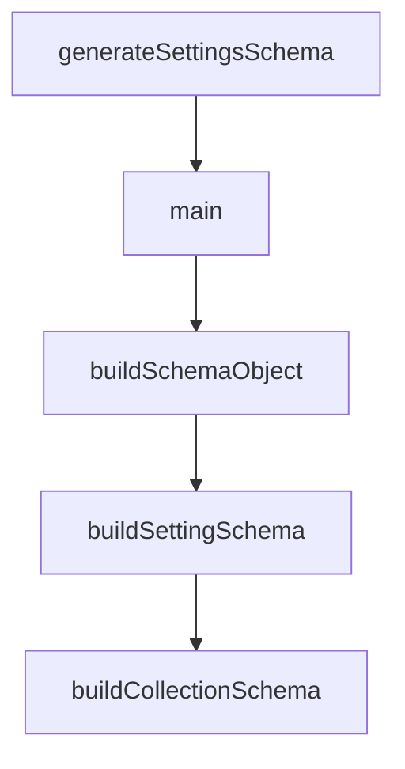

# Chapter 5: MCP, Extensions, and Skills

Welcome to **Chapter 5: MCP, Extensions, and Skills**. In this part of **Gemini CLI Tutorial: Terminal-First Agent Workflows with Google Gemini**, you will build an intuitive mental model first, then move into concrete implementation details and practical production tradeoffs.


This chapter covers extensibility through MCP servers, extension packs, and skills.

## Learning Goals

- configure and validate MCP server connections
- understand extension packaging and lifecycle controls
- install and manage skills across scopes
- apply safe defaults for third-party extension surfaces

## MCP Integration Basics

Configure MCP servers in Gemini settings and verify discovery:

- use `/mcp` for runtime visibility
- validate authentication and connection state per server
- test tool execution with low-risk read-only tasks first

## Extensions and Skills

- extensions package commands, hooks, MCP configs, and assets
- skills provide structured domain guidance with controlled activation
- both can be managed from CLI command surfaces

## Security Baseline

- install only trusted sources
- keep extension inventory minimal and reviewed
- isolate experimental integrations from critical workflows

## Source References

- [MCP Server Docs](https://github.com/google-gemini/gemini-cli/blob/main/docs/tools/mcp-server.md)
- [Extensions Docs](https://github.com/google-gemini/gemini-cli/blob/main/docs/extensions/index.md)
- [Skills Docs](https://github.com/google-gemini/gemini-cli/blob/main/docs/cli/skills.md)

## Summary

You now have an extensibility model that balances capability and control.

Next: [Chapter 6: Headless Mode and CI Automation](06-headless-mode-and-ci-automation.md)

## Depth Expansion Playbook

## Source Code Walkthrough

### `scripts/generate-settings-schema.ts`

The `generateSettingsSchema` function in [`scripts/generate-settings-schema.ts`](https://github.com/google-gemini/gemini-cli/blob/HEAD/scripts/generate-settings-schema.ts) handles a key part of this chapter's functionality:

```ts
}

export async function generateSettingsSchema(
  options: GenerateOptions,
): Promise<void> {
  const repoRoot = path.resolve(
    path.dirname(fileURLToPath(import.meta.url)),
    '..',
  );
  const outputPath = path.join(repoRoot, ...OUTPUT_RELATIVE_PATH);
  await mkdir(path.dirname(outputPath), { recursive: true });

  const schemaObject = buildSchemaObject(getSettingsSchema());
  const formatted = await formatWithPrettier(
    JSON.stringify(schemaObject, null, 2),
    outputPath,
  );

  let existing: string | undefined;
  try {
    existing = await readFile(outputPath, 'utf8');
  } catch (error) {
    if ((error as NodeJS.ErrnoException).code !== 'ENOENT') {
      throw error;
    }
  }

  if (
    existing &&
    normalizeForCompare(existing) === normalizeForCompare(formatted)
  ) {
    if (!options.checkOnly) {
```

This function is important because it defines how Gemini CLI Tutorial: Terminal-First Agent Workflows with Google Gemini implements the patterns covered in this chapter.

### `scripts/generate-settings-schema.ts`

The `main` function in [`scripts/generate-settings-schema.ts`](https://github.com/google-gemini/gemini-cli/blob/HEAD/scripts/generate-settings-schema.ts) handles a key part of this chapter's functionality:

```ts
const OUTPUT_RELATIVE_PATH = ['schemas', 'settings.schema.json'];
const SCHEMA_ID =
  'https://raw.githubusercontent.com/google-gemini/gemini-cli/main/schemas/settings.schema.json';

type JsonPrimitive = string | number | boolean | null;
type JsonValue = JsonPrimitive | JsonValue[] | { [key: string]: JsonValue };

interface JsonSchema {
  [key: string]: JsonValue | JsonSchema | JsonSchema[] | undefined;
  $schema?: string;
  $id?: string;
  title?: string;
  description?: string;
  markdownDescription?: string;
  type?: string | string[];
  enum?: JsonPrimitive[];
  default?: JsonValue;
  properties?: Record<string, JsonSchema>;
  items?: JsonSchema;
  additionalProperties?: boolean | JsonSchema;
  required?: string[];
  $ref?: string;
  anyOf?: JsonSchema[];
}

interface GenerateOptions {
  checkOnly: boolean;
}

export async function generateSettingsSchema(
  options: GenerateOptions,
): Promise<void> {
```

This function is important because it defines how Gemini CLI Tutorial: Terminal-First Agent Workflows with Google Gemini implements the patterns covered in this chapter.

### `scripts/generate-settings-schema.ts`

The `buildSchemaObject` function in [`scripts/generate-settings-schema.ts`](https://github.com/google-gemini/gemini-cli/blob/HEAD/scripts/generate-settings-schema.ts) handles a key part of this chapter's functionality:

```ts
  await mkdir(path.dirname(outputPath), { recursive: true });

  const schemaObject = buildSchemaObject(getSettingsSchema());
  const formatted = await formatWithPrettier(
    JSON.stringify(schemaObject, null, 2),
    outputPath,
  );

  let existing: string | undefined;
  try {
    existing = await readFile(outputPath, 'utf8');
  } catch (error) {
    if ((error as NodeJS.ErrnoException).code !== 'ENOENT') {
      throw error;
    }
  }

  if (
    existing &&
    normalizeForCompare(existing) === normalizeForCompare(formatted)
  ) {
    if (!options.checkOnly) {
      console.log('Settings JSON schema already up to date.');
    }
    return;
  }

  if (options.checkOnly) {
    console.error(
      'Settings JSON schema is out of date. Run `npm run schema:settings` to regenerate.',
    );
    process.exitCode = 1;
```

This function is important because it defines how Gemini CLI Tutorial: Terminal-First Agent Workflows with Google Gemini implements the patterns covered in this chapter.

### `scripts/generate-settings-schema.ts`

The `buildSettingSchema` function in [`scripts/generate-settings-schema.ts`](https://github.com/google-gemini/gemini-cli/blob/HEAD/scripts/generate-settings-schema.ts) handles a key part of this chapter's functionality:

```ts

  for (const [key, definition] of Object.entries(schema)) {
    root.properties![key] = buildSettingSchema(definition, [key], defs);
  }

  if (defs.size > 0) {
    root.$defs = Object.fromEntries(defs.entries());
  }

  return root;
}

function buildSettingSchema(
  definition: SettingDefinition,
  pathSegments: string[],
  defs: Map<string, JsonSchema>,
): JsonSchema {
  const base: JsonSchema = {
    title: definition.label,
    description: definition.description,
    markdownDescription: buildMarkdownDescription(definition),
  };

  if (definition.default !== undefined) {
    base.default = definition.default as JsonValue;
  }

  const schemaShape = definition.ref
    ? buildRefSchema(definition.ref, defs)
    : buildSchemaForType(definition, pathSegments, defs);

  return { ...base, ...schemaShape };
```

This function is important because it defines how Gemini CLI Tutorial: Terminal-First Agent Workflows with Google Gemini implements the patterns covered in this chapter.


## How These Components Connect


