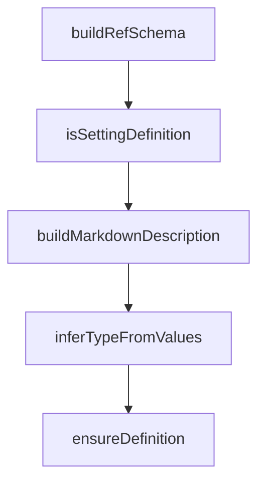

# Chapter 6: Headless Mode and CI Automation

Welcome to **Chapter 6: Headless Mode and CI Automation**. In this part of **Gemini CLI Tutorial: Terminal-First Agent Workflows with Google Gemini**, you will build an intuitive mental model first, then move into concrete implementation details and practical production tradeoffs.


This chapter shows how to run Gemini CLI in deterministic automation loops.

## Learning Goals

- run non-interactive prompts in scripts and CI jobs
- choose between text, JSON, and streaming JSON outputs
- parse response structures reliably for downstream steps
- integrate Gemini CLI with GitHub workflow automation

## Headless Patterns

### Basic text automation

```bash
gemini -p "Generate a changelog for this diff"
```

### Structured JSON output

```bash
gemini -p "Summarize test failures" --output-format json
```

### Event stream mode

```bash
gemini -p "Run release checklist" --output-format stream-json
```

## CI Integration Notes

- use explicit prompts with strict output contracts
- parse machine-readable output with resilient tooling
- fail fast on non-zero exit codes and invalid JSON

## Source References

- [Headless Mode Docs](https://github.com/google-gemini/gemini-cli/blob/main/docs/cli/headless.md)
- [CLI Reference](https://github.com/google-gemini/gemini-cli/blob/main/docs/cli/cli-reference.md)
- [GitHub Action Integration](https://github.com/google-github-actions/run-gemini-cli)

## Summary

You now have practical patterns for scriptable and CI-safe Gemini CLI execution.

Next: [Chapter 7: Sandboxing, Security, and Troubleshooting](07-sandboxing-security-and-troubleshooting.md)

## Depth Expansion Playbook

## Source Code Walkthrough

### `scripts/generate-settings-schema.ts`

The `buildRefSchema` function in [`scripts/generate-settings-schema.ts`](https://github.com/google-gemini/gemini-cli/blob/HEAD/scripts/generate-settings-schema.ts) handles a key part of this chapter's functionality:

```ts

  const schemaShape = definition.ref
    ? buildRefSchema(definition.ref, defs)
    : buildSchemaForType(definition, pathSegments, defs);

  return { ...base, ...schemaShape };
}

function buildCollectionSchema(
  collection: SettingCollectionDefinition,
  pathSegments: string[],
  defs: Map<string, JsonSchema>,
): JsonSchema {
  if (collection.ref) {
    return buildRefSchema(collection.ref, defs);
  }
  return buildSchemaForType(collection, pathSegments, defs);
}

function buildSchemaForType(
  source: SettingDefinition | SettingCollectionDefinition,
  pathSegments: string[],
  defs: Map<string, JsonSchema>,
): JsonSchema {
  switch (source.type) {
    case 'boolean':
    case 'string':
    case 'number':
      return { type: source.type };
    case 'enum':
      return buildEnumSchema(source.options);
    case 'array': {
```

This function is important because it defines how Gemini CLI Tutorial: Terminal-First Agent Workflows with Google Gemini implements the patterns covered in this chapter.

### `scripts/generate-settings-schema.ts`

The `isSettingDefinition` function in [`scripts/generate-settings-schema.ts`](https://github.com/google-gemini/gemini-cli/blob/HEAD/scripts/generate-settings-schema.ts) handles a key part of this chapter's functionality:

```ts
    case 'array': {
      const itemPath = [...pathSegments, '<items>'];
      const items = isSettingDefinition(source)
        ? source.items
          ? buildCollectionSchema(source.items, itemPath, defs)
          : {}
        : source.properties
          ? buildInlineObjectSchema(source.properties, itemPath, defs)
          : {};
      return { type: 'array', items };
    }
    case 'object':
      return isSettingDefinition(source)
        ? buildObjectDefinitionSchema(source, pathSegments, defs)
        : buildObjectCollectionSchema(source, pathSegments, defs);
    default:
      return {};
  }
}

function buildEnumSchema(
  options:
    | SettingDefinition['options']
    | SettingCollectionDefinition['options'],
): JsonSchema {
  const values = options?.map((option) => option.value) ?? [];
  const inferred = inferTypeFromValues(values);
  return {
    type: inferred ?? undefined,
    enum: values,
  };
}
```

This function is important because it defines how Gemini CLI Tutorial: Terminal-First Agent Workflows with Google Gemini implements the patterns covered in this chapter.

### `scripts/generate-settings-schema.ts`

The `buildMarkdownDescription` function in [`scripts/generate-settings-schema.ts`](https://github.com/google-gemini/gemini-cli/blob/HEAD/scripts/generate-settings-schema.ts) handles a key part of this chapter's functionality:

```ts
    title: definition.label,
    description: definition.description,
    markdownDescription: buildMarkdownDescription(definition),
  };

  if (definition.default !== undefined) {
    base.default = definition.default as JsonValue;
  }

  const schemaShape = definition.ref
    ? buildRefSchema(definition.ref, defs)
    : buildSchemaForType(definition, pathSegments, defs);

  return { ...base, ...schemaShape };
}

function buildCollectionSchema(
  collection: SettingCollectionDefinition,
  pathSegments: string[],
  defs: Map<string, JsonSchema>,
): JsonSchema {
  if (collection.ref) {
    return buildRefSchema(collection.ref, defs);
  }
  return buildSchemaForType(collection, pathSegments, defs);
}

function buildSchemaForType(
  source: SettingDefinition | SettingCollectionDefinition,
  pathSegments: string[],
  defs: Map<string, JsonSchema>,
): JsonSchema {
```

This function is important because it defines how Gemini CLI Tutorial: Terminal-First Agent Workflows with Google Gemini implements the patterns covered in this chapter.

### `scripts/generate-settings-schema.ts`

The `inferTypeFromValues` function in [`scripts/generate-settings-schema.ts`](https://github.com/google-gemini/gemini-cli/blob/HEAD/scripts/generate-settings-schema.ts) handles a key part of this chapter's functionality:

```ts
): JsonSchema {
  const values = options?.map((option) => option.value) ?? [];
  const inferred = inferTypeFromValues(values);
  return {
    type: inferred ?? undefined,
    enum: values,
  };
}

function buildObjectDefinitionSchema(
  definition: SettingDefinition,
  pathSegments: string[],
  defs: Map<string, JsonSchema>,
): JsonSchema {
  const properties = definition.properties
    ? buildObjectProperties(definition.properties, pathSegments, defs)
    : undefined;

  const schema: JsonSchema = {
    type: 'object',
  };

  if (properties && Object.keys(properties).length > 0) {
    schema.properties = properties;
  }

  if (definition.additionalProperties) {
    schema.additionalProperties = buildCollectionSchema(
      definition.additionalProperties,
      [...pathSegments, '<additionalProperties>'],
      defs,
    );
```

This function is important because it defines how Gemini CLI Tutorial: Terminal-First Agent Workflows with Google Gemini implements the patterns covered in this chapter.


## How These Components Connect


