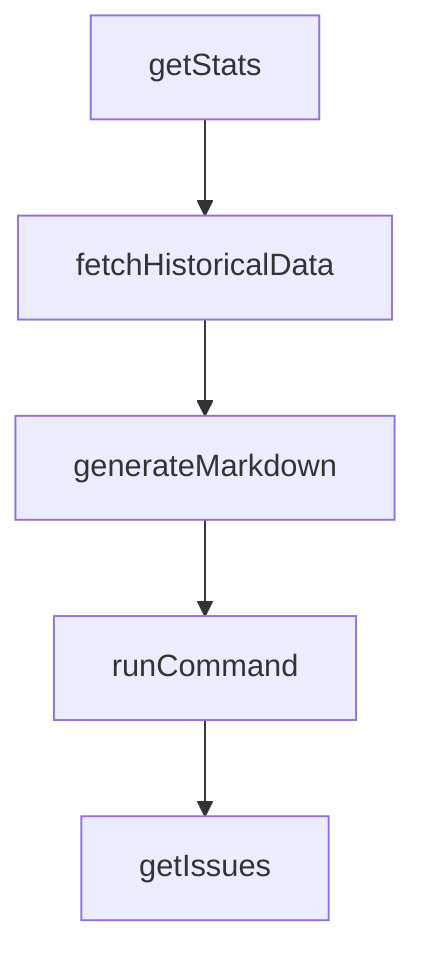

# Chapter 6: Headless Mode and CI Automation

Welcome to **Chapter 6: Headless Mode and CI Automation**. In this part of **Gemini CLI Tutorial: Terminal-First Agent Workflows with Google Gemini**, you will build an intuitive mental model first, then move into concrete implementation details and practical production tradeoffs.


This chapter shows how to run Gemini CLI in deterministic automation loops.

## Learning Goals

- run non-interactive prompts in scripts and CI jobs
- choose between text, JSON, and streaming JSON outputs
- parse response structures reliably for downstream steps
- integrate Gemini CLI with GitHub workflow automation

## Headless Patterns

### Basic text automation

```bash
gemini -p "Generate a changelog for this diff"
```

### Structured JSON output

```bash
gemini -p "Summarize test failures" --output-format json
```

### Event stream mode

```bash
gemini -p "Run release checklist" --output-format stream-json
```

## CI Integration Notes

- use explicit prompts with strict output contracts
- parse machine-readable output with resilient tooling
- fail fast on non-zero exit codes and invalid JSON

## Source References

- [Headless Mode Docs](https://github.com/google-gemini/gemini-cli/blob/main/docs/cli/headless.md)
- [CLI Reference](https://github.com/google-gemini/gemini-cli/blob/main/docs/cli/cli-reference.md)
- [GitHub Action Integration](https://github.com/google-github-actions/run-gemini-cli)

## Summary

You now have practical patterns for scriptable and CI-safe Gemini CLI execution.

Next: [Chapter 7: Sandboxing, Security, and Troubleshooting](07-sandboxing-security-and-troubleshooting.md)

## Source Code Walkthrough

### `scripts/aggregate_evals.js`

The `getStats` function in [`scripts/aggregate_evals.js`](https://github.com/google-gemini/gemini-cli/blob/HEAD/scripts/aggregate_evals.js) handles a key part of this chapter's functionality:

```js
}

function getStats(reports) {
  // Structure: { [model]: { [testName]: { passed, failed, total } } }
  const statsByModel = {};

  for (const reportPath of reports) {
    try {
      const model = getModelFromPath(reportPath);
      if (!statsByModel[model]) {
        statsByModel[model] = {};
      }
      const testStats = statsByModel[model];

      const content = fs.readFileSync(reportPath, 'utf-8');
      const json = JSON.parse(content);

      for (const testResult of json.testResults) {
        for (const assertion of testResult.assertionResults) {
          const name = assertion.title;
          if (!testStats[name]) {
            testStats[name] = { passed: 0, failed: 0, total: 0 };
          }
          testStats[name].total++;
          if (assertion.status === 'passed') {
            testStats[name].passed++;
          } else {
            testStats[name].failed++;
          }
        }
      }
    } catch (error) {
```

This function is important because it defines how Gemini CLI Tutorial: Terminal-First Agent Workflows with Google Gemini implements the patterns covered in this chapter.

### `scripts/aggregate_evals.js`

The `fetchHistoricalData` function in [`scripts/aggregate_evals.js`](https://github.com/google-gemini/gemini-cli/blob/HEAD/scripts/aggregate_evals.js) handles a key part of this chapter's functionality:

```js
}

function fetchHistoricalData() {
  const history = [];

  try {
    // Determine branch
    const branch = 'main';

    // Get recent runs
    const cmd = `gh run list --workflow evals-nightly.yml --branch "${branch}" --limit ${
      MAX_HISTORY + 5
    } --json databaseId,createdAt,url,displayTitle,status,conclusion`;
    const runsJson = execSync(cmd, { encoding: 'utf-8' });
    let runs = JSON.parse(runsJson);

    // Filter out current run
    const currentRunId = process.env.GITHUB_RUN_ID;
    if (currentRunId) {
      runs = runs.filter((r) => r.databaseId.toString() !== currentRunId);
    }

    // Filter for runs that likely have artifacts (completed) and take top N
    // We accept 'failure' too because we want to see stats.
    runs = runs.filter((r) => r.status === 'completed').slice(0, MAX_HISTORY);

    // Fetch artifacts for each run
    for (const run of runs) {
      const tmpDir = fs.mkdtempSync(
        path.join(os.tmpdir(), `gemini-evals-${run.databaseId}-`),
      );
      try {
```

This function is important because it defines how Gemini CLI Tutorial: Terminal-First Agent Workflows with Google Gemini implements the patterns covered in this chapter.

### `scripts/aggregate_evals.js`

The `generateMarkdown` function in [`scripts/aggregate_evals.js`](https://github.com/google-gemini/gemini-cli/blob/HEAD/scripts/aggregate_evals.js) handles a key part of this chapter's functionality:

```js
}

function generateMarkdown(currentStatsByModel, history) {
  console.log('### Evals Nightly Summary\n');
  console.log(
    'See [evals/README.md](https://github.com/google-gemini/gemini-cli/tree/main/evals) for more details.\n',
  );

  // Reverse history to show oldest first
  const reversedHistory = [...history].reverse();

  const models = Object.keys(currentStatsByModel).sort();

  const getPassRate = (statsForModel) => {
    if (!statsForModel) return '-';
    const totalStats = Object.values(statsForModel).reduce(
      (acc, stats) => {
        acc.passed += stats.passed;
        acc.total += stats.total;
        return acc;
      },
      { passed: 0, total: 0 },
    );
    return totalStats.total > 0
      ? ((totalStats.passed / totalStats.total) * 100).toFixed(1) + '%'
      : '-';
  };

  for (const model of models) {
    const currentStats = currentStatsByModel[model];
    const totalPassRate = getPassRate(currentStats);

```

This function is important because it defines how Gemini CLI Tutorial: Terminal-First Agent Workflows with Google Gemini implements the patterns covered in this chapter.

### `scripts/sync_project_dry_run.js`

The `runCommand` function in [`scripts/sync_project_dry_run.js`](https://github.com/google-gemini/gemini-cli/blob/HEAD/scripts/sync_project_dry_run.js) handles a key part of this chapter's functionality:

```js
const FORCE_INCLUDE_LABELS = ['🔒 maintainer only'];

function runCommand(command) {
  try {
    return execSync(command, {
      encoding: 'utf8',
      stdio: ['ignore', 'pipe', 'ignore'],
      maxBuffer: 10 * 1024 * 1024,
    });
  } catch {
    return null;
  }
}

function getIssues(repo) {
  console.log(`Fetching open issues from ${repo}...`);
  const json = runCommand(
    `gh issue list --repo ${repo} --state open --limit 3000 --json number,title,url,labels`,
  );
  if (!json) {
    return [];
  }
  return JSON.parse(json);
}

function getIssueBody(repo, number) {
  const json = runCommand(
    `gh issue view ${number} --repo ${repo} --json body,title,url,number`,
  );
  if (!json) {
    return null;
  }
```

This function is important because it defines how Gemini CLI Tutorial: Terminal-First Agent Workflows with Google Gemini implements the patterns covered in this chapter.


## How These Components Connect


