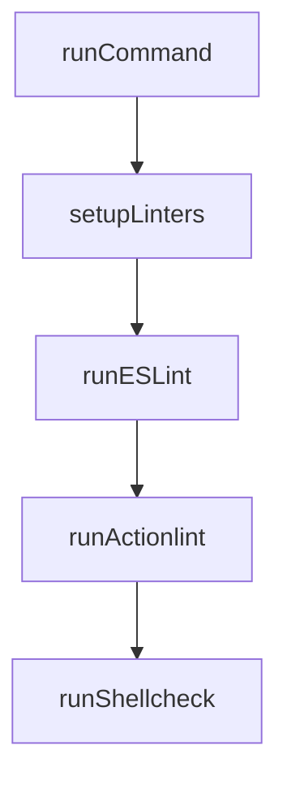

# Chapter 7: Sandboxing, Security, and Troubleshooting

Welcome to **Chapter 7: Sandboxing, Security, and Troubleshooting**. In this part of **Gemini CLI Tutorial: Terminal-First Agent Workflows with Google Gemini**, you will build an intuitive mental model first, then move into concrete implementation details and practical production tradeoffs.


This chapter focuses on safe execution and common failure recovery.

## Learning Goals

- enable and validate sandbox modes
- reason about trusted-folder and execution-risk controls
- troubleshoot auth, command, and environment failures
- establish repeatable incident diagnosis loops

## Sandboxing Modes

Gemini CLI supports host and containerized approaches depending on platform constraints.

- macOS Seatbelt for local constrained execution
- Docker/Podman container sandboxing for broader isolation

## Practical Security Controls

- use trusted-folder policies intentionally
- constrain risky operations in shared environments
- prefer read-only validation tasks for first-run integrations

## Troubleshooting Focus Areas

- authentication and login failures
- model/access configuration conflicts
- MCP server connectivity and auth issues
- sandbox setup and runtime environment mismatches

## Source References

- [Sandboxing Docs](https://github.com/google-gemini/gemini-cli/blob/main/docs/cli/sandbox.md)
- [Trusted Folders Docs](https://github.com/google-gemini/gemini-cli/blob/main/docs/cli/trusted-folders.md)
- [Troubleshooting Guide](https://github.com/google-gemini/gemini-cli/blob/main/docs/troubleshooting.md)
- [Security Policy](https://github.com/google-gemini/gemini-cli/blob/main/SECURITY.md)

## Summary

You now have a reliability and risk-control playbook for Gemini CLI operations.

Next: [Chapter 8: Contribution Workflow and Enterprise Operations](08-contribution-workflow-and-enterprise-operations.md)

## Source Code Walkthrough

### `scripts/lint.js`

The `runCommand` function in [`scripts/lint.js`](https://github.com/google-gemini/gemini-cli/blob/HEAD/scripts/lint.js) handles a key part of this chapter's functionality:

```js
};

function runCommand(command, stdio = 'inherit') {
  try {
    const env = { ...process.env };
    const nodeBin = join(process.cwd(), 'node_modules', '.bin');
    const sep = isWindows ? ';' : ':';
    const pythonBin = isWindows
      ? join(PYTHON_VENV_PATH, 'Scripts')
      : join(PYTHON_VENV_PATH, 'bin');
    // Windows sometimes uses 'Path' instead of 'PATH'
    const pathKey = 'Path' in env ? 'Path' : 'PATH';
    env[pathKey] = [
      nodeBin,
      join(TEMP_DIR, 'actionlint'),
      join(TEMP_DIR, 'shellcheck'),
      pythonBin,
      env[pathKey],
    ].join(sep);
    execSync(command, { stdio, env, shell: true });
    return true;
  } catch {
    return false;
  }
}

export function setupLinters() {
  console.log('Setting up linters...');
  if (!process.env.GEMINI_LINT_TEMP_DIR) {
    rmSync(TEMP_DIR, { recursive: true, force: true });
  }
  mkdirSync(TEMP_DIR, { recursive: true });
```

This function is important because it defines how Gemini CLI Tutorial: Terminal-First Agent Workflows with Google Gemini implements the patterns covered in this chapter.

### `scripts/lint.js`

The `setupLinters` function in [`scripts/lint.js`](https://github.com/google-gemini/gemini-cli/blob/HEAD/scripts/lint.js) handles a key part of this chapter's functionality:

```js
}

export function setupLinters() {
  console.log('Setting up linters...');
  if (!process.env.GEMINI_LINT_TEMP_DIR) {
    rmSync(TEMP_DIR, { recursive: true, force: true });
  }
  mkdirSync(TEMP_DIR, { recursive: true });

  for (const linter in LINTERS) {
    const { check, installer } = LINTERS[linter];
    if (!runCommand(check, 'ignore')) {
      console.log(`Installing ${linter}...`);
      if (!runCommand(installer)) {
        console.error(
          `Failed to install ${linter}. Please install it manually.`,
        );
        process.exit(1);
      }
    }
  }
  console.log('All required linters are available.');
}

export function runESLint() {
  console.log('\nRunning ESLint...');
  if (!runCommand('npm run lint')) {
    process.exit(1);
  }
}

export function runActionlint() {
```

This function is important because it defines how Gemini CLI Tutorial: Terminal-First Agent Workflows with Google Gemini implements the patterns covered in this chapter.

### `scripts/lint.js`

The `runESLint` function in [`scripts/lint.js`](https://github.com/google-gemini/gemini-cli/blob/HEAD/scripts/lint.js) handles a key part of this chapter's functionality:

```js
}

export function runESLint() {
  console.log('\nRunning ESLint...');
  if (!runCommand('npm run lint')) {
    process.exit(1);
  }
}

export function runActionlint() {
  console.log('\nRunning actionlint...');
  if (!runCommand(LINTERS.actionlint.run)) {
    process.exit(1);
  }
}

export function runShellcheck() {
  console.log('\nRunning shellcheck...');
  if (!runCommand(LINTERS.shellcheck.run)) {
    process.exit(1);
  }
}

export function runYamllint() {
  console.log('\nRunning yamllint...');
  if (!runCommand(LINTERS.yamllint.run)) {
    process.exit(1);
  }
}

export function runPrettier() {
  console.log('\nRunning Prettier...');
```

This function is important because it defines how Gemini CLI Tutorial: Terminal-First Agent Workflows with Google Gemini implements the patterns covered in this chapter.

### `scripts/lint.js`

The `runActionlint` function in [`scripts/lint.js`](https://github.com/google-gemini/gemini-cli/blob/HEAD/scripts/lint.js) handles a key part of this chapter's functionality:

```js
}

export function runActionlint() {
  console.log('\nRunning actionlint...');
  if (!runCommand(LINTERS.actionlint.run)) {
    process.exit(1);
  }
}

export function runShellcheck() {
  console.log('\nRunning shellcheck...');
  if (!runCommand(LINTERS.shellcheck.run)) {
    process.exit(1);
  }
}

export function runYamllint() {
  console.log('\nRunning yamllint...');
  if (!runCommand(LINTERS.yamllint.run)) {
    process.exit(1);
  }
}

export function runPrettier() {
  console.log('\nRunning Prettier...');
  if (!runCommand('prettier --check .')) {
    console.log(
      'Prettier check failed. Please run "npm run format" to fix formatting issues.',
    );
    process.exit(1);
  }
}
```

This function is important because it defines how Gemini CLI Tutorial: Terminal-First Agent Workflows with Google Gemini implements the patterns covered in this chapter.


## How These Components Connect


