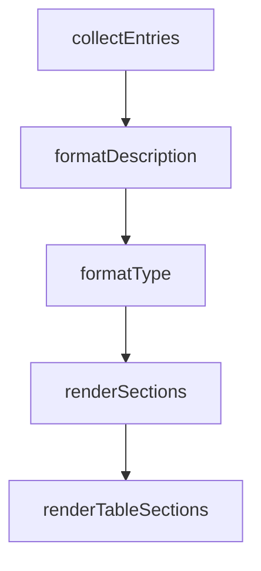

# Chapter 7: Sandboxing, Security, and Troubleshooting

Welcome to **Chapter 7: Sandboxing, Security, and Troubleshooting**. In this part of **Gemini CLI Tutorial: Terminal-First Agent Workflows with Google Gemini**, you will build an intuitive mental model first, then move into concrete implementation details and practical production tradeoffs.


This chapter focuses on safe execution and common failure recovery.

## Learning Goals

- enable and validate sandbox modes
- reason about trusted-folder and execution-risk controls
- troubleshoot auth, command, and environment failures
- establish repeatable incident diagnosis loops

## Sandboxing Modes

Gemini CLI supports host and containerized approaches depending on platform constraints.

- macOS Seatbelt for local constrained execution
- Docker/Podman container sandboxing for broader isolation

## Practical Security Controls

- use trusted-folder policies intentionally
- constrain risky operations in shared environments
- prefer read-only validation tasks for first-run integrations

## Troubleshooting Focus Areas

- authentication and login failures
- model/access configuration conflicts
- MCP server connectivity and auth issues
- sandbox setup and runtime environment mismatches

## Source References

- [Sandboxing Docs](https://github.com/google-gemini/gemini-cli/blob/main/docs/cli/sandbox.md)
- [Trusted Folders Docs](https://github.com/google-gemini/gemini-cli/blob/main/docs/cli/trusted-folders.md)
- [Troubleshooting Guide](https://github.com/google-gemini/gemini-cli/blob/main/docs/troubleshooting.md)
- [Security Policy](https://github.com/google-gemini/gemini-cli/blob/main/SECURITY.md)

## Summary

You now have a reliability and risk-control playbook for Gemini CLI operations.

Next: [Chapter 8: Contribution Workflow and Enterprise Operations](08-contribution-workflow-and-enterprise-operations.md)

## Depth Expansion Playbook

## Source Code Walkthrough

### `scripts/generate-settings-doc.ts`

The `collectEntries` function in [`scripts/generate-settings-doc.ts`](https://github.com/google-gemini/gemini-cli/blob/HEAD/scripts/generate-settings-doc.ts) handles a key part of this chapter's functionality:

```ts
  const { getSettingsSchema } = await loadSettingsSchemaModule();
  const schema = getSettingsSchema();
  const allSettingsSections = collectEntries(schema, { includeAll: true });
  const filteredSettingsSections = collectEntries(schema, {
    includeAll: false,
  });

  const generatedBlock = renderSections(allSettingsSections);
  const generatedTableBlock = renderTableSections(filteredSettingsSections);

  await updateFile(docPath, generatedBlock, checkOnly);
  await updateFile(cliSettingsDocPath, generatedTableBlock, checkOnly);
}

async function updateFile(
  filePath: string,
  newContent: string,
  checkOnly: boolean,
) {
  const doc = await readFile(filePath, 'utf8');
  const injectedDoc = injectBetweenMarkers({
    document: doc,
    startMarker: START_MARKER,
    endMarker: END_MARKER,
    newContent: newContent,
    paddingBefore: '\n',
    paddingAfter: '\n',
  });
  const formattedDoc = await formatWithPrettier(injectedDoc, filePath);

  if (normalizeForCompare(doc) === normalizeForCompare(formattedDoc)) {
    if (!checkOnly) {
```

This function is important because it defines how Gemini CLI Tutorial: Terminal-First Agent Workflows with Google Gemini implements the patterns covered in this chapter.

### `scripts/generate-settings-doc.ts`

The `formatDescription` function in [`scripts/generate-settings-doc.ts`](https://github.com/google-gemini/gemini-cli/blob/HEAD/scripts/generate-settings-doc.ts) handles a key part of this chapter's functionality:

```ts
          label: definition.label,
          category: definition.category,
          description: formatDescription(definition),
          defaultValue: formatDefaultValue(definition.default, {
            quoteStrings: true,
          }),
          requiresRestart: Boolean(definition.requiresRestart),
          enumValues: definition.options?.map((option) =>
            formatDefaultValue(option.value, { quoteStrings: true }),
          ),
        });
      }

      if (hasChildren && definition.properties) {
        visit(definition.properties, newPathSegments, sectionKey);
      }
    }
  };

  visit(schema, []);
  return sections;
}

function formatDescription(definition: SettingDefinition) {
  if (definition.description?.trim()) {
    return definition.description.trim();
  }
  return 'Description not provided.';
}

function formatType(definition: SettingDefinition): string {
  switch (definition.ref) {
```

This function is important because it defines how Gemini CLI Tutorial: Terminal-First Agent Workflows with Google Gemini implements the patterns covered in this chapter.

### `scripts/generate-settings-doc.ts`

The `formatType` function in [`scripts/generate-settings-doc.ts`](https://github.com/google-gemini/gemini-cli/blob/HEAD/scripts/generate-settings-doc.ts) handles a key part of this chapter's functionality:

```ts
        sections.get(sectionKey)!.push({
          path: newPathSegments.join('.'),
          type: formatType(definition),
          label: definition.label,
          category: definition.category,
          description: formatDescription(definition),
          defaultValue: formatDefaultValue(definition.default, {
            quoteStrings: true,
          }),
          requiresRestart: Boolean(definition.requiresRestart),
          enumValues: definition.options?.map((option) =>
            formatDefaultValue(option.value, { quoteStrings: true }),
          ),
        });
      }

      if (hasChildren && definition.properties) {
        visit(definition.properties, newPathSegments, sectionKey);
      }
    }
  };

  visit(schema, []);
  return sections;
}

function formatDescription(definition: SettingDefinition) {
  if (definition.description?.trim()) {
    return definition.description.trim();
  }
  return 'Description not provided.';
}
```

This function is important because it defines how Gemini CLI Tutorial: Terminal-First Agent Workflows with Google Gemini implements the patterns covered in this chapter.

### `scripts/generate-settings-doc.ts`

The `renderSections` function in [`scripts/generate-settings-doc.ts`](https://github.com/google-gemini/gemini-cli/blob/HEAD/scripts/generate-settings-doc.ts) handles a key part of this chapter's functionality:

```ts
  });

  const generatedBlock = renderSections(allSettingsSections);
  const generatedTableBlock = renderTableSections(filteredSettingsSections);

  await updateFile(docPath, generatedBlock, checkOnly);
  await updateFile(cliSettingsDocPath, generatedTableBlock, checkOnly);
}

async function updateFile(
  filePath: string,
  newContent: string,
  checkOnly: boolean,
) {
  const doc = await readFile(filePath, 'utf8');
  const injectedDoc = injectBetweenMarkers({
    document: doc,
    startMarker: START_MARKER,
    endMarker: END_MARKER,
    newContent: newContent,
    paddingBefore: '\n',
    paddingAfter: '\n',
  });
  const formattedDoc = await formatWithPrettier(injectedDoc, filePath);

  if (normalizeForCompare(doc) === normalizeForCompare(formattedDoc)) {
    if (!checkOnly) {
      console.log(
        `Settings documentation (${path.basename(filePath)}) already up to date.`,
      );
    }
    return;
```

This function is important because it defines how Gemini CLI Tutorial: Terminal-First Agent Workflows with Google Gemini implements the patterns covered in this chapter.


## How These Components Connect


