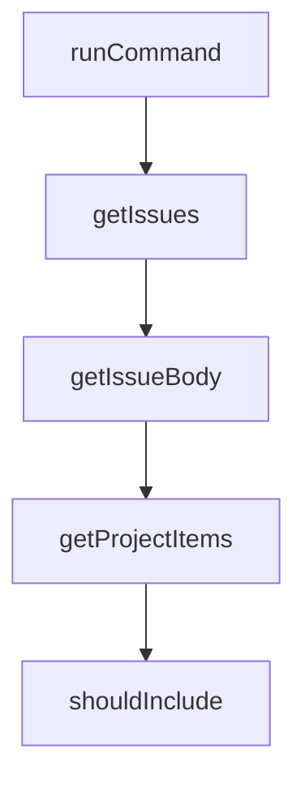

# Chapter 8: Contribution Workflow and Enterprise Operations

Welcome to **Chapter 8: Contribution Workflow and Enterprise Operations**. In this part of **Gemini CLI Tutorial: Terminal-First Agent Workflows with Google Gemini**, you will build an intuitive mental model first, then move into concrete implementation details and practical production tradeoffs.


This chapter covers contribution mechanics and team-scale operating patterns.

## Learning Goals

- contribute code/docs in alignment with project standards
- run local build/test/lint workflows before PRs
- adopt enterprise-oriented controls for reproducibility
- align release/channel strategy with risk tolerance

## Contribution Workflow

1. identify issue scope and ownership
2. branch and implement focused changes
3. run checks and update docs with behavior changes
4. submit PR with clear validation evidence

## Enterprise Operations Notes

- pin release channels (`latest`, `preview`, `nightly`) by environment
- standardize auth/model/config baselines for teams
- treat extension and MCP inventories as governed dependencies

## Source References

- [Contributing Guide](https://github.com/google-gemini/gemini-cli/blob/main/CONTRIBUTING.md)
- [Enterprise Docs](https://github.com/google-gemini/gemini-cli/blob/main/docs/cli/enterprise.md)
- [Release Cadence and Tags](https://github.com/google-gemini/gemini-cli/blob/main/README.md#release-cadence-and-tags)

## Summary

You now have an end-to-end strategy for adopting and contributing to Gemini CLI at team scale.

Next steps:

- standardize your team settings and command templates
- run pilot automation in headless mode with strict output contracts
- contribute one focused improvement with tests and docs

## Depth Expansion Playbook

## Source Code Walkthrough

### `scripts/sync_project_dry_run.js`

The `runCommand` function in [`scripts/sync_project_dry_run.js`](https://github.com/google-gemini/gemini-cli/blob/HEAD/scripts/sync_project_dry_run.js) handles a key part of this chapter's functionality:

```js
const FORCE_INCLUDE_LABELS = ['🔒 maintainer only'];

function runCommand(command) {
  try {
    return execSync(command, {
      encoding: 'utf8',
      stdio: ['ignore', 'pipe', 'ignore'],
      maxBuffer: 10 * 1024 * 1024,
    });
  } catch (_e) {
    return null;
  }
}

function getIssues(repo) {
  console.log(`Fetching open issues from ${repo}...`);
  const json = runCommand(
    `gh issue list --repo ${repo} --state open --limit 3000 --json number,title,url,labels`,
  );
  if (!json) {
    return [];
  }
  return JSON.parse(json);
}

function getIssueBody(repo, number) {
  const json = runCommand(
    `gh issue view ${number} --repo ${repo} --json body,title,url,number`,
  );
  if (!json) {
    return null;
  }
```

This function is important because it defines how Gemini CLI Tutorial: Terminal-First Agent Workflows with Google Gemini implements the patterns covered in this chapter.

### `scripts/sync_project_dry_run.js`

The `getIssues` function in [`scripts/sync_project_dry_run.js`](https://github.com/google-gemini/gemini-cli/blob/HEAD/scripts/sync_project_dry_run.js) handles a key part of this chapter's functionality:

```js
}

function getIssues(repo) {
  console.log(`Fetching open issues from ${repo}...`);
  const json = runCommand(
    `gh issue list --repo ${repo} --state open --limit 3000 --json number,title,url,labels`,
  );
  if (!json) {
    return [];
  }
  return JSON.parse(json);
}

function getIssueBody(repo, number) {
  const json = runCommand(
    `gh issue view ${number} --repo ${repo} --json body,title,url,number`,
  );
  if (!json) {
    return null;
  }
  return JSON.parse(json);
}

function getProjectItems() {
  console.log(`Fetching items from Project ${PROJECT_ID}...`);
  const json = runCommand(
    `gh project item-list ${PROJECT_ID} --owner ${ORG} --format json --limit 3000`,
  );
  if (!json) {
    return [];
  }
  return JSON.parse(json).items;
```

This function is important because it defines how Gemini CLI Tutorial: Terminal-First Agent Workflows with Google Gemini implements the patterns covered in this chapter.

### `scripts/sync_project_dry_run.js`

The `getIssueBody` function in [`scripts/sync_project_dry_run.js`](https://github.com/google-gemini/gemini-cli/blob/HEAD/scripts/sync_project_dry_run.js) handles a key part of this chapter's functionality:

```js
}

function getIssueBody(repo, number) {
  const json = runCommand(
    `gh issue view ${number} --repo ${repo} --json body,title,url,number`,
  );
  if (!json) {
    return null;
  }
  return JSON.parse(json);
}

function getProjectItems() {
  console.log(`Fetching items from Project ${PROJECT_ID}...`);
  const json = runCommand(
    `gh project item-list ${PROJECT_ID} --owner ${ORG} --format json --limit 3000`,
  );
  if (!json) {
    return [];
  }
  return JSON.parse(json).items;
}

function shouldInclude(issue) {
  const labels = issue.labels.map((l) => l.name);

  // Check Force Include first
  if (labels.some((l) => FORCE_INCLUDE_LABELS.includes(l))) {
    return true;
  }

  // Check Exclude
```

This function is important because it defines how Gemini CLI Tutorial: Terminal-First Agent Workflows with Google Gemini implements the patterns covered in this chapter.

### `scripts/sync_project_dry_run.js`

The `getProjectItems` function in [`scripts/sync_project_dry_run.js`](https://github.com/google-gemini/gemini-cli/blob/HEAD/scripts/sync_project_dry_run.js) handles a key part of this chapter's functionality:

```js
}

function getProjectItems() {
  console.log(`Fetching items from Project ${PROJECT_ID}...`);
  const json = runCommand(
    `gh project item-list ${PROJECT_ID} --owner ${ORG} --format json --limit 3000`,
  );
  if (!json) {
    return [];
  }
  return JSON.parse(json).items;
}

function shouldInclude(issue) {
  const labels = issue.labels.map((l) => l.name);

  // Check Force Include first
  if (labels.some((l) => FORCE_INCLUDE_LABELS.includes(l))) {
    return true;
  }

  // Check Exclude
  if (labels.some((l) => EXCLUDED_LABELS.includes(l))) {
    return false;
  }

  return true;
}

// Recursive function to find children
const visitedParents = new Set();
async function findChildren(repo, number, depth = 0) {
```

This function is important because it defines how Gemini CLI Tutorial: Terminal-First Agent Workflows with Google Gemini implements the patterns covered in this chapter.


## How These Components Connect


