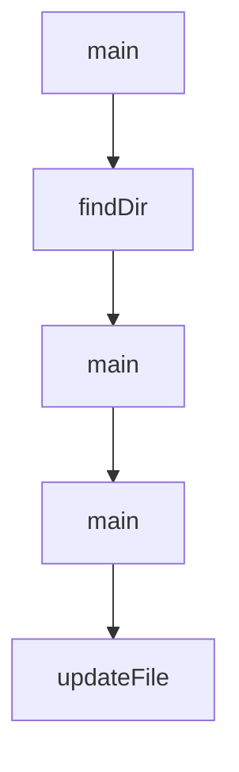

# Chapter 8: Contribution Workflow and Enterprise Operations

Welcome to **Chapter 8: Contribution Workflow and Enterprise Operations**. In this part of **Gemini CLI Tutorial: Terminal-First Agent Workflows with Google Gemini**, you will build an intuitive mental model first, then move into concrete implementation details and practical production tradeoffs.


This chapter covers contribution mechanics and team-scale operating patterns.

## Learning Goals

- contribute code/docs in alignment with project standards
- run local build/test/lint workflows before PRs
- adopt enterprise-oriented controls for reproducibility
- align release/channel strategy with risk tolerance

## Contribution Workflow

1. identify issue scope and ownership
2. branch and implement focused changes
3. run checks and update docs with behavior changes
4. submit PR with clear validation evidence

## Enterprise Operations Notes

- pin release channels (`latest`, `preview`, `nightly`) by environment
- standardize auth/model/config baselines for teams
- treat extension and MCP inventories as governed dependencies

## Source References

- [Contributing Guide](https://github.com/google-gemini/gemini-cli/blob/main/CONTRIBUTING.md)
- [Enterprise Docs](https://github.com/google-gemini/gemini-cli/blob/main/docs/cli/enterprise.md)
- [Release Cadence and Tags](https://github.com/google-gemini/gemini-cli/blob/main/README.md#release-cadence-and-tags)

## Summary

You now have an end-to-end strategy for adopting and contributing to Gemini CLI at team scale.

Next steps:

- standardize your team settings and command templates
- run pilot automation in headless mode with strict output contracts
- contribute one focused improvement with tests and docs

## Source Code Walkthrough

### `scripts/lint.js`

The `main` function in [`scripts/lint.js`](https://github.com/google-gemini/gemini-cli/blob/HEAD/scripts/lint.js) handles a key part of this chapter's functionality:

```js

  function getChangedFiles() {
    const baseRef = process.env.GITHUB_BASE_REF || 'main';
    try {
      execSync(`git fetch origin ${baseRef}`);
      const mergeBase = execSync(`git merge-base HEAD origin/${baseRef}`)
        .toString()
        .trim();
      return execSync(`git diff --name-only ${mergeBase}..HEAD`)
        .toString()
        .trim()
        .split('\n')
        .filter(Boolean);
    } catch {
      console.error(`Could not get changed files against origin/${baseRef}.`);
      try {
        console.log('Falling back to diff against HEAD~1');
        return execSync(`git diff --name-only HEAD~1..HEAD`)
          .toString()
          .trim()
          .split('\n')
          .filter(Boolean);
      } catch {
        console.error('Could not get changed files against HEAD~1 either.');
        process.exit(1);
      }
    }
  }

  const changedFiles = getChangedFiles();
  let violationsFound = false;

```

This function is important because it defines how Gemini CLI Tutorial: Terminal-First Agent Workflows with Google Gemini implements the patterns covered in this chapter.

### `evals/tool_output_masking.eval.ts`

The `findDir` function in [`evals/tool_output_masking.eval.ts`](https://github.com/google-gemini/gemini-cli/blob/HEAD/evals/tool_output_masking.eval.ts) handles a key part of this chapter's functionality:

```ts

// Recursive function to find a directory by name
function findDir(base: string, name: string): string | null {
  if (!fs.existsSync(base)) return null;
  const files = fs.readdirSync(base);
  for (const file of files) {
    const fullPath = path.join(base, file);
    if (fs.statSync(fullPath).isDirectory()) {
      if (file === name) return fullPath;
      const found = findDir(fullPath, name);
      if (found) return found;
    }
  }
  return null;
}

describe('Tool Output Masking Behavioral Evals', () => {
  /**
   * Scenario: The agent needs information that was masked in a previous turn.
   * It should recognize the <tool_output_masked> tag and use a tool to read the file.
   */
  evalTest('USUALLY_PASSES', {
    name: 'should attempt to read the redirected full output file when information is masked',
    params: {
      security: {
        folderTrust: {
          enabled: true,
        },
      },
    },
    prompt: '/help',
    assert: async (rig) => {
```

This function is important because it defines how Gemini CLI Tutorial: Terminal-First Agent Workflows with Google Gemini implements the patterns covered in this chapter.

### `scripts/local_telemetry.js`

The `main` function in [`scripts/local_telemetry.js`](https://github.com/google-gemini/gemini-cli/blob/HEAD/scripts/local_telemetry.js) handles a key part of this chapter's functionality:

```js
`;

async function main() {
  // 1. Ensure binaries are available, downloading if necessary.
  // Binaries are stored in the project's .gemini/otel/bin directory
  // to avoid modifying the user's system.
  if (!fileExists(BIN_DIR)) fs.mkdirSync(BIN_DIR, { recursive: true });

  const otelcolPath = await ensureBinary(
    'otelcol-contrib',
    'open-telemetry/opentelemetry-collector-releases',
    (version, platform, arch, ext) =>
      `otelcol-contrib_${version}_${platform}_${arch}.${ext}`,
    'otelcol-contrib',
    false, // isJaeger = false
  ).catch((e) => {
    console.error(`🛑 Error getting otelcol-contrib: ${e.message}`);
    return null;
  });
  if (!otelcolPath) process.exit(1);

  const jaegerPath = await ensureBinary(
    'jaeger',
    'jaegertracing/jaeger',
    (version, platform, arch, ext) =>
      `jaeger-${version}-${platform}-${arch}.${ext}`,
    'jaeger',
    true, // isJaeger = true
  ).catch((e) => {
    console.error(`🛑 Error getting jaeger: ${e.message}`);
    return null;
  });
```

This function is important because it defines how Gemini CLI Tutorial: Terminal-First Agent Workflows with Google Gemini implements the patterns covered in this chapter.

### `scripts/generate-settings-doc.ts`

The `main` function in [`scripts/generate-settings-doc.ts`](https://github.com/google-gemini/gemini-cli/blob/HEAD/scripts/generate-settings-doc.ts) handles a key part of this chapter's functionality:

```ts
}

export async function main(argv = process.argv.slice(2)) {
  const checkOnly = argv.includes('--check');

  await generateSettingsSchema({ checkOnly });

  const repoRoot = path.resolve(
    path.dirname(fileURLToPath(import.meta.url)),
    '..',
  );
  const docPath = path.join(repoRoot, 'docs/reference/configuration.md');
  const cliSettingsDocPath = path.join(repoRoot, 'docs/cli/settings.md');

  const { getSettingsSchema } = await loadSettingsSchemaModule();
  const schema = getSettingsSchema();
  const allSettingsSections = collectEntries(schema, { includeAll: true });
  const filteredSettingsSections = collectEntries(schema, {
    includeAll: false,
  });

  const generatedBlock = renderSections(allSettingsSections);
  const generatedTableBlock = renderTableSections(filteredSettingsSections);

  await updateFile(docPath, generatedBlock, checkOnly);
  await updateFile(cliSettingsDocPath, generatedTableBlock, checkOnly);
}

async function updateFile(
  filePath: string,
  newContent: string,
  checkOnly: boolean,
```

This function is important because it defines how Gemini CLI Tutorial: Terminal-First Agent Workflows with Google Gemini implements the patterns covered in this chapter.


## How These Components Connect


