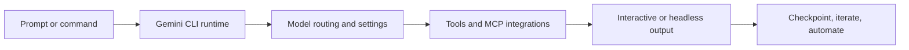

# Gemini CLI Tutorial: Terminal-First Agent Workflows with Google Gemini

> Learn how to use `google-gemini/gemini-cli` to run coding and operations workflows in terminal-first loops with strong tooling, MCP extensibility, headless automation, and safety controls.

## Why This Track Matters

Gemini CLI is now one of the largest open-source coding-agent CLIs and provides a full stack for interactive, scripted, and extensible AI-assisted development.

This track focuses on:

- getting stable local setup and authentication running quickly
- understanding settings, command surfaces, and model routing
- integrating MCP servers, extensions, and skills safely
- operating Gemini CLI in automation and production-adjacent workflows

## Current Snapshot (auto-updated)

- repository: [`google-gemini/gemini-cli`](https://github.com/google-gemini/gemini-cli)
- stars: about **94.3k**
- latest release: [`v0.28.2`](https://github.com/google-gemini/gemini-cli/releases/tag/v0.28.2)
- recent activity: updates on **February 12, 2026**
- project positioning: open-source Gemini-powered terminal AI agent with first-class docs and extension model

## Mental Model

## Chapter Guide

| Chapter | Key Question | Outcome |
|:--------|:-------------|:--------|
| [01 - Getting Started](01-getting-started.md) | How do I install and run Gemini CLI quickly? | Working baseline |
| [02 - Architecture, Tools, and Agent Loop](02-architecture-tools-and-agent-loop.md) | How does Gemini CLI orchestrate core behavior? | Strong execution mental model |
| [03 - Authentication and Model Access Strategy](03-authentication-and-model-access-strategy.md) | How do auth methods and model routing differ? | Stable access strategy |
| [04 - Settings, Context, and Custom Commands](04-settings-context-and-custom-commands.md) | How do I customize behavior without workflow drift? | Reproducible customization |
| [05 - MCP, Extensions, and Skills](05-mcp-extensions-and-skills.md) | How do I extend capabilities safely? | Better extensibility model |
| [06 - Headless Mode and CI Automation](06-headless-mode-and-ci-automation.md) | How do I run Gemini CLI in scripts and pipelines? | Automation readiness |
| [07 - Sandboxing, Security, and Troubleshooting](07-sandboxing-security-and-troubleshooting.md) | How do I reduce operational risk and recover quickly? | Reliability playbook |
| [08 - Contribution Workflow and Enterprise Operations](08-contribution-workflow-and-enterprise-operations.md) | How do teams contribute and standardize usage at scale? | Team adoption baseline |

## What You Will Learn

- how to operate Gemini CLI across interactive and scripted workflows
- how to configure model/auth/runtime settings for reliability
- how to connect MCP servers and extension systems safely
- how to deploy governance and contribution practices for teams

## Source References

- [Gemini CLI Repository](https://github.com/google-gemini/gemini-cli)
- [Gemini CLI README](https://github.com/google-gemini/gemini-cli/blob/main/README.md)
- [Gemini CLI Docs](https://geminicli.com/docs)
- [CLI Commands Docs](https://github.com/google-gemini/gemini-cli/blob/main/docs/cli/commands.md)
- [MCP Integration Docs](https://github.com/google-gemini/gemini-cli/blob/main/docs/tools/mcp-server.md)

## Related Tutorials

- [Codex CLI Tutorial](../codex-cli-tutorial/)
- [OpenCode Tutorial](../opencode-tutorial/)
- [Claude Code Tutorial](../claude-code-tutorial/)
- [MCP Servers Tutorial](../mcp-servers-tutorial/)

---

Start with [Chapter 1: Getting Started](01-getting-started.md).

## Navigation & Backlinks

- [Start Here: Chapter 1: Getting Started](01-getting-started.md)
- [Back to Main Catalog](../../README.md#-tutorial-catalog)
- [Browse A-Z Tutorial Directory](../../discoverability/tutorial-directory.md)
- [Search by Intent](../../discoverability/query-hub.md)
- [Explore Category Hubs](../../README.md#category-hubs)

## Full Chapter Map

1. [Chapter 1: Getting Started](01-getting-started.md)
2. [Chapter 2: Architecture, Tools, and Agent Loop](02-architecture-tools-and-agent-loop.md)
3. [Chapter 3: Authentication and Model Access Strategy](03-authentication-and-model-access-strategy.md)
4. [Chapter 4: Settings, Context, and Custom Commands](04-settings-context-and-custom-commands.md)
5. [Chapter 5: MCP, Extensions, and Skills](05-mcp-extensions-and-skills.md)
6. [Chapter 6: Headless Mode and CI Automation](06-headless-mode-and-ci-automation.md)
7. [Chapter 7: Sandboxing, Security, and Troubleshooting](07-sandboxing-security-and-troubleshooting.md)
8. [Chapter 8: Contribution Workflow and Enterprise Operations](08-contribution-workflow-and-enterprise-operations.md)

*Generated by [AI Codebase Knowledge Builder](https://github.com/The-Pocket/Tutorial-Codebase-Knowledge)*
