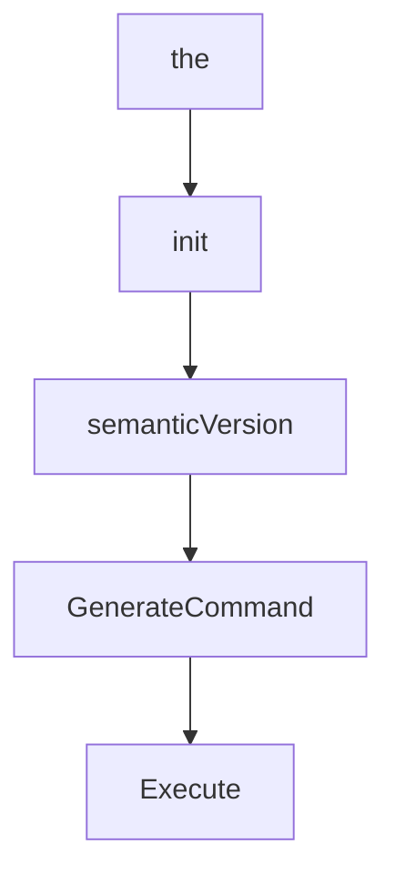

# Chapter 1: Getting Started

Welcome to **Chapter 1: Getting Started**. In this part of **GenAI Toolbox Tutorial: MCP-First Database Tooling with Config-Driven Control Planes**, you will build an intuitive mental model first, then move into concrete implementation details and practical production tradeoffs.


This chapter gets a local Toolbox instance running against a real database quickly.

## Learning Goals

- run Toolbox with a minimal `tools.yaml`
- connect a local database and verify first tool execution
- understand quickstart differences between MCP and SDK workflows
- establish a repeatable local baseline before extending scope

## Fast Start Loop

1. prepare database prerequisites (for example PostgreSQL)
2. define `sources` and one tool in `tools.yaml`
3. run Toolbox (`npx @toolbox-sdk/server --tools-file tools.yaml` or local binary)
4. connect from an SDK or MCP client and execute the tool
5. capture working config as your baseline template

## Source References

- [README Quickstart](https://github.com/googleapis/genai-toolbox/blob/main/README.md)
- [Python Local Quickstart](https://github.com/googleapis/genai-toolbox/blob/main/docs/en/getting-started/local_quickstart.md)
- [Toolbox Server README](https://github.com/googleapis/genai-toolbox/blob/main/docs/TOOLBOX_README.md)

## Summary

You now have a validated local loop for running and invoking Toolbox tools.

Next: [Chapter 2: Architecture and Control Plane](02-architecture-and-control-plane.md)

## Source Code Walkthrough

### `server.json`

The `the` interface in [`server.json`](https://github.com/googleapis/genai-toolbox/blob/HEAD/server.json) handles a key part of this chapter's functionality:

```json
                    "type": "named",
                    "name": "--config",
                    "description": "File path specifying the tool configuration.",
                    "default": "tools.yaml",
                    "isRequired": false
                },
                {
                    "type": "named",
                    "name": "--configs",
                    "description": "Multiple file paths specifying tool configurations. Files will be merged. Cannot be used with –-config or –-config-folder.",
                    "isRequired": false
                },
                {
                    "type": "named",
                    "name": "--config-folder",
                    "description": "Directory path containing YAML tool configuration files. All .yaml and .yml files in the directory will be loaded and merged. Cannot be used with –-config or –-configs.",
                    "isRequired": false
                },
                {
                    "type": "named",
                    "name": "--address",
                    "valueHint": "host",
                    "description": "Address of the interface the server will listen on.",
                    "value": "{host}",
                    "variables": {
                        "host": {
                            "description": "ip address",
                            "isRequired": true,
                            "default": "127.0.0.1"
                        }
                    }
                },
```

This interface is important because it defines how GenAI Toolbox Tutorial: MCP-First Database Tooling with Config-Driven Control Planes implements the patterns covered in this chapter.

### `cmd/root.go`

The `init` function in [`cmd/root.go`](https://github.com/googleapis/genai-toolbox/blob/HEAD/cmd/root.go) handles a key part of this chapter's functionality:

```go
)

func init() {
	versionString = semanticVersion()
}

// semanticVersion returns the version of the CLI including a compile-time metadata.
func semanticVersion() string {
	metadataStrings := []string{buildType, runtime.GOOS, runtime.GOARCH}
	if commitSha != "" {
		metadataStrings = append(metadataStrings, commitSha)
	}
	v := strings.TrimSpace(versionNum) + "+" + strings.Join(metadataStrings, ".")
	return v
}

// GenerateCommand returns a new Command object with the specified IO streams
// This is used for integration test package
func GenerateCommand(out, err io.Writer) *cobra.Command {
	opts := internal.NewToolboxOptions(internal.WithIOStreams(out, err))
	return NewCommand(opts)
}

// Execute adds all child commands to the root command and sets flags appropriately.
// This is called by main.main(). It only needs to happen once to the rootCmd.
func Execute() {
	// Initialize options
	opts := internal.NewToolboxOptions()

	if err := NewCommand(opts).Execute(); err != nil {
		exit := 1
		os.Exit(exit)
```

This function is important because it defines how GenAI Toolbox Tutorial: MCP-First Database Tooling with Config-Driven Control Planes implements the patterns covered in this chapter.

### `cmd/root.go`

The `semanticVersion` function in [`cmd/root.go`](https://github.com/googleapis/genai-toolbox/blob/HEAD/cmd/root.go) handles a key part of this chapter's functionality:

```go

func init() {
	versionString = semanticVersion()
}

// semanticVersion returns the version of the CLI including a compile-time metadata.
func semanticVersion() string {
	metadataStrings := []string{buildType, runtime.GOOS, runtime.GOARCH}
	if commitSha != "" {
		metadataStrings = append(metadataStrings, commitSha)
	}
	v := strings.TrimSpace(versionNum) + "+" + strings.Join(metadataStrings, ".")
	return v
}

// GenerateCommand returns a new Command object with the specified IO streams
// This is used for integration test package
func GenerateCommand(out, err io.Writer) *cobra.Command {
	opts := internal.NewToolboxOptions(internal.WithIOStreams(out, err))
	return NewCommand(opts)
}

// Execute adds all child commands to the root command and sets flags appropriately.
// This is called by main.main(). It only needs to happen once to the rootCmd.
func Execute() {
	// Initialize options
	opts := internal.NewToolboxOptions()

	if err := NewCommand(opts).Execute(); err != nil {
		exit := 1
		os.Exit(exit)
	}
```

This function is important because it defines how GenAI Toolbox Tutorial: MCP-First Database Tooling with Config-Driven Control Planes implements the patterns covered in this chapter.

### `cmd/root.go`

The `GenerateCommand` function in [`cmd/root.go`](https://github.com/googleapis/genai-toolbox/blob/HEAD/cmd/root.go) handles a key part of this chapter's functionality:

```go
}

// GenerateCommand returns a new Command object with the specified IO streams
// This is used for integration test package
func GenerateCommand(out, err io.Writer) *cobra.Command {
	opts := internal.NewToolboxOptions(internal.WithIOStreams(out, err))
	return NewCommand(opts)
}

// Execute adds all child commands to the root command and sets flags appropriately.
// This is called by main.main(). It only needs to happen once to the rootCmd.
func Execute() {
	// Initialize options
	opts := internal.NewToolboxOptions()

	if err := NewCommand(opts).Execute(); err != nil {
		exit := 1
		os.Exit(exit)
	}
}

// NewCommand returns a Command object representing an invocation of the CLI.
func NewCommand(opts *internal.ToolboxOptions) *cobra.Command {
	cmd := &cobra.Command{
		Use:           "toolbox",
		Version:       versionString,
		SilenceErrors: true,
	}

	// Do not print Usage on runtime error
	cmd.SilenceUsage = true

```

This function is important because it defines how GenAI Toolbox Tutorial: MCP-First Database Tooling with Config-Driven Control Planes implements the patterns covered in this chapter.


## How These Components Connect


