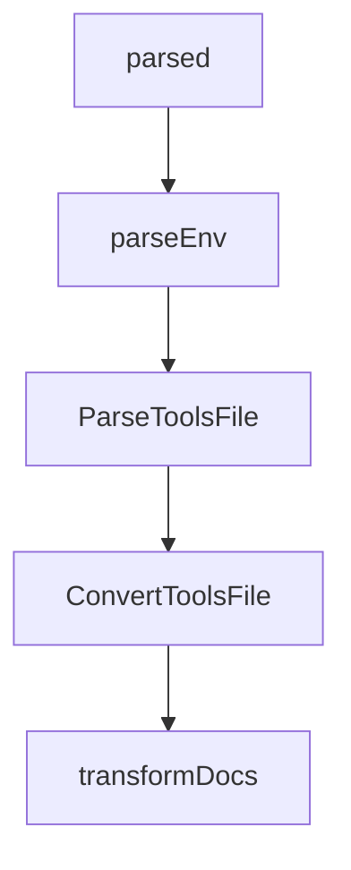

# Chapter 2: Architecture and Control Plane

Welcome to **Chapter 2: Architecture and Control Plane**. In this part of **GenAI Toolbox Tutorial: MCP-First Database Tooling with Config-Driven Control Planes**, you will build an intuitive mental model first, then move into concrete implementation details and practical production tradeoffs.


This chapter explains how Toolbox sits between agent frameworks and data systems.

## Learning Goals

- map the control-plane role of Toolbox in agent architectures
- understand why config-driven tool definitions reduce redeploy friction
- separate orchestration concerns from database execution concerns
- reason about shared tool reuse across multiple agents and apps

## Architecture Summary

Toolbox centralizes source and tool definitions, then exposes them to clients through consistent runtime interfaces. This lets teams evolve tooling and access patterns without continually rewriting integration code.

## Source References

- [README Architecture Section](https://github.com/googleapis/genai-toolbox/blob/main/README.md)
- [Introduction Docs](https://github.com/googleapis/genai-toolbox/blob/main/docs/en/getting-started/introduction/_index.md)

## Summary

You now understand how Toolbox provides a reusable orchestration layer for database-aware agents.

Next: [Chapter 3: `tools.yaml`: Sources, Tools, Toolsets, Prompts](03-tools-yaml-sources-tools-toolsets-prompts.md)

## Depth Expansion Playbook

## Source Code Walkthrough

### `cmd/internal/options.go`

The `parsed` interface in [`cmd/internal/options.go`](https://github.com/googleapis/genai-toolbox/blob/HEAD/cmd/internal/options.go) handles a key part of this chapter's functionality:

```go

			// Parse into ToolsFile struct
			parsed, err := parser.ParseToolsFile(ctx, buf)
			if err != nil {
				errMsg := fmt.Errorf("unable to parse prebuilt tool configuration for '%s': %w", configName, err)
				logger.ErrorContext(ctx, errMsg.Error())
				return isCustomConfigured, errMsg
			}
			allToolsFiles = append(allToolsFiles, parsed)
		}
	}

	// Load Custom Configurations
	if isCustomConfigured {
		customTools, err := parser.LoadAndMergeToolsFiles(ctx, filesPaths)
		if err != nil {
			logger.ErrorContext(ctx, err.Error())
			return isCustomConfigured, err
		}
		allToolsFiles = append(allToolsFiles, customTools)
	}

	// Modify version string based on loaded configurations
	if len(opts.PrebuiltConfigs) > 0 {
		tag := "prebuilt"
		if isCustomConfigured {
			tag = "custom"
		}
		// prebuiltConfigs is already sorted above
		for _, configName := range opts.PrebuiltConfigs {
			opts.Cfg.Version += fmt.Sprintf("+%s.%s", tag, configName)
		}
```

This interface is important because it defines how GenAI Toolbox Tutorial: MCP-First Database Tooling with Config-Driven Control Planes implements the patterns covered in this chapter.

### `cmd/internal/tools_file.go`

The `parseEnv` function in [`cmd/internal/tools_file.go`](https://github.com/googleapis/genai-toolbox/blob/HEAD/cmd/internal/tools_file.go) handles a key part of this chapter's functionality:

```go
}

// parseEnv replaces environment variables ${ENV_NAME} with their values.
// also support ${ENV_NAME:default_value}.
func (p *ToolsFileParser) parseEnv(input string) (string, error) {
	re := regexp.MustCompile(`\$\{(\w+)(:([^}]*))?\}`)

	if p.EnvVars == nil {
		p.EnvVars = make(map[string]string)
	}

	var err error
	output := re.ReplaceAllStringFunc(input, func(match string) string {
		parts := re.FindStringSubmatch(match)

		// extract the variable name
		variableName := parts[1]
		if value, found := os.LookupEnv(variableName); found {
			p.EnvVars[variableName] = value
			return value
		}
		if len(parts) >= 4 && parts[2] != "" {
			value := parts[3]
			p.EnvVars[variableName] = value
			return value
		}
		err = fmt.Errorf("environment variable not found: %q", variableName)
		return ""
	})
	return output, err
}

```

This function is important because it defines how GenAI Toolbox Tutorial: MCP-First Database Tooling with Config-Driven Control Planes implements the patterns covered in this chapter.

### `cmd/internal/tools_file.go`

The `ParseToolsFile` function in [`cmd/internal/tools_file.go`](https://github.com/googleapis/genai-toolbox/blob/HEAD/cmd/internal/tools_file.go) handles a key part of this chapter's functionality:

```go
}

// ParseToolsFile parses the provided yaml into appropriate configs.
func (p *ToolsFileParser) ParseToolsFile(ctx context.Context, raw []byte) (ToolsFile, error) {
	var toolsFile ToolsFile
	// Replace environment variables if found
	output, err := p.parseEnv(string(raw))
	if err != nil {
		return toolsFile, fmt.Errorf("error parsing environment variables: %s", err)
	}
	raw = []byte(output)

	raw, err = ConvertToolsFile(raw)
	if err != nil {
		return toolsFile, fmt.Errorf("error converting tools file: %s", err)
	}

	// Parse contents
	toolsFile.Sources, toolsFile.AuthServices, toolsFile.EmbeddingModels, toolsFile.Tools, toolsFile.Toolsets, toolsFile.Prompts, err = server.UnmarshalResourceConfig(ctx, raw)
	if err != nil {
		return toolsFile, err
	}
	return toolsFile, nil
}

// ConvertToolsFile converts configuration file from v1 to v2 format.
func ConvertToolsFile(raw []byte) ([]byte, error) {
	var input yaml.MapSlice
	decoder := yaml.NewDecoder(bytes.NewReader(raw), yaml.UseOrderedMap())

	// convert to tools file v2
	var buf bytes.Buffer
```

This function is important because it defines how GenAI Toolbox Tutorial: MCP-First Database Tooling with Config-Driven Control Planes implements the patterns covered in this chapter.

### `cmd/internal/tools_file.go`

The `ConvertToolsFile` function in [`cmd/internal/tools_file.go`](https://github.com/googleapis/genai-toolbox/blob/HEAD/cmd/internal/tools_file.go) handles a key part of this chapter's functionality:

```go
	raw = []byte(output)

	raw, err = ConvertToolsFile(raw)
	if err != nil {
		return toolsFile, fmt.Errorf("error converting tools file: %s", err)
	}

	// Parse contents
	toolsFile.Sources, toolsFile.AuthServices, toolsFile.EmbeddingModels, toolsFile.Tools, toolsFile.Toolsets, toolsFile.Prompts, err = server.UnmarshalResourceConfig(ctx, raw)
	if err != nil {
		return toolsFile, err
	}
	return toolsFile, nil
}

// ConvertToolsFile converts configuration file from v1 to v2 format.
func ConvertToolsFile(raw []byte) ([]byte, error) {
	var input yaml.MapSlice
	decoder := yaml.NewDecoder(bytes.NewReader(raw), yaml.UseOrderedMap())

	// convert to tools file v2
	var buf bytes.Buffer
	encoder := yaml.NewEncoder(&buf)

	v1keys := []string{"sources", "authSources", "authServices", "embeddingModels", "tools", "toolsets", "prompts"}
	for {
		if err := decoder.Decode(&input); err != nil {
			if err == io.EOF {
				break
			}
			return nil, err
		}
```

This function is important because it defines how GenAI Toolbox Tutorial: MCP-First Database Tooling with Config-Driven Control Planes implements the patterns covered in this chapter.


## How These Components Connect


