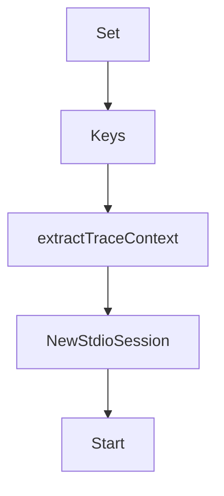

# Chapter 2: Architecture and Control Plane

Welcome to **Chapter 2: Architecture and Control Plane**. In this part of **GenAI Toolbox Tutorial: MCP-First Database Tooling with Config-Driven Control Planes**, you will build an intuitive mental model first, then move into concrete implementation details and practical production tradeoffs.


This chapter explains how Toolbox sits between agent frameworks and data systems.

## Learning Goals

- map the control-plane role of Toolbox in agent architectures
- understand why config-driven tool definitions reduce redeploy friction
- separate orchestration concerns from database execution concerns
- reason about shared tool reuse across multiple agents and apps

## Architecture Summary

Toolbox centralizes source and tool definitions, then exposes them to clients through consistent runtime interfaces. This lets teams evolve tooling and access patterns without continually rewriting integration code.

## Source References

- [README Architecture Section](https://github.com/googleapis/genai-toolbox/blob/main/README.md)
- [Introduction Docs](https://github.com/googleapis/genai-toolbox/blob/main/docs/en/getting-started/introduction/_index.md)

## Summary

You now understand how Toolbox provides a reusable orchestration layer for database-aware agents.

Next: [Chapter 3: `tools.yaml`: Sources, Tools, Toolsets, Prompts](03-tools-yaml-sources-tools-toolsets-prompts.md)

## Source Code Walkthrough

### `internal/server/mcp.go`

The `Set` function in [`internal/server/mcp.go`](https://github.com/googleapis/genai-toolbox/blob/HEAD/internal/server/mcp.go) handles a key part of this chapter's functionality:

```go
}

func (c traceContextCarrier) Set(key, value string) {
	c[key] = value
}

func (c traceContextCarrier) Keys() []string {
	keys := make([]string, 0, len(c))
	for k := range c {
		keys = append(keys, k)
	}
	return keys
}

// extractTraceContext extracts W3C Trace Context from params._meta
func extractTraceContext(ctx context.Context, body []byte) context.Context {
	// Try to parse the request to extract _meta
	var req struct {
		Params struct {
			Meta struct {
				Traceparent string `json:"traceparent,omitempty"`
				Tracestate  string `json:"tracestate,omitempty"`
			} `json:"_meta,omitempty"`
		} `json:"params,omitempty"`
	}

	if err := json.Unmarshal(body, &req); err != nil {
		return ctx
	}

	// If traceparent is present, extract the context
	if req.Params.Meta.Traceparent != "" {
```

This function is important because it defines how GenAI Toolbox Tutorial: MCP-First Database Tooling with Config-Driven Control Planes implements the patterns covered in this chapter.

### `internal/server/mcp.go`

The `Keys` function in [`internal/server/mcp.go`](https://github.com/googleapis/genai-toolbox/blob/HEAD/internal/server/mcp.go) handles a key part of this chapter's functionality:

```go
}

func (c traceContextCarrier) Keys() []string {
	keys := make([]string, 0, len(c))
	for k := range c {
		keys = append(keys, k)
	}
	return keys
}

// extractTraceContext extracts W3C Trace Context from params._meta
func extractTraceContext(ctx context.Context, body []byte) context.Context {
	// Try to parse the request to extract _meta
	var req struct {
		Params struct {
			Meta struct {
				Traceparent string `json:"traceparent,omitempty"`
				Tracestate  string `json:"tracestate,omitempty"`
			} `json:"_meta,omitempty"`
		} `json:"params,omitempty"`
	}

	if err := json.Unmarshal(body, &req); err != nil {
		return ctx
	}

	// If traceparent is present, extract the context
	if req.Params.Meta.Traceparent != "" {
		carrier := traceContextCarrier{
			"traceparent": req.Params.Meta.Traceparent,
		}
		if req.Params.Meta.Tracestate != "" {
```

This function is important because it defines how GenAI Toolbox Tutorial: MCP-First Database Tooling with Config-Driven Control Planes implements the patterns covered in this chapter.

### `internal/server/mcp.go`

The `extractTraceContext` function in [`internal/server/mcp.go`](https://github.com/googleapis/genai-toolbox/blob/HEAD/internal/server/mcp.go) handles a key part of this chapter's functionality:

```go
}

// extractTraceContext extracts W3C Trace Context from params._meta
func extractTraceContext(ctx context.Context, body []byte) context.Context {
	// Try to parse the request to extract _meta
	var req struct {
		Params struct {
			Meta struct {
				Traceparent string `json:"traceparent,omitempty"`
				Tracestate  string `json:"tracestate,omitempty"`
			} `json:"_meta,omitempty"`
		} `json:"params,omitempty"`
	}

	if err := json.Unmarshal(body, &req); err != nil {
		return ctx
	}

	// If traceparent is present, extract the context
	if req.Params.Meta.Traceparent != "" {
		carrier := traceContextCarrier{
			"traceparent": req.Params.Meta.Traceparent,
		}
		if req.Params.Meta.Tracestate != "" {
			carrier["tracestate"] = req.Params.Meta.Tracestate
		}
		return otel.GetTextMapPropagator().Extract(ctx, carrier)
	}

	return ctx
}

```

This function is important because it defines how GenAI Toolbox Tutorial: MCP-First Database Tooling with Config-Driven Control Planes implements the patterns covered in this chapter.

### `internal/server/mcp.go`

The `NewStdioSession` function in [`internal/server/mcp.go`](https://github.com/googleapis/genai-toolbox/blob/HEAD/internal/server/mcp.go) handles a key part of this chapter's functionality:

```go
}

func NewStdioSession(s *Server, stdin io.Reader, stdout io.Writer) *stdioSession {
	stdioSession := &stdioSession{
		server: s,
		reader: bufio.NewReader(stdin),
		writer: stdout,
	}
	return stdioSession
}

func (s *stdioSession) Start(ctx context.Context) error {
	return s.readInputStream(ctx)
}

// readInputStream reads requests/notifications from MCP clients through stdin
func (s *stdioSession) readInputStream(ctx context.Context) error {
	sessionStart := time.Now()

	// Define attributes for session metrics
	// Note: mcp.protocol.version is added dynamically after protocol negotiation
	sessionAttrs := []attribute.KeyValue{
		attribute.String("network.transport", "pipe"),
		attribute.String("network.protocol.name", "stdio"),
	}

	s.server.instrumentation.McpActiveSessions.Add(ctx, 1, metric.WithAttributes(sessionAttrs...))

	var err error
	defer func() {
		// Build full attributes including mcp.protocol.version if negotiated
		fullAttrs := sessionAttrs
```

This function is important because it defines how GenAI Toolbox Tutorial: MCP-First Database Tooling with Config-Driven Control Planes implements the patterns covered in this chapter.


## How These Components Connect


