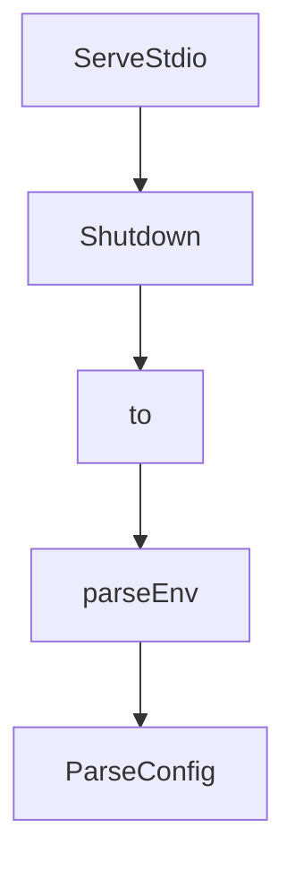

# Chapter 3: `tools.yaml`: Sources, Tools, Toolsets, Prompts

Welcome to **Chapter 3: `tools.yaml`: Sources, Tools, Toolsets, Prompts**. In this part of **GenAI Toolbox Tutorial: MCP-First Database Tooling with Config-Driven Control Planes**, you will build an intuitive mental model first, then move into concrete implementation details and practical production tradeoffs.


This chapter focuses on building maintainable configuration contracts in `tools.yaml`.

## Learning Goals

- model sources cleanly and avoid hardcoded secrets
- define tools with safe parameters and clear descriptions
- group capabilities into toolsets for context-specific loading
- add prompt templates for repeatable model instruction patterns

## Configuration Rule

Treat `tools.yaml` as a versioned interface contract. Keep it small, explicit, and environment-variable driven to avoid hidden coupling and credential leakage.

## Source References

- [Configuration Guide](https://github.com/googleapis/genai-toolbox/blob/main/docs/en/getting-started/configure.md)
- [README Configuration](https://github.com/googleapis/genai-toolbox/blob/main/README.md)

## Summary

You can now design `tools.yaml` schemas that stay readable and stable as capabilities grow.

Next: [Chapter 4: MCP Connectivity and Client Integration](04-mcp-connectivity-and-client-integration.md)

## Source Code Walkthrough

### `internal/server/server.go`

The `ServeStdio` function in [`internal/server/server.go`](https://github.com/googleapis/genai-toolbox/blob/HEAD/internal/server/server.go) handles a key part of this chapter's functionality:

```go
}

// ServeStdio starts a new stdio session for mcp.
func (s *Server) ServeStdio(ctx context.Context, stdin io.Reader, stdout io.Writer) error {
	stdioServer := NewStdioSession(s, stdin, stdout)
	return stdioServer.Start(ctx)
}

// Shutdown gracefully shuts down the server without interrupting any active
// connections. It uses http.Server.Shutdown() and has the same functionality.
func (s *Server) Shutdown(ctx context.Context) error {
	s.logger.DebugContext(ctx, "shutting down the server.")
	return s.srv.Shutdown(ctx)
}

```

This function is important because it defines how GenAI Toolbox Tutorial: MCP-First Database Tooling with Config-Driven Control Planes implements the patterns covered in this chapter.

### `internal/server/server.go`

The `Shutdown` function in [`internal/server/server.go`](https://github.com/googleapis/genai-toolbox/blob/HEAD/internal/server/server.go) handles a key part of this chapter's functionality:

```go
}

// Shutdown gracefully shuts down the server without interrupting any active
// connections. It uses http.Server.Shutdown() and has the same functionality.
func (s *Server) Shutdown(ctx context.Context) error {
	s.logger.DebugContext(ctx, "shutting down the server.")
	return s.srv.Shutdown(ctx)
}

```

This function is important because it defines how GenAI Toolbox Tutorial: MCP-First Database Tooling with Config-Driven Control Planes implements the patterns covered in this chapter.

### `internal/server/server.go`

The `to` interface in [`internal/server/server.go`](https://github.com/googleapis/genai-toolbox/blob/HEAD/internal/server/server.go) handles a key part of this chapter's functionality:

```go
//     http://www.apache.org/licenses/LICENSE-2.0
//
// Unless required by applicable law or agreed to in writing, software
// distributed under the License is distributed on an "AS IS" BASIS,
// WITHOUT WARRANTIES OR CONDITIONS OF ANY KIND, either express or implied.
// See the License for the specific language governing permissions and
// limitations under the License.

package server

import (
	"context"
	"encoding/json"
	"errors"
	"fmt"
	"io"
	"net"
	"net/http"
	"os"
	"slices"
	"strconv"
	"strings"
	"time"

	"github.com/go-chi/chi/v5"
	"github.com/go-chi/chi/v5/middleware"
	"github.com/go-chi/cors"
	"github.com/go-chi/httplog/v3"
	"github.com/go-chi/render"
	"github.com/googleapis/genai-toolbox/internal/auth"
	"github.com/googleapis/genai-toolbox/internal/auth/generic"
	"github.com/googleapis/genai-toolbox/internal/embeddingmodels"
```

This interface is important because it defines how GenAI Toolbox Tutorial: MCP-First Database Tooling with Config-Driven Control Planes implements the patterns covered in this chapter.

### `cmd/internal/config.go`

The `parseEnv` function in [`cmd/internal/config.go`](https://github.com/googleapis/genai-toolbox/blob/HEAD/cmd/internal/config.go) handles a key part of this chapter's functionality:

```go
}

// parseEnv replaces environment variables ${ENV_NAME} with their values.
// also support ${ENV_NAME:default_value}.
func (p *ConfigParser) parseEnv(input string) (string, error) {
	re := regexp.MustCompile(`\$\{(\w+)(:([^}]*))?\}`)

	if p.EnvVars == nil {
		p.EnvVars = make(map[string]string)
	}

	var err error
	output := re.ReplaceAllStringFunc(input, func(match string) string {
		parts := re.FindStringSubmatch(match)

		// extract the variable name
		variableName := parts[1]
		if value, found := os.LookupEnv(variableName); found {
			p.EnvVars[variableName] = value
			return value
		}
		if len(parts) >= 4 && parts[2] != "" {
			value := parts[3]
			p.EnvVars[variableName] = value
			return value
		}
		err = fmt.Errorf("environment variable not found: %q", variableName)
		return ""
	})
	return output, err
}

```

This function is important because it defines how GenAI Toolbox Tutorial: MCP-First Database Tooling with Config-Driven Control Planes implements the patterns covered in this chapter.


## How These Components Connect


