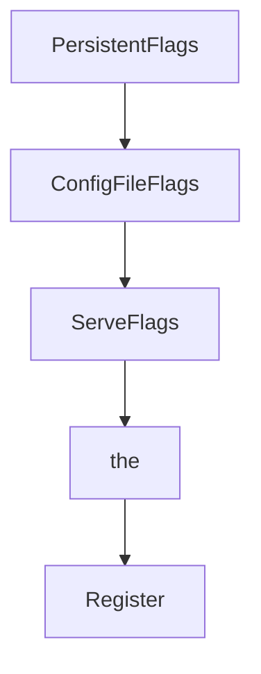

# Chapter 4: MCP Connectivity and Client Integration

Welcome to **Chapter 4: MCP Connectivity and Client Integration**. In this part of **GenAI Toolbox Tutorial: MCP-First Database Tooling with Config-Driven Control Planes**, you will build an intuitive mental model first, then move into concrete implementation details and practical production tradeoffs.


This chapter compares MCP transport options with native SDK integrations.

## Learning Goals

- configure stdio and HTTP-based MCP client connectivity
- understand current MCP-spec coverage and version compatibility notes
- identify features that are available in native SDK paths but not MCP
- choose integration mode by capability, not trend

## Integration Decision Rule

Use native Toolbox SDKs when you need Toolbox-specific auth/authorization features. Use MCP for host compatibility and interoperability where protocol constraints are acceptable.

## Source References

- [Connect via MCP](https://github.com/googleapis/genai-toolbox/blob/main/docs/en/how-to/connect_via_mcp.md)
- [MCP Toolbox Extension README](https://github.com/googleapis/genai-toolbox/blob/main/MCP-TOOLBOX-EXTENSION.md)
- [README Integration Section](https://github.com/googleapis/genai-toolbox/blob/main/README.md)

## Summary

You now have a practical framework for choosing and operating Toolbox integration paths.

Next: [Chapter 5: Prebuilt Connectors and Database Patterns](05-prebuilt-connectors-and-database-patterns.md)

## Source Code Walkthrough

### `cmd/internal/flags.go`

The `PersistentFlags` function in [`cmd/internal/flags.go`](https://github.com/googleapis/genai-toolbox/blob/HEAD/cmd/internal/flags.go) handles a key part of this chapter's functionality:

```go
)

// PersistentFlags sets up flags that are available for all commands and
// subcommands
// It is also used to set up persistent flags during subcommand unit tests
func PersistentFlags(parentCmd *cobra.Command, opts *ToolboxOptions) {
	persistentFlags := parentCmd.PersistentFlags()

	persistentFlags.Var(&opts.Cfg.LogLevel, "log-level", "Specify the minimum level logged. Allowed: 'DEBUG', 'INFO', 'WARN', 'ERROR'.")
	persistentFlags.Var(&opts.Cfg.LoggingFormat, "logging-format", "Specify logging format to use. Allowed: 'standard' or 'JSON'.")
	persistentFlags.BoolVar(&opts.Cfg.TelemetryGCP, "telemetry-gcp", false, "Enable exporting directly to Google Cloud Monitoring.")
	persistentFlags.StringVar(&opts.Cfg.TelemetryOTLP, "telemetry-otlp", "", "Enable exporting using OpenTelemetry Protocol (OTLP) to the specified endpoint (e.g. 'http://127.0.0.1:4318')")
	persistentFlags.StringVar(&opts.Cfg.TelemetryServiceName, "telemetry-service-name", "toolbox", "Sets the value of the service.name resource attribute for telemetry data.")
	persistentFlags.StringSliceVar(&opts.Cfg.UserAgentMetadata, "user-agent-metadata", []string{}, "Appends additional metadata to the User-Agent.")
}

// ConfigFileFlags defines flags related to the configuration file.
// It should be applied to any command that requires configuration loading.
func ConfigFileFlags(flags *pflag.FlagSet, opts *ToolboxOptions) {
	flags.StringVar(&opts.Config, "config", "", "File path specifying the tool configuration. Cannot be used with --configs, or --config-folder.")
	flags.StringVar(&opts.Config, "tools-file", "", "File path specifying the tool configuration. Cannot be used with --tools-files, or --tools-folder.")
	_ = flags.MarkDeprecated("tools-file", "please use --config instead") // DEPRECATED
	flags.StringSliceVar(&opts.Configs, "configs", []string{}, "Multiple file paths specifying tool configurations. Files will be merged. Cannot be used with --config, or --config-folder.")
	flags.StringSliceVar(&opts.Configs, "tools-files", []string{}, "Multiple file paths specifying tool configurations. Files will be merged. Cannot be used with --tools-file, or --tools-folder.")
	_ = flags.MarkDeprecated("tools-files", "please use --configs instead") // DEPRECATED
	flags.StringVar(&opts.ConfigFolder, "config-folder", "", "Directory path containing YAML tool configuration files. All .yaml and .yml files in the directory will be loaded and merged. Cannot be used with --config, or --configs.")
	flags.StringVar(&opts.ConfigFolder, "tools-folder", "", "Directory path containing YAML tool configuration files. All .yaml and .yml files in the directory will be loaded and merged. Cannot be used with --tools-file, or --tools-files.")
	_ = flags.MarkDeprecated("tools-folder", "please use --config-folder instead") // DEPRECATED
	// Fetch prebuilt tools sources to customize the help description
	prebuiltHelp := fmt.Sprintf(
		"Use a prebuilt tool configuration by source type. Allowed: '%s'. Can be specified multiple times.",
		strings.Join(prebuiltconfigs.GetPrebuiltSources(), "', '"),
```

This function is important because it defines how GenAI Toolbox Tutorial: MCP-First Database Tooling with Config-Driven Control Planes implements the patterns covered in this chapter.

### `cmd/internal/flags.go`

The `ConfigFileFlags` function in [`cmd/internal/flags.go`](https://github.com/googleapis/genai-toolbox/blob/HEAD/cmd/internal/flags.go) handles a key part of this chapter's functionality:

```go
}

// ConfigFileFlags defines flags related to the configuration file.
// It should be applied to any command that requires configuration loading.
func ConfigFileFlags(flags *pflag.FlagSet, opts *ToolboxOptions) {
	flags.StringVar(&opts.Config, "config", "", "File path specifying the tool configuration. Cannot be used with --configs, or --config-folder.")
	flags.StringVar(&opts.Config, "tools-file", "", "File path specifying the tool configuration. Cannot be used with --tools-files, or --tools-folder.")
	_ = flags.MarkDeprecated("tools-file", "please use --config instead") // DEPRECATED
	flags.StringSliceVar(&opts.Configs, "configs", []string{}, "Multiple file paths specifying tool configurations. Files will be merged. Cannot be used with --config, or --config-folder.")
	flags.StringSliceVar(&opts.Configs, "tools-files", []string{}, "Multiple file paths specifying tool configurations. Files will be merged. Cannot be used with --tools-file, or --tools-folder.")
	_ = flags.MarkDeprecated("tools-files", "please use --configs instead") // DEPRECATED
	flags.StringVar(&opts.ConfigFolder, "config-folder", "", "Directory path containing YAML tool configuration files. All .yaml and .yml files in the directory will be loaded and merged. Cannot be used with --config, or --configs.")
	flags.StringVar(&opts.ConfigFolder, "tools-folder", "", "Directory path containing YAML tool configuration files. All .yaml and .yml files in the directory will be loaded and merged. Cannot be used with --tools-file, or --tools-files.")
	_ = flags.MarkDeprecated("tools-folder", "please use --config-folder instead") // DEPRECATED
	// Fetch prebuilt tools sources to customize the help description
	prebuiltHelp := fmt.Sprintf(
		"Use a prebuilt tool configuration by source type. Allowed: '%s'. Can be specified multiple times.",
		strings.Join(prebuiltconfigs.GetPrebuiltSources(), "', '"),
	)
	flags.StringSliceVar(&opts.PrebuiltConfigs, "prebuilt", []string{}, prebuiltHelp)
}

// ServeFlags defines flags for starting and configuring the server.
func ServeFlags(flags *pflag.FlagSet, opts *ToolboxOptions) {
	flags.StringVarP(&opts.Cfg.Address, "address", "a", "127.0.0.1", "Address of the interface the server will listen on.")
	flags.IntVarP(&opts.Cfg.Port, "port", "p", 5000, "Port the server will listen on.")
	flags.BoolVar(&opts.Cfg.Stdio, "stdio", false, "Listens via MCP STDIO instead of acting as a remote HTTP server.")
	flags.BoolVar(&opts.Cfg.UI, "ui", false, "Launches the Toolbox UI web server.")
	flags.BoolVar(&opts.Cfg.EnableAPI, "enable-api", false, "Enable the /api endpoint.")
	flags.StringVar(&opts.Cfg.ToolboxUrl, "toolbox-url", "", "Specifies the Toolbox URL. Used as the resource field in the MCP PRM file when MCP Auth is enabled. Falls back to TOOLBOX_URL environment variable.")
	flags.StringVar(&opts.Cfg.McpPrmFile, "mcp-prm-file", "", "Path to a manual Protected Resource Metadata (PRM) JSON file. If provided, overrides auto-generation.")
	flags.StringSliceVar(&opts.Cfg.AllowedOrigins, "allowed-origins", []string{"*"}, "Specifies a list of origins permitted to access this server. Defaults to '*'.")
```

This function is important because it defines how GenAI Toolbox Tutorial: MCP-First Database Tooling with Config-Driven Control Planes implements the patterns covered in this chapter.

### `cmd/internal/flags.go`

The `ServeFlags` function in [`cmd/internal/flags.go`](https://github.com/googleapis/genai-toolbox/blob/HEAD/cmd/internal/flags.go) handles a key part of this chapter's functionality:

```go
}

// ServeFlags defines flags for starting and configuring the server.
func ServeFlags(flags *pflag.FlagSet, opts *ToolboxOptions) {
	flags.StringVarP(&opts.Cfg.Address, "address", "a", "127.0.0.1", "Address of the interface the server will listen on.")
	flags.IntVarP(&opts.Cfg.Port, "port", "p", 5000, "Port the server will listen on.")
	flags.BoolVar(&opts.Cfg.Stdio, "stdio", false, "Listens via MCP STDIO instead of acting as a remote HTTP server.")
	flags.BoolVar(&opts.Cfg.UI, "ui", false, "Launches the Toolbox UI web server.")
	flags.BoolVar(&opts.Cfg.EnableAPI, "enable-api", false, "Enable the /api endpoint.")
	flags.StringVar(&opts.Cfg.ToolboxUrl, "toolbox-url", "", "Specifies the Toolbox URL. Used as the resource field in the MCP PRM file when MCP Auth is enabled. Falls back to TOOLBOX_URL environment variable.")
	flags.StringVar(&opts.Cfg.McpPrmFile, "mcp-prm-file", "", "Path to a manual Protected Resource Metadata (PRM) JSON file. If provided, overrides auto-generation.")
	flags.StringSliceVar(&opts.Cfg.AllowedOrigins, "allowed-origins", []string{"*"}, "Specifies a list of origins permitted to access this server. Defaults to '*'.")
	flags.StringSliceVar(&opts.Cfg.AllowedHosts, "allowed-hosts", []string{"*"}, "Specifies a list of hosts permitted to access this server. Defaults to '*'.")
}

```

This function is important because it defines how GenAI Toolbox Tutorial: MCP-First Database Tooling with Config-Driven Control Planes implements the patterns covered in this chapter.

### `cmd/internal/flags.go`

The `the` interface in [`cmd/internal/flags.go`](https://github.com/googleapis/genai-toolbox/blob/HEAD/cmd/internal/flags.go) handles a key part of this chapter's functionality:

```go
// Copyright 2026 Google LLC
//
// Licensed under the Apache License, Version 2.0 (the "License");
// you may not use this file except in compliance with the License.
// You may obtain a copy of the License at
//
//     http://www.apache.org/licenses/LICENSE-2.0
//
// Unless required by applicable law or agreed to in writing, software
// distributed under the License is distributed on an "AS IS" BASIS,
// WITHOUT WARRANTIES OR CONDITIONS OF ANY KIND, either express or implied.
// See the License for the specific language governing permissions and
// limitations under the License.

package internal

import (
	"fmt"
	"strings"

	"github.com/googleapis/genai-toolbox/internal/prebuiltconfigs"
	"github.com/spf13/cobra"
	"github.com/spf13/pflag"
)

// PersistentFlags sets up flags that are available for all commands and
// subcommands
// It is also used to set up persistent flags during subcommand unit tests
func PersistentFlags(parentCmd *cobra.Command, opts *ToolboxOptions) {
	persistentFlags := parentCmd.PersistentFlags()

	persistentFlags.Var(&opts.Cfg.LogLevel, "log-level", "Specify the minimum level logged. Allowed: 'DEBUG', 'INFO', 'WARN', 'ERROR'.")
```

This interface is important because it defines how GenAI Toolbox Tutorial: MCP-First Database Tooling with Config-Driven Control Planes implements the patterns covered in this chapter.


## How These Components Connect


