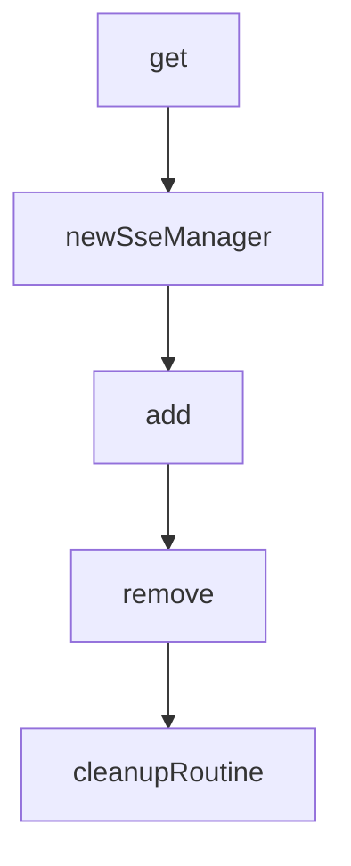

# Chapter 4: MCP Connectivity and Client Integration

Welcome to **Chapter 4: MCP Connectivity and Client Integration**. In this part of **GenAI Toolbox Tutorial: MCP-First Database Tooling with Config-Driven Control Planes**, you will build an intuitive mental model first, then move into concrete implementation details and practical production tradeoffs.


This chapter compares MCP transport options with native SDK integrations.

## Learning Goals

- configure stdio and HTTP-based MCP client connectivity
- understand current MCP-spec coverage and version compatibility notes
- identify features that are available in native SDK paths but not MCP
- choose integration mode by capability, not trend

## Integration Decision Rule

Use native Toolbox SDKs when you need Toolbox-specific auth/authorization features. Use MCP for host compatibility and interoperability where protocol constraints are acceptable.

## Source References

- [Connect via MCP](https://github.com/googleapis/genai-toolbox/blob/main/docs/en/how-to/connect_via_mcp.md)
- [MCP Toolbox Extension README](https://github.com/googleapis/genai-toolbox/blob/main/MCP-TOOLBOX-EXTENSION.md)
- [README Integration Section](https://github.com/googleapis/genai-toolbox/blob/main/README.md)

## Summary

You now have a practical framework for choosing and operating Toolbox integration paths.

Next: [Chapter 5: Prebuilt Connectors and Database Patterns](05-prebuilt-connectors-and-database-patterns.md)

## Depth Expansion Playbook

## Source Code Walkthrough

### `internal/server/mcp.go`

The `get` function in [`internal/server/mcp.go`](https://github.com/googleapis/genai-toolbox/blob/HEAD/internal/server/mcp.go) handles a key part of this chapter's functionality:

```go
}

func (m *sseManager) get(id string) (*sseSession, bool) {
	m.mu.Lock()
	defer m.mu.Unlock()
	session, ok := m.sseSessions[id]
	if !ok || session == nil {
		// Be defensive: a nil session entry should be treated as unavailable.
		if ok && session == nil {
			delete(m.sseSessions, id)
		}
		return nil, false
	}
	session.lastActive = time.Now()
	return session, true
}

func newSseManager(ctx context.Context) *sseManager {
	sseM := &sseManager{
		mu:          sync.Mutex{},
		sseSessions: make(map[string]*sseSession),
	}
	go sseM.cleanupRoutine(ctx)
	return sseM
}

func (m *sseManager) add(id string, session *sseSession) {
	m.mu.Lock()
	defer m.mu.Unlock()
	m.sseSessions[id] = session
	session.lastActive = time.Now()
}
```

This function is important because it defines how GenAI Toolbox Tutorial: MCP-First Database Tooling with Config-Driven Control Planes implements the patterns covered in this chapter.

### `internal/server/mcp.go`

The `newSseManager` function in [`internal/server/mcp.go`](https://github.com/googleapis/genai-toolbox/blob/HEAD/internal/server/mcp.go) handles a key part of this chapter's functionality:

```go
}

func newSseManager(ctx context.Context) *sseManager {
	sseM := &sseManager{
		mu:          sync.Mutex{},
		sseSessions: make(map[string]*sseSession),
	}
	go sseM.cleanupRoutine(ctx)
	return sseM
}

func (m *sseManager) add(id string, session *sseSession) {
	m.mu.Lock()
	defer m.mu.Unlock()
	m.sseSessions[id] = session
	session.lastActive = time.Now()
}

func (m *sseManager) remove(id string) {
	m.mu.Lock()
	delete(m.sseSessions, id)
	m.mu.Unlock()
}

func (m *sseManager) cleanupRoutine(ctx context.Context) {
	timeout := 10 * time.Minute
	ticker := time.NewTicker(timeout)
	defer ticker.Stop()

	for {
		select {
		case <-ctx.Done():
```

This function is important because it defines how GenAI Toolbox Tutorial: MCP-First Database Tooling with Config-Driven Control Planes implements the patterns covered in this chapter.

### `internal/server/mcp.go`

The `add` function in [`internal/server/mcp.go`](https://github.com/googleapis/genai-toolbox/blob/HEAD/internal/server/mcp.go) handles a key part of this chapter's functionality:

```go
}

func (m *sseManager) add(id string, session *sseSession) {
	m.mu.Lock()
	defer m.mu.Unlock()
	m.sseSessions[id] = session
	session.lastActive = time.Now()
}

func (m *sseManager) remove(id string) {
	m.mu.Lock()
	delete(m.sseSessions, id)
	m.mu.Unlock()
}

func (m *sseManager) cleanupRoutine(ctx context.Context) {
	timeout := 10 * time.Minute
	ticker := time.NewTicker(timeout)
	defer ticker.Stop()

	for {
		select {
		case <-ctx.Done():
			return
		case <-ticker.C:
			func() {
				m.mu.Lock()
				defer m.mu.Unlock()
				now := time.Now()
				for id, sess := range m.sseSessions {
					if now.Sub(sess.lastActive) > timeout {
						delete(m.sseSessions, id)
```

This function is important because it defines how GenAI Toolbox Tutorial: MCP-First Database Tooling with Config-Driven Control Planes implements the patterns covered in this chapter.

### `internal/server/mcp.go`

The `remove` function in [`internal/server/mcp.go`](https://github.com/googleapis/genai-toolbox/blob/HEAD/internal/server/mcp.go) handles a key part of this chapter's functionality:

```go
}

func (m *sseManager) remove(id string) {
	m.mu.Lock()
	delete(m.sseSessions, id)
	m.mu.Unlock()
}

func (m *sseManager) cleanupRoutine(ctx context.Context) {
	timeout := 10 * time.Minute
	ticker := time.NewTicker(timeout)
	defer ticker.Stop()

	for {
		select {
		case <-ctx.Done():
			return
		case <-ticker.C:
			func() {
				m.mu.Lock()
				defer m.mu.Unlock()
				now := time.Now()
				for id, sess := range m.sseSessions {
					if now.Sub(sess.lastActive) > timeout {
						delete(m.sseSessions, id)
					}
				}
			}()
		}
	}
}

```

This function is important because it defines how GenAI Toolbox Tutorial: MCP-First Database Tooling with Config-Driven Control Planes implements the patterns covered in this chapter.


## How These Components Connect


