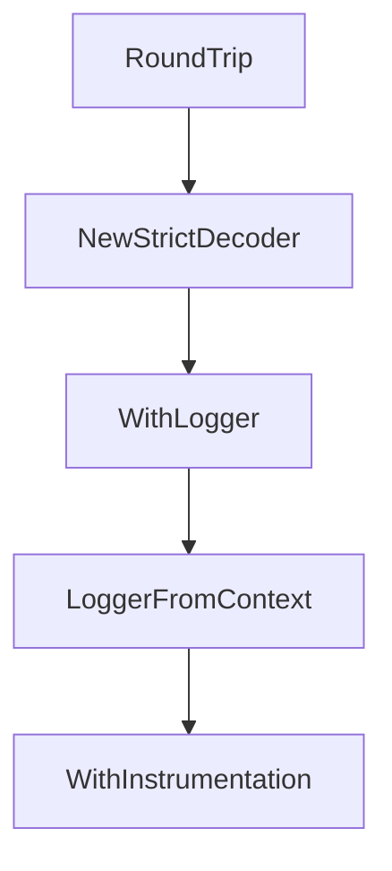

# Chapter 5: Prebuilt Connectors and Database Patterns

Welcome to **Chapter 5: Prebuilt Connectors and Database Patterns**. In this part of **GenAI Toolbox Tutorial: MCP-First Database Tooling with Config-Driven Control Planes**, you will build an intuitive mental model first, then move into concrete implementation details and practical production tradeoffs.


This chapter covers prebuilt source/tool configurations and connector scaling patterns.

## Learning Goals

- use prebuilt connector options to accelerate onboarding
- evaluate connector choice by operational constraints
- structure multi-database coverage with explicit boundaries
- avoid overloading one toolbox instance with conflicting toolsets

## Connector Strategy

Start with one production-critical source type, validate latency and reliability, then expand connector surface area incrementally using toolsets aligned to concrete use cases.

## Source References

- [Prebuilt Tools Reference](https://github.com/googleapis/genai-toolbox/blob/main/docs/en/reference/prebuilt-tools.md)
- [Source Type Docs](https://github.com/googleapis/genai-toolbox/tree/main/docs/en/resources/sources)
- [Tool Type Docs](https://github.com/googleapis/genai-toolbox/tree/main/docs/en/resources/tools)

## Summary

You now understand how to scale database coverage without losing operational clarity.

Next: [Chapter 6: Deployment and Observability Patterns](06-deployment-and-observability-patterns.md)

## Source Code Walkthrough

### `internal/util/util.go`

The `RoundTrip` function in [`internal/util/util.go`](https://github.com/googleapis/genai-toolbox/blob/HEAD/internal/util/util.go) handles a key part of this chapter's functionality:

```go
}

type UserAgentRoundTripper struct {
	userAgent string
	next      http.RoundTripper
}

func NewUserAgentRoundTripper(ua string, next http.RoundTripper) *UserAgentRoundTripper {
	return &UserAgentRoundTripper{
		userAgent: ua,
		next:      next,
	}
}

func (rt *UserAgentRoundTripper) RoundTrip(req *http.Request) (*http.Response, error) {
	// create a deep copy of the request
	newReq := req.Clone(req.Context())
	ua := newReq.Header.Get("User-Agent")
	if ua == "" {
		newReq.Header.Set("User-Agent", rt.userAgent)
	} else {
		newReq.Header.Set("User-Agent", ua+" "+rt.userAgent)
	}
	return rt.next.RoundTrip(newReq)
}

func NewStrictDecoder(v interface{}) (*yaml.Decoder, error) {
	b, err := yaml.Marshal(v)
	if err != nil {
		return nil, fmt.Errorf("fail to marshal %q: %w", v, err)
	}

```

This function is important because it defines how GenAI Toolbox Tutorial: MCP-First Database Tooling with Config-Driven Control Planes implements the patterns covered in this chapter.

### `internal/util/util.go`

The `NewStrictDecoder` function in [`internal/util/util.go`](https://github.com/googleapis/genai-toolbox/blob/HEAD/internal/util/util.go) handles a key part of this chapter's functionality:

```go
}

func NewStrictDecoder(v interface{}) (*yaml.Decoder, error) {
	b, err := yaml.Marshal(v)
	if err != nil {
		return nil, fmt.Errorf("fail to marshal %q: %w", v, err)
	}

	dec := yaml.NewDecoder(
		bytes.NewReader(b),
		yaml.Strict(),
		yaml.Validator(validator.New()),
	)
	return dec, nil
}

// loggerKey is the key used to store logger within context
const loggerKey contextKey = "logger"

// WithLogger adds a logger into the context as a value
func WithLogger(ctx context.Context, logger log.Logger) context.Context {
	return context.WithValue(ctx, loggerKey, logger)
}

// LoggerFromContext retrieves the logger or return an error
func LoggerFromContext(ctx context.Context) (log.Logger, error) {
	if logger, ok := ctx.Value(loggerKey).(log.Logger); ok {
		return logger, nil
	}
	return nil, fmt.Errorf("unable to retrieve logger")
}

```

This function is important because it defines how GenAI Toolbox Tutorial: MCP-First Database Tooling with Config-Driven Control Planes implements the patterns covered in this chapter.

### `internal/util/util.go`

The `WithLogger` function in [`internal/util/util.go`](https://github.com/googleapis/genai-toolbox/blob/HEAD/internal/util/util.go) handles a key part of this chapter's functionality:

```go
const loggerKey contextKey = "logger"

// WithLogger adds a logger into the context as a value
func WithLogger(ctx context.Context, logger log.Logger) context.Context {
	return context.WithValue(ctx, loggerKey, logger)
}

// LoggerFromContext retrieves the logger or return an error
func LoggerFromContext(ctx context.Context) (log.Logger, error) {
	if logger, ok := ctx.Value(loggerKey).(log.Logger); ok {
		return logger, nil
	}
	return nil, fmt.Errorf("unable to retrieve logger")
}

const instrumentationKey contextKey = "instrumentation"

// WithInstrumentation adds an instrumentation into the context as a value
func WithInstrumentation(ctx context.Context, instrumentation *telemetry.Instrumentation) context.Context {
	return context.WithValue(ctx, instrumentationKey, instrumentation)
}

// InstrumentationFromContext retrieves the instrumentation or return an error
func InstrumentationFromContext(ctx context.Context) (*telemetry.Instrumentation, error) {
	if instrumentation, ok := ctx.Value(instrumentationKey).(*telemetry.Instrumentation); ok {
		return instrumentation, nil
	}
	return nil, fmt.Errorf("unable to retrieve instrumentation")
}

// GenAIMetricAttrs holds gen_ai and network attributes for metrics
type GenAIMetricAttrs struct {
```

This function is important because it defines how GenAI Toolbox Tutorial: MCP-First Database Tooling with Config-Driven Control Planes implements the patterns covered in this chapter.

### `internal/util/util.go`

The `LoggerFromContext` function in [`internal/util/util.go`](https://github.com/googleapis/genai-toolbox/blob/HEAD/internal/util/util.go) handles a key part of this chapter's functionality:

```go
}

// LoggerFromContext retrieves the logger or return an error
func LoggerFromContext(ctx context.Context) (log.Logger, error) {
	if logger, ok := ctx.Value(loggerKey).(log.Logger); ok {
		return logger, nil
	}
	return nil, fmt.Errorf("unable to retrieve logger")
}

const instrumentationKey contextKey = "instrumentation"

// WithInstrumentation adds an instrumentation into the context as a value
func WithInstrumentation(ctx context.Context, instrumentation *telemetry.Instrumentation) context.Context {
	return context.WithValue(ctx, instrumentationKey, instrumentation)
}

// InstrumentationFromContext retrieves the instrumentation or return an error
func InstrumentationFromContext(ctx context.Context) (*telemetry.Instrumentation, error) {
	if instrumentation, ok := ctx.Value(instrumentationKey).(*telemetry.Instrumentation); ok {
		return instrumentation, nil
	}
	return nil, fmt.Errorf("unable to retrieve instrumentation")
}

// GenAIMetricAttrs holds gen_ai and network attributes for metrics
type GenAIMetricAttrs struct {
	OperationName          string
	ToolName               string
	PromptName             string
	NetworkProtocolName    string
	NetworkProtocolVersion string
```

This function is important because it defines how GenAI Toolbox Tutorial: MCP-First Database Tooling with Config-Driven Control Planes implements the patterns covered in this chapter.


## How These Components Connect


