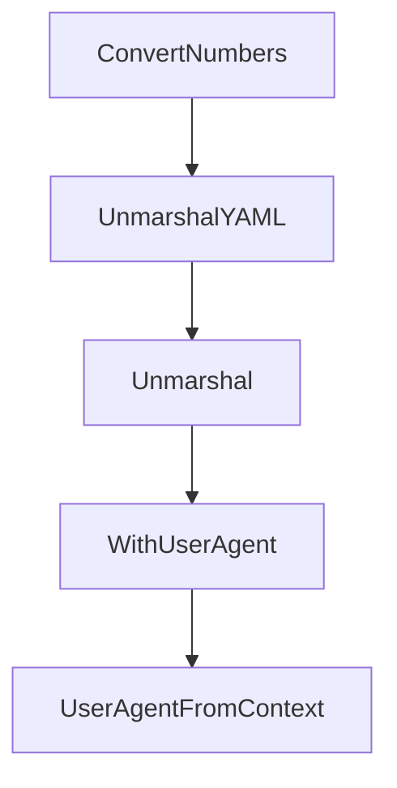

# Chapter 5: Prebuilt Connectors and Database Patterns

Welcome to **Chapter 5: Prebuilt Connectors and Database Patterns**. In this part of **GenAI Toolbox Tutorial: MCP-First Database Tooling with Config-Driven Control Planes**, you will build an intuitive mental model first, then move into concrete implementation details and practical production tradeoffs.


This chapter covers prebuilt source/tool configurations and connector scaling patterns.

## Learning Goals

- use prebuilt connector options to accelerate onboarding
- evaluate connector choice by operational constraints
- structure multi-database coverage with explicit boundaries
- avoid overloading one toolbox instance with conflicting toolsets

## Connector Strategy

Start with one production-critical source type, validate latency and reliability, then expand connector surface area incrementally using toolsets aligned to concrete use cases.

## Source References

- [Prebuilt Tools Reference](https://github.com/googleapis/genai-toolbox/blob/main/docs/en/reference/prebuilt-tools.md)
- [Source Type Docs](https://github.com/googleapis/genai-toolbox/tree/main/docs/en/resources/sources)
- [Tool Type Docs](https://github.com/googleapis/genai-toolbox/tree/main/docs/en/resources/tools)

## Summary

You now understand how to scale database coverage without losing operational clarity.

Next: [Chapter 6: Deployment and Observability Patterns](06-deployment-and-observability-patterns.md)

## Depth Expansion Playbook

## Source Code Walkthrough

### `internal/util/util.go`

The `ConvertNumbers` function in [`internal/util/util.go`](https://github.com/googleapis/genai-toolbox/blob/HEAD/internal/util/util.go) handles a key part of this chapter's functionality:

```go
}

// ConvertNumbers traverses an interface and converts all json.Number
// instances to int64 or float64.
func ConvertNumbers(data any) (any, error) {
	switch v := data.(type) {
	// If it's a map, recursively convert the values.
	case map[string]any:
		for key, val := range v {
			convertedVal, err := ConvertNumbers(val)
			if err != nil {
				return nil, err
			}
			v[key] = convertedVal
		}
		return v, nil

	// If it's a slice, recursively convert the elements.
	case []any:
		for i, val := range v {
			convertedVal, err := ConvertNumbers(val)
			if err != nil {
				return nil, err
			}
			v[i] = convertedVal
		}
		return v, nil

	// If it's a json.Number, convert it to float or int
	case json.Number:
		// Check for a decimal point to decide the type.
		if strings.Contains(v.String(), ".") {
```

This function is important because it defines how GenAI Toolbox Tutorial: MCP-First Database Tooling with Config-Driven Control Planes implements the patterns covered in this chapter.

### `internal/util/util.go`

The `UnmarshalYAML` function in [`internal/util/util.go`](https://github.com/googleapis/genai-toolbox/blob/HEAD/internal/util/util.go) handles a key part of this chapter's functionality:

```go

// DelayedUnmarshaler is struct that saves the provided unmarshal function
// passed to UnmarshalYAML so it can be re-used later once the target interface
// is known.
type DelayedUnmarshaler struct {
	unmarshal func(interface{}) error
}

func (d *DelayedUnmarshaler) UnmarshalYAML(ctx context.Context, unmarshal func(interface{}) error) error {
	d.unmarshal = unmarshal
	return nil
}

func (d *DelayedUnmarshaler) Unmarshal(v interface{}) error {
	if d.unmarshal == nil {
		return fmt.Errorf("nothing to unmarshal")
	}
	return d.unmarshal(v)
}

type contextKey string

// userAgentKey is the key used to store userAgent within context
const userAgentKey contextKey = "userAgent"

// WithUserAgent adds a user agent into the context as a value
func WithUserAgent(ctx context.Context, versionString string) context.Context {
	userAgent := "genai-toolbox/" + versionString
	return context.WithValue(ctx, userAgentKey, userAgent)
}

// UserAgentFromContext retrieves the user agent or return an error
```

This function is important because it defines how GenAI Toolbox Tutorial: MCP-First Database Tooling with Config-Driven Control Planes implements the patterns covered in this chapter.

### `internal/util/util.go`

The `Unmarshal` function in [`internal/util/util.go`](https://github.com/googleapis/genai-toolbox/blob/HEAD/internal/util/util.go) handles a key part of this chapter's functionality:

```go
}

var _ yaml.InterfaceUnmarshalerContext = &DelayedUnmarshaler{}

// DelayedUnmarshaler is struct that saves the provided unmarshal function
// passed to UnmarshalYAML so it can be re-used later once the target interface
// is known.
type DelayedUnmarshaler struct {
	unmarshal func(interface{}) error
}

func (d *DelayedUnmarshaler) UnmarshalYAML(ctx context.Context, unmarshal func(interface{}) error) error {
	d.unmarshal = unmarshal
	return nil
}

func (d *DelayedUnmarshaler) Unmarshal(v interface{}) error {
	if d.unmarshal == nil {
		return fmt.Errorf("nothing to unmarshal")
	}
	return d.unmarshal(v)
}

type contextKey string

// userAgentKey is the key used to store userAgent within context
const userAgentKey contextKey = "userAgent"

// WithUserAgent adds a user agent into the context as a value
func WithUserAgent(ctx context.Context, versionString string) context.Context {
	userAgent := "genai-toolbox/" + versionString
	return context.WithValue(ctx, userAgentKey, userAgent)
```

This function is important because it defines how GenAI Toolbox Tutorial: MCP-First Database Tooling with Config-Driven Control Planes implements the patterns covered in this chapter.

### `internal/util/util.go`

The `WithUserAgent` function in [`internal/util/util.go`](https://github.com/googleapis/genai-toolbox/blob/HEAD/internal/util/util.go) handles a key part of this chapter's functionality:

```go
const userAgentKey contextKey = "userAgent"

// WithUserAgent adds a user agent into the context as a value
func WithUserAgent(ctx context.Context, versionString string) context.Context {
	userAgent := "genai-toolbox/" + versionString
	return context.WithValue(ctx, userAgentKey, userAgent)
}

// UserAgentFromContext retrieves the user agent or return an error
func UserAgentFromContext(ctx context.Context) (string, error) {
	if ua := ctx.Value(userAgentKey); ua != nil {
		return ua.(string), nil
	} else {
		return "", fmt.Errorf("unable to retrieve user agent")
	}
}

type UserAgentRoundTripper struct {
	userAgent string
	next      http.RoundTripper
}

func NewUserAgentRoundTripper(ua string, next http.RoundTripper) *UserAgentRoundTripper {
	return &UserAgentRoundTripper{
		userAgent: ua,
		next:      next,
	}
}

func (rt *UserAgentRoundTripper) RoundTrip(req *http.Request) (*http.Response, error) {
	// create a deep copy of the request
	newReq := req.Clone(req.Context())
```

This function is important because it defines how GenAI Toolbox Tutorial: MCP-First Database Tooling with Config-Driven Control Planes implements the patterns covered in this chapter.


## How These Components Connect


