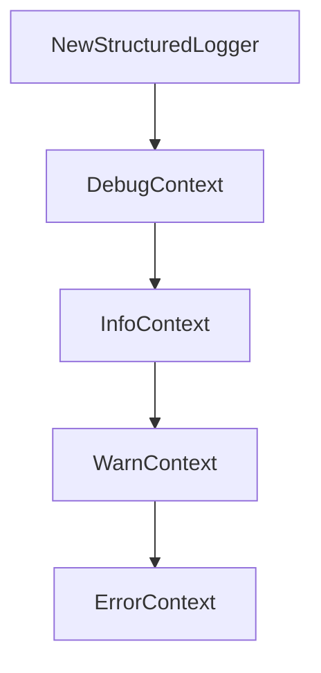

# Chapter 6: Deployment and Observability Patterns

Welcome to **Chapter 6: Deployment and Observability Patterns**. In this part of **GenAI Toolbox Tutorial: MCP-First Database Tooling with Config-Driven Control Planes**, you will build an intuitive mental model first, then move into concrete implementation details and practical production tradeoffs.


This chapter explains runtime deployment options and telemetry controls.

## Learning Goals

- deploy Toolbox with Docker Compose and containerized workflows
- configure network and host controls explicitly
- enable telemetry export modes deliberately
- prepare observability baselines before production traffic

## Deployment Baseline

Use pinned image versions, explicit host/origin settings, and telemetry destinations from day one. Treat local defaults as development conveniences, not production policy.

## Source References

- [Deploy using Docker Compose](https://github.com/googleapis/genai-toolbox/blob/main/docs/en/how-to/deploy_docker.md)
- [CLI Reference](https://github.com/googleapis/genai-toolbox/blob/main/docs/en/reference/cli.md)
- [Telemetry Concepts](https://github.com/googleapis/genai-toolbox/blob/main/docs/en/concepts/telemetry/index.md)

## Summary

You now have a deployment model that balances speed with operational controls.

Next: [Chapter 7: CLI, Testing, and Development Workflow](07-cli-testing-and-development-workflow.md)

## Source Code Walkthrough

### `internal/log/log.go`

The `NewStructuredLogger` function in [`internal/log/log.go`](https://github.com/googleapis/genai-toolbox/blob/HEAD/internal/log/log.go) handles a key part of this chapter's functionality:

```go
	switch strings.ToLower(format) {
	case "json":
		return NewStructuredLogger(out, err, level)
	case "standard":
		return NewStdLogger(out, err, level)
	default:
		return nil, fmt.Errorf("logging format invalid: %s", format)
	}
}

// StdLogger is the standard logger
type StdLogger struct {
	outLogger *slog.Logger
	errLogger *slog.Logger
}

// NewStdLogger create a Logger that uses out and err for informational and error messages.
func NewStdLogger(outW, errW io.Writer, logLevel string) (Logger, error) {
	//Set log level
	var programLevel = new(slog.LevelVar)
	slogLevel, err := SeverityToLevel(logLevel)
	if err != nil {
		return nil, err
	}
	programLevel.Set(slogLevel)

	handlerOptions := &slog.HandlerOptions{Level: programLevel}

	return &StdLogger{
		outLogger: slog.New(NewValueTextHandler(outW, handlerOptions)),
		errLogger: slog.New(NewValueTextHandler(errW, handlerOptions)),
	}, nil
```

This function is important because it defines how GenAI Toolbox Tutorial: MCP-First Database Tooling with Config-Driven Control Planes implements the patterns covered in this chapter.

### `internal/log/log.go`

The `DebugContext` function in [`internal/log/log.go`](https://github.com/googleapis/genai-toolbox/blob/HEAD/internal/log/log.go) handles a key part of this chapter's functionality:

```go
}

// DebugContext logs debug messages
func (sl *StdLogger) DebugContext(ctx context.Context, msg string, keysAndValues ...any) {
	sl.outLogger.DebugContext(ctx, msg, keysAndValues...)
}

// InfoContext logs debug messages
func (sl *StdLogger) InfoContext(ctx context.Context, msg string, keysAndValues ...any) {
	sl.outLogger.InfoContext(ctx, msg, keysAndValues...)
}

// WarnContext logs warning messages
func (sl *StdLogger) WarnContext(ctx context.Context, msg string, keysAndValues ...any) {
	sl.errLogger.WarnContext(ctx, msg, keysAndValues...)
}

// ErrorContext logs error messages
func (sl *StdLogger) ErrorContext(ctx context.Context, msg string, keysAndValues ...any) {
	sl.errLogger.ErrorContext(ctx, msg, keysAndValues...)
}

// SlogLogger returns a single standard *slog.Logger that routes
// records to the outLogger or errLogger based on the log level.
func (sl *StdLogger) SlogLogger() *slog.Logger {
	splitHandler := &SplitHandler{
		OutHandler: sl.outLogger.Handler(),
		ErrHandler: sl.errLogger.Handler(),
	}
	return slog.New(splitHandler)
}

```

This function is important because it defines how GenAI Toolbox Tutorial: MCP-First Database Tooling with Config-Driven Control Planes implements the patterns covered in this chapter.

### `internal/log/log.go`

The `InfoContext` function in [`internal/log/log.go`](https://github.com/googleapis/genai-toolbox/blob/HEAD/internal/log/log.go) handles a key part of this chapter's functionality:

```go
}

// InfoContext logs debug messages
func (sl *StdLogger) InfoContext(ctx context.Context, msg string, keysAndValues ...any) {
	sl.outLogger.InfoContext(ctx, msg, keysAndValues...)
}

// WarnContext logs warning messages
func (sl *StdLogger) WarnContext(ctx context.Context, msg string, keysAndValues ...any) {
	sl.errLogger.WarnContext(ctx, msg, keysAndValues...)
}

// ErrorContext logs error messages
func (sl *StdLogger) ErrorContext(ctx context.Context, msg string, keysAndValues ...any) {
	sl.errLogger.ErrorContext(ctx, msg, keysAndValues...)
}

// SlogLogger returns a single standard *slog.Logger that routes
// records to the outLogger or errLogger based on the log level.
func (sl *StdLogger) SlogLogger() *slog.Logger {
	splitHandler := &SplitHandler{
		OutHandler: sl.outLogger.Handler(),
		ErrHandler: sl.errLogger.Handler(),
	}
	return slog.New(splitHandler)
}

const (
	Debug = "DEBUG"
	Info  = "INFO"
	Warn  = "WARN"
	Error = "ERROR"
```

This function is important because it defines how GenAI Toolbox Tutorial: MCP-First Database Tooling with Config-Driven Control Planes implements the patterns covered in this chapter.

### `internal/log/log.go`

The `WarnContext` function in [`internal/log/log.go`](https://github.com/googleapis/genai-toolbox/blob/HEAD/internal/log/log.go) handles a key part of this chapter's functionality:

```go
}

// WarnContext logs warning messages
func (sl *StdLogger) WarnContext(ctx context.Context, msg string, keysAndValues ...any) {
	sl.errLogger.WarnContext(ctx, msg, keysAndValues...)
}

// ErrorContext logs error messages
func (sl *StdLogger) ErrorContext(ctx context.Context, msg string, keysAndValues ...any) {
	sl.errLogger.ErrorContext(ctx, msg, keysAndValues...)
}

// SlogLogger returns a single standard *slog.Logger that routes
// records to the outLogger or errLogger based on the log level.
func (sl *StdLogger) SlogLogger() *slog.Logger {
	splitHandler := &SplitHandler{
		OutHandler: sl.outLogger.Handler(),
		ErrHandler: sl.errLogger.Handler(),
	}
	return slog.New(splitHandler)
}

const (
	Debug = "DEBUG"
	Info  = "INFO"
	Warn  = "WARN"
	Error = "ERROR"
)

// Returns severity level based on string.
func SeverityToLevel(s string) (slog.Level, error) {
	switch strings.ToUpper(s) {
```

This function is important because it defines how GenAI Toolbox Tutorial: MCP-First Database Tooling with Config-Driven Control Planes implements the patterns covered in this chapter.


## How These Components Connect


