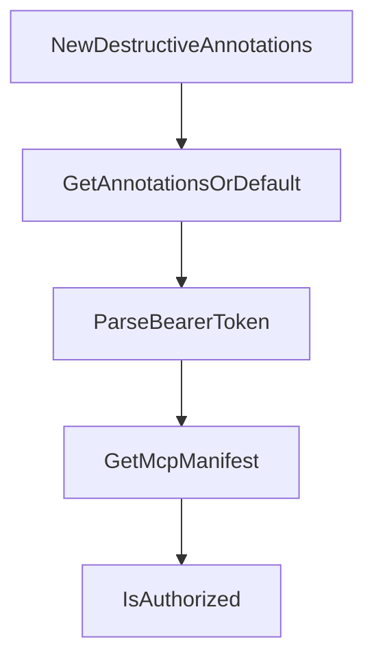

# Chapter 6: Deployment and Observability Patterns

Welcome to **Chapter 6: Deployment and Observability Patterns**. In this part of **GenAI Toolbox Tutorial: MCP-First Database Tooling with Config-Driven Control Planes**, you will build an intuitive mental model first, then move into concrete implementation details and practical production tradeoffs.


This chapter explains runtime deployment options and telemetry controls.

## Learning Goals

- deploy Toolbox with Docker Compose and containerized workflows
- configure network and host controls explicitly
- enable telemetry export modes deliberately
- prepare observability baselines before production traffic

## Deployment Baseline

Use pinned image versions, explicit host/origin settings, and telemetry destinations from day one. Treat local defaults as development conveniences, not production policy.

## Source References

- [Deploy using Docker Compose](https://github.com/googleapis/genai-toolbox/blob/main/docs/en/how-to/deploy_docker.md)
- [CLI Reference](https://github.com/googleapis/genai-toolbox/blob/main/docs/en/reference/cli.md)
- [Telemetry Concepts](https://github.com/googleapis/genai-toolbox/blob/main/docs/en/concepts/telemetry/index.md)

## Summary

You now have a deployment model that balances speed with operational controls.

Next: [Chapter 7: CLI, Testing, and Development Workflow](07-cli-testing-and-development-workflow.md)

## Depth Expansion Playbook

## Source Code Walkthrough

### `internal/tools/tools.go`

The `NewDestructiveAnnotations` function in [`internal/tools/tools.go`](https://github.com/googleapis/genai-toolbox/blob/HEAD/internal/tools/tools.go) handles a key part of this chapter's functionality:

```go
}

// NewDestructiveAnnotations creates default annotations for a destructive tool.
// Use this for tools that create, update, or delete data.
func NewDestructiveAnnotations() *ToolAnnotations {
	readOnly := false
	destructive := true
	return &ToolAnnotations{
		ReadOnlyHint:    &readOnly,
		DestructiveHint: &destructive,
	}
}

// GetAnnotationsOrDefault returns the provided annotations if non-nil,
// otherwise returns the result of calling defaultFn.
func GetAnnotationsOrDefault(annotations *ToolAnnotations, defaultFn func() *ToolAnnotations) *ToolAnnotations {
	if annotations != nil {
		return annotations
	}
	return defaultFn()
}

type AccessToken string

func (token AccessToken) ParseBearerToken() (string, error) {
	headerParts := strings.Split(string(token), " ")
	if len(headerParts) != 2 || strings.ToLower(headerParts[0]) != "bearer" {
		return "", util.NewClientServerError("authorization header must be in the format 'Bearer <token>'", http.StatusUnauthorized, nil)
	}
	return headerParts[1], nil
}

```

This function is important because it defines how GenAI Toolbox Tutorial: MCP-First Database Tooling with Config-Driven Control Planes implements the patterns covered in this chapter.

### `internal/tools/tools.go`

The `GetAnnotationsOrDefault` function in [`internal/tools/tools.go`](https://github.com/googleapis/genai-toolbox/blob/HEAD/internal/tools/tools.go) handles a key part of this chapter's functionality:

```go
}

// GetAnnotationsOrDefault returns the provided annotations if non-nil,
// otherwise returns the result of calling defaultFn.
func GetAnnotationsOrDefault(annotations *ToolAnnotations, defaultFn func() *ToolAnnotations) *ToolAnnotations {
	if annotations != nil {
		return annotations
	}
	return defaultFn()
}

type AccessToken string

func (token AccessToken) ParseBearerToken() (string, error) {
	headerParts := strings.Split(string(token), " ")
	if len(headerParts) != 2 || strings.ToLower(headerParts[0]) != "bearer" {
		return "", util.NewClientServerError("authorization header must be in the format 'Bearer <token>'", http.StatusUnauthorized, nil)
	}
	return headerParts[1], nil
}

type Tool interface {
	Invoke(context.Context, SourceProvider, parameters.ParamValues, AccessToken) (any, util.ToolboxError)
	EmbedParams(context.Context, parameters.ParamValues, map[string]embeddingmodels.EmbeddingModel) (parameters.ParamValues, error)
	Manifest() Manifest
	McpManifest() McpManifest
	Authorized([]string) bool
	RequiresClientAuthorization(SourceProvider) (bool, error)
	ToConfig() ToolConfig
	GetAuthTokenHeaderName(SourceProvider) (string, error)
	GetParameters() parameters.Parameters
}
```

This function is important because it defines how GenAI Toolbox Tutorial: MCP-First Database Tooling with Config-Driven Control Planes implements the patterns covered in this chapter.

### `internal/tools/tools.go`

The `ParseBearerToken` function in [`internal/tools/tools.go`](https://github.com/googleapis/genai-toolbox/blob/HEAD/internal/tools/tools.go) handles a key part of this chapter's functionality:

```go
type AccessToken string

func (token AccessToken) ParseBearerToken() (string, error) {
	headerParts := strings.Split(string(token), " ")
	if len(headerParts) != 2 || strings.ToLower(headerParts[0]) != "bearer" {
		return "", util.NewClientServerError("authorization header must be in the format 'Bearer <token>'", http.StatusUnauthorized, nil)
	}
	return headerParts[1], nil
}

type Tool interface {
	Invoke(context.Context, SourceProvider, parameters.ParamValues, AccessToken) (any, util.ToolboxError)
	EmbedParams(context.Context, parameters.ParamValues, map[string]embeddingmodels.EmbeddingModel) (parameters.ParamValues, error)
	Manifest() Manifest
	McpManifest() McpManifest
	Authorized([]string) bool
	RequiresClientAuthorization(SourceProvider) (bool, error)
	ToConfig() ToolConfig
	GetAuthTokenHeaderName(SourceProvider) (string, error)
	GetParameters() parameters.Parameters
}

// SourceProvider defines the minimal view of the server.ResourceManager
// that the Tool package needs.
// This is implemented to prevent import cycles.
type SourceProvider interface {
	GetSource(sourceName string) (sources.Source, bool)
}

// Manifest is the representation of tools sent to Client SDKs.
type Manifest struct {
	Description  string                         `json:"description"`
```

This function is important because it defines how GenAI Toolbox Tutorial: MCP-First Database Tooling with Config-Driven Control Planes implements the patterns covered in this chapter.

### `internal/tools/tools.go`

The `GetMcpManifest` function in [`internal/tools/tools.go`](https://github.com/googleapis/genai-toolbox/blob/HEAD/internal/tools/tools.go) handles a key part of this chapter's functionality:

```go
}

func GetMcpManifest(name, desc string, authInvoke []string, params parameters.Parameters, annotations *ToolAnnotations) McpManifest {
	inputSchema, authParams := params.McpManifest()
	mcpManifest := McpManifest{
		Name:        name,
		Description: desc,
		InputSchema: inputSchema,
		Annotations: annotations,
	}

	// construct metadata, if applicable
	metadata := make(map[string]any)
	if len(authInvoke) > 0 {
		metadata["toolbox/authInvoke"] = authInvoke
	}
	if len(authParams) > 0 {
		metadata["toolbox/authParam"] = authParams
	}
	if len(metadata) > 0 {
		mcpManifest.Metadata = metadata
	}
	return mcpManifest
}

// Helper function that returns if a tool invocation request is authorized
func IsAuthorized(authRequiredSources []string, verifiedAuthServices []string) bool {
	if len(authRequiredSources) == 0 {
		// no authorization requirement
		return true
	}
	for _, a := range authRequiredSources {
```

This function is important because it defines how GenAI Toolbox Tutorial: MCP-First Database Tooling with Config-Driven Control Planes implements the patterns covered in this chapter.


## How These Components Connect


