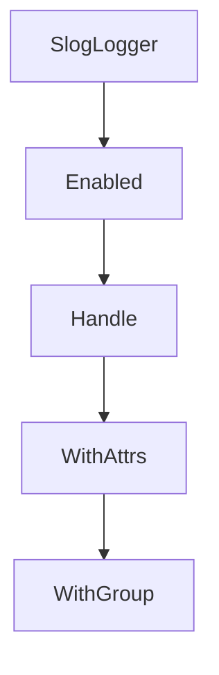

# Chapter 7: CLI, Testing, and Development Workflow

Welcome to **Chapter 7: CLI, Testing, and Development Workflow**. In this part of **GenAI Toolbox Tutorial: MCP-First Database Tooling with Config-Driven Control Planes**, you will build an intuitive mental model first, then move into concrete implementation details and practical production tradeoffs.


This chapter focuses on iterative development quality gates.

## Learning Goals

- use CLI flags and invoke helpers for fast validation
- run lint/unit/integration loops consistently
- align local test behavior with CI expectations
- keep naming/version conventions coherent across tool surfaces

## Engineering Loop

Treat `go run . --help`, direct tool invocation, and targeted tests as your shortest quality loop. Promote changes only after link, lint, and integration checks align.

## Source References

- [CLI Reference](https://github.com/googleapis/genai-toolbox/blob/main/docs/en/reference/cli.md)
- [Developer Guide](https://github.com/googleapis/genai-toolbox/blob/main/DEVELOPER.md)
- [Contributing](https://github.com/googleapis/genai-toolbox/blob/main/CONTRIBUTING.md)

## Summary

You now have a repeatable workflow for shipping Toolbox changes with lower regression risk.

Next: [Chapter 8: Production Governance and Release Strategy](08-production-governance-and-release-strategy.md)

## Depth Expansion Playbook

## Source Code Walkthrough

### `internal/log/log.go`

The `SlogLogger` function in [`internal/log/log.go`](https://github.com/googleapis/genai-toolbox/blob/HEAD/internal/log/log.go) handles a key part of this chapter's functionality:

```go
}

// SlogLogger returns a single standard *slog.Logger that routes
// records to the outLogger or errLogger based on the log level.
func (sl *StdLogger) SlogLogger() *slog.Logger {
	splitHandler := &SplitHandler{
		OutHandler: sl.outLogger.Handler(),
		ErrHandler: sl.errLogger.Handler(),
	}
	return slog.New(splitHandler)
}

const (
	Debug = "DEBUG"
	Info  = "INFO"
	Warn  = "WARN"
	Error = "ERROR"
)

// Returns severity level based on string.
func SeverityToLevel(s string) (slog.Level, error) {
	switch strings.ToUpper(s) {
	case Debug:
		return slog.LevelDebug, nil
	case Info:
		return slog.LevelInfo, nil
	case Warn:
		return slog.LevelWarn, nil
	case Error:
		return slog.LevelError, nil
	default:
		return slog.Level(-5), fmt.Errorf("invalid log level")
```

This function is important because it defines how GenAI Toolbox Tutorial: MCP-First Database Tooling with Config-Driven Control Planes implements the patterns covered in this chapter.

### `internal/log/log.go`

The `Enabled` function in [`internal/log/log.go`](https://github.com/googleapis/genai-toolbox/blob/HEAD/internal/log/log.go) handles a key part of this chapter's functionality:

```go
}

func (h *SplitHandler) Enabled(ctx context.Context, level slog.Level) bool {
	if level >= slog.LevelWarn {
		return h.ErrHandler.Enabled(ctx, level)
	}
	return h.OutHandler.Enabled(ctx, level)
}

func (h *SplitHandler) Handle(ctx context.Context, r slog.Record) error {
	if r.Level >= slog.LevelWarn {
		return h.ErrHandler.Handle(ctx, r)
	}
	return h.OutHandler.Handle(ctx, r)
}

func (h *SplitHandler) WithAttrs(attrs []slog.Attr) slog.Handler {
	return &SplitHandler{
		OutHandler: h.OutHandler.WithAttrs(attrs),
		ErrHandler: h.ErrHandler.WithAttrs(attrs),
	}
}

func (h *SplitHandler) WithGroup(name string) slog.Handler {
	return &SplitHandler{
		OutHandler: h.OutHandler.WithGroup(name),
		ErrHandler: h.ErrHandler.WithGroup(name),
	}
}

```

This function is important because it defines how GenAI Toolbox Tutorial: MCP-First Database Tooling with Config-Driven Control Planes implements the patterns covered in this chapter.

### `internal/log/log.go`

The `Handle` function in [`internal/log/log.go`](https://github.com/googleapis/genai-toolbox/blob/HEAD/internal/log/log.go) handles a key part of this chapter's functionality:

```go
	programLevel.Set(slogLevel)

	handlerOptions := &slog.HandlerOptions{Level: programLevel}

	return &StdLogger{
		outLogger: slog.New(NewValueTextHandler(outW, handlerOptions)),
		errLogger: slog.New(NewValueTextHandler(errW, handlerOptions)),
	}, nil
}

// DebugContext logs debug messages
func (sl *StdLogger) DebugContext(ctx context.Context, msg string, keysAndValues ...any) {
	sl.outLogger.DebugContext(ctx, msg, keysAndValues...)
}

// InfoContext logs debug messages
func (sl *StdLogger) InfoContext(ctx context.Context, msg string, keysAndValues ...any) {
	sl.outLogger.InfoContext(ctx, msg, keysAndValues...)
}

// WarnContext logs warning messages
func (sl *StdLogger) WarnContext(ctx context.Context, msg string, keysAndValues ...any) {
	sl.errLogger.WarnContext(ctx, msg, keysAndValues...)
}

// ErrorContext logs error messages
func (sl *StdLogger) ErrorContext(ctx context.Context, msg string, keysAndValues ...any) {
	sl.errLogger.ErrorContext(ctx, msg, keysAndValues...)
}

// SlogLogger returns a single standard *slog.Logger that routes
// records to the outLogger or errLogger based on the log level.
```

This function is important because it defines how GenAI Toolbox Tutorial: MCP-First Database Tooling with Config-Driven Control Planes implements the patterns covered in this chapter.

### `internal/log/log.go`

The `WithAttrs` function in [`internal/log/log.go`](https://github.com/googleapis/genai-toolbox/blob/HEAD/internal/log/log.go) handles a key part of this chapter's functionality:

```go
}

func (h *SplitHandler) WithAttrs(attrs []slog.Attr) slog.Handler {
	return &SplitHandler{
		OutHandler: h.OutHandler.WithAttrs(attrs),
		ErrHandler: h.ErrHandler.WithAttrs(attrs),
	}
}

func (h *SplitHandler) WithGroup(name string) slog.Handler {
	return &SplitHandler{
		OutHandler: h.OutHandler.WithGroup(name),
		ErrHandler: h.ErrHandler.WithGroup(name),
	}
}

```

This function is important because it defines how GenAI Toolbox Tutorial: MCP-First Database Tooling with Config-Driven Control Planes implements the patterns covered in this chapter.


## How These Components Connect


