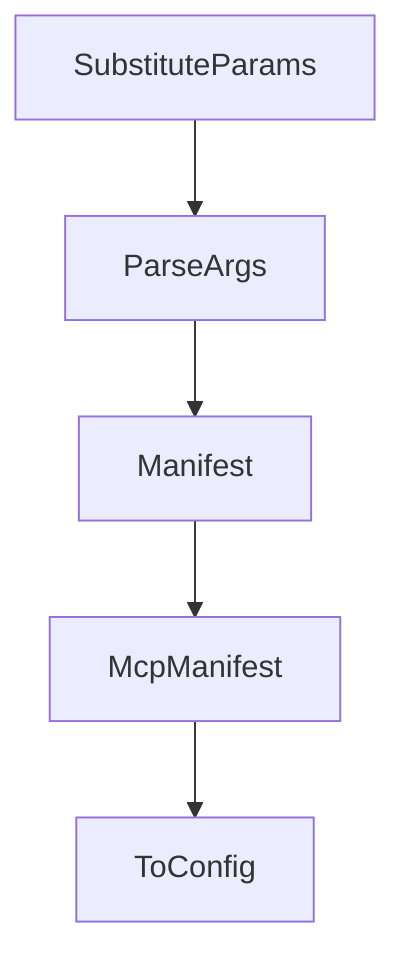

# Chapter 7: CLI, Testing, and Development Workflow

Welcome to **Chapter 7: CLI, Testing, and Development Workflow**. In this part of **GenAI Toolbox Tutorial: MCP-First Database Tooling with Config-Driven Control Planes**, you will build an intuitive mental model first, then move into concrete implementation details and practical production tradeoffs.


This chapter focuses on iterative development quality gates.

## Learning Goals

- use CLI flags and invoke helpers for fast validation
- run lint/unit/integration loops consistently
- align local test behavior with CI expectations
- keep naming/version conventions coherent across tool surfaces

## Engineering Loop

Treat `go run . --help`, direct tool invocation, and targeted tests as your shortest quality loop. Promote changes only after link, lint, and integration checks align.

## Source References

- [CLI Reference](https://github.com/googleapis/genai-toolbox/blob/main/docs/en/reference/cli.md)
- [Developer Guide](https://github.com/googleapis/genai-toolbox/blob/main/DEVELOPER.md)
- [Contributing](https://github.com/googleapis/genai-toolbox/blob/main/CONTRIBUTING.md)

## Summary

You now have a repeatable workflow for shipping Toolbox changes with lower regression risk.

Next: [Chapter 8: Production Governance and Release Strategy](08-production-governance-and-release-strategy.md)

## Source Code Walkthrough

### `internal/server/mocks.go`

The `SubstituteParams` function in [`internal/server/mocks.go`](https://github.com/googleapis/genai-toolbox/blob/HEAD/internal/server/mocks.go) handles a key part of this chapter's functionality:

```go
}

func (p MockPrompt) SubstituteParams(vals parameters.ParamValues) (any, error) {
	return []prompts.Message{
		{
			Role:    "user",
			Content: fmt.Sprintf("substituted %s", p.Name),
		},
	}, nil
}

func (p MockPrompt) ParseArgs(data map[string]any, claimsMap map[string]map[string]any) (parameters.ParamValues, error) {
	var params parameters.Parameters
	for _, arg := range p.Args {
		params = append(params, arg.Parameter)
	}
	return parameters.ParseParams(params, data, claimsMap)
}

func (p MockPrompt) Manifest() prompts.Manifest {
	var argManifests []parameters.ParameterManifest
	for _, arg := range p.Args {
		argManifests = append(argManifests, arg.Manifest())
	}
	return prompts.Manifest{
		Description: p.Description,
		Arguments:   argManifests,
	}
}

func (p MockPrompt) McpManifest() prompts.McpManifest {
	return prompts.GetMcpManifest(p.Name, p.Description, p.Args)
```

This function is important because it defines how GenAI Toolbox Tutorial: MCP-First Database Tooling with Config-Driven Control Planes implements the patterns covered in this chapter.

### `internal/server/mocks.go`

The `ParseArgs` function in [`internal/server/mocks.go`](https://github.com/googleapis/genai-toolbox/blob/HEAD/internal/server/mocks.go) handles a key part of this chapter's functionality:

```go
}

func (p MockPrompt) ParseArgs(data map[string]any, claimsMap map[string]map[string]any) (parameters.ParamValues, error) {
	var params parameters.Parameters
	for _, arg := range p.Args {
		params = append(params, arg.Parameter)
	}
	return parameters.ParseParams(params, data, claimsMap)
}

func (p MockPrompt) Manifest() prompts.Manifest {
	var argManifests []parameters.ParameterManifest
	for _, arg := range p.Args {
		argManifests = append(argManifests, arg.Manifest())
	}
	return prompts.Manifest{
		Description: p.Description,
		Arguments:   argManifests,
	}
}

func (p MockPrompt) McpManifest() prompts.McpManifest {
	return prompts.GetMcpManifest(p.Name, p.Description, p.Args)
}

func (p MockPrompt) ToConfig() prompts.PromptConfig {
	return nil
}

```

This function is important because it defines how GenAI Toolbox Tutorial: MCP-First Database Tooling with Config-Driven Control Planes implements the patterns covered in this chapter.

### `internal/server/mocks.go`

The `Manifest` function in [`internal/server/mocks.go`](https://github.com/googleapis/genai-toolbox/blob/HEAD/internal/server/mocks.go) handles a key part of this chapter's functionality:

```go
	Description                 string
	Params                      []parameters.Parameter
	manifest                    tools.Manifest
	unauthorized                bool
	requiresClientAuthorization bool
}

func (t MockTool) Invoke(context.Context, tools.SourceProvider, parameters.ParamValues, tools.AccessToken) (any, util.ToolboxError) {
	mock := []any{t.Name}
	return mock, nil
}

func (t MockTool) ToConfig() tools.ToolConfig {
	return nil
}

// claims is a map of user info decoded from an auth token
func (t MockTool) ParseParams(data map[string]any, claimsMap map[string]map[string]any) (parameters.ParamValues, error) {
	return parameters.ParseParams(t.Params, data, claimsMap)
}

func (t MockTool) EmbedParams(ctx context.Context, paramValues parameters.ParamValues, embeddingModelsMap map[string]embeddingmodels.EmbeddingModel) (parameters.ParamValues, error) {
	return parameters.EmbedParams(ctx, t.Params, paramValues, embeddingModelsMap, nil)
}

func (t MockTool) Manifest() tools.Manifest {
	pMs := make([]parameters.ParameterManifest, 0, len(t.Params))
	for _, p := range t.Params {
		pMs = append(pMs, p.Manifest())
	}
	return tools.Manifest{Description: t.Description, Parameters: pMs}
}
```

This function is important because it defines how GenAI Toolbox Tutorial: MCP-First Database Tooling with Config-Driven Control Planes implements the patterns covered in this chapter.

### `internal/server/mocks.go`

The `McpManifest` function in [`internal/server/mocks.go`](https://github.com/googleapis/genai-toolbox/blob/HEAD/internal/server/mocks.go) handles a key part of this chapter's functionality:

```go
}

func (t MockTool) McpManifest() tools.McpManifest {
	properties := make(map[string]parameters.ParameterMcpManifest)
	required := make([]string, 0)
	authParams := make(map[string][]string)

	for _, p := range t.Params {
		name := p.GetName()
		paramManifest, authParamList := p.McpManifest()
		properties[name] = paramManifest
		required = append(required, name)

		if len(authParamList) > 0 {
			authParams[name] = authParamList
		}
	}

	toolsSchema := parameters.McpToolsSchema{
		Type:       "object",
		Properties: properties,
		Required:   required,
	}

	mcpManifest := tools.McpManifest{
		Name:        t.Name,
		Description: t.Description,
		InputSchema: toolsSchema,
	}

	if len(authParams) > 0 {
		mcpManifest.Metadata = map[string]any{
```

This function is important because it defines how GenAI Toolbox Tutorial: MCP-First Database Tooling with Config-Driven Control Planes implements the patterns covered in this chapter.


## How These Components Connect


