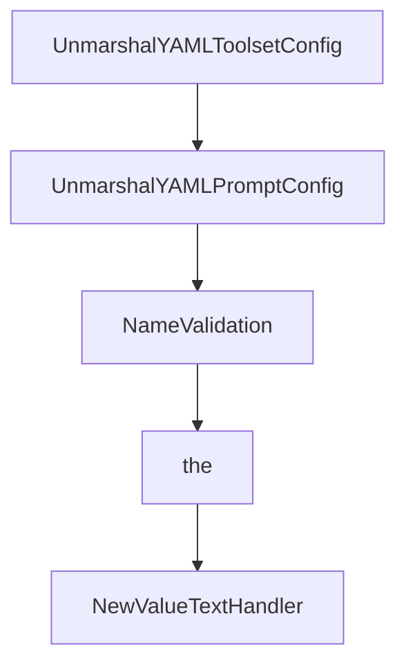

# Chapter 8: Production Governance and Release Strategy

Welcome to **Chapter 8: Production Governance and Release Strategy**. In this part of **GenAI Toolbox Tutorial: MCP-First Database Tooling with Config-Driven Control Planes**, you will build an intuitive mental model first, then move into concrete implementation details and practical production tradeoffs.


This chapter closes with operating discipline for pre-1.0 and post-1.0 evolution.

## Learning Goals

- apply versioning expectations before and after stable release
- maintain security and secret handling standards in config and runtime
- define change-management gates for connector and tool updates
- keep documentation and operational runbooks synchronized

## Governance Playbook

1. pin runtime versions and document upgrade windows
2. gate schema/config changes through staged validation
3. monitor request behavior, failures, and connector-level drift
4. keep incident and rollback procedures tied to specific release versions
5. regularly revisit MCP versus SDK mode assumptions as requirements evolve

## Source References

- [README Versioning](https://github.com/googleapis/genai-toolbox/blob/main/README.md)
- [Developer Guide](https://github.com/googleapis/genai-toolbox/blob/main/DEVELOPER.md)
- [CHANGELOG](https://github.com/googleapis/genai-toolbox/blob/main/CHANGELOG.md)

## Summary

You now have an operational model for running GenAI Toolbox as production MCP database infrastructure.

## Source Code Walkthrough

### `internal/server/config.go`

The `UnmarshalYAMLToolsetConfig` function in [`internal/server/config.go`](https://github.com/googleapis/genai-toolbox/blob/HEAD/internal/server/config.go) handles a key part of this chapter's functionality:

```go
			toolConfigs[name] = c
		case "toolset":
			c, err := UnmarshalYAMLToolsetConfig(ctx, name, resource)
			if err != nil {
				return nil, nil, nil, nil, nil, nil, fmt.Errorf("error unmarshaling %s: %s", kind, err)
			}
			if toolsetConfigs == nil {
				toolsetConfigs = make(ToolsetConfigs)
			}
			toolsetConfigs[name] = c
		case "embeddingModel":
			c, err := UnmarshalYAMLEmbeddingModelConfig(ctx, name, resource)
			if err != nil {
				return nil, nil, nil, nil, nil, nil, fmt.Errorf("error unmarshaling %s: %s", kind, err)
			}
			if embeddingModelConfigs == nil {
				embeddingModelConfigs = make(EmbeddingModelConfigs)
			}
			embeddingModelConfigs[name] = c
		case "prompt":
			c, err := UnmarshalYAMLPromptConfig(ctx, name, resource)
			if err != nil {
				return nil, nil, nil, nil, nil, nil, fmt.Errorf("error unmarshaling %s: %s", kind, err)
			}
			if promptConfigs == nil {
				promptConfigs = make(PromptConfigs)
			}
			promptConfigs[name] = c
		default:
			return nil, nil, nil, nil, nil, nil, fmt.Errorf("invalid kind %s", kind)
		}
	}
```

This function is important because it defines how GenAI Toolbox Tutorial: MCP-First Database Tooling with Config-Driven Control Planes implements the patterns covered in this chapter.

### `internal/server/config.go`

The `UnmarshalYAMLPromptConfig` function in [`internal/server/config.go`](https://github.com/googleapis/genai-toolbox/blob/HEAD/internal/server/config.go) handles a key part of this chapter's functionality:

```go
			embeddingModelConfigs[name] = c
		case "prompt":
			c, err := UnmarshalYAMLPromptConfig(ctx, name, resource)
			if err != nil {
				return nil, nil, nil, nil, nil, nil, fmt.Errorf("error unmarshaling %s: %s", kind, err)
			}
			if promptConfigs == nil {
				promptConfigs = make(PromptConfigs)
			}
			promptConfigs[name] = c
		default:
			return nil, nil, nil, nil, nil, nil, fmt.Errorf("invalid kind %s", kind)
		}
	}
	return sourceConfigs, authServiceConfigs, embeddingModelConfigs, toolConfigs, toolsetConfigs, promptConfigs, nil
}

func UnmarshalYAMLSourceConfig(ctx context.Context, name string, r map[string]any) (sources.SourceConfig, error) {
	resourceType, ok := r["type"].(string)
	if !ok {
		return nil, fmt.Errorf("missing 'type' field or it is not a string")
	}
	dec, err := util.NewStrictDecoder(r)
	if err != nil {
		return nil, fmt.Errorf("error creating decoder: %w", err)
	}
	sourceConfig, err := sources.DecodeConfig(ctx, resourceType, name, dec)
	if err != nil {
		return nil, err
	}
	return sourceConfig, nil
}
```

This function is important because it defines how GenAI Toolbox Tutorial: MCP-First Database Tooling with Config-Driven Control Planes implements the patterns covered in this chapter.

### `internal/server/config.go`

The `NameValidation` function in [`internal/server/config.go`](https://github.com/googleapis/genai-toolbox/blob/HEAD/internal/server/config.go) handles a key part of this chapter's functionality:

```go
// Tool names SHOULD NOT contain spaces, commas, or other special characters.
// Tool names SHOULD be unique within a server.
func NameValidation(name string) error {
	strLen := len(name)
	if strLen < 1 || strLen > 128 {
		return fmt.Errorf("resource name SHOULD be between 1 and 128 characters in length (inclusive)")
	}
	validChars := regexp.MustCompile("^[a-zA-Z0-9_.-]+$")
	isValid := validChars.MatchString(name)
	if !isValid {
		return fmt.Errorf("invalid character for resource name; only uppercase and lowercase ASCII letters (A-Z, a-z), digits (0-9), underscore (_), hyphen (-), and dot (.) is allowed")
	}
	return nil
}

```

This function is important because it defines how GenAI Toolbox Tutorial: MCP-First Database Tooling with Config-Driven Control Planes implements the patterns covered in this chapter.

### `internal/server/config.go`

The `the` interface in [`internal/server/config.go`](https://github.com/googleapis/genai-toolbox/blob/HEAD/internal/server/config.go) handles a key part of this chapter's functionality:

```go
// Copyright 2024 Google LLC
//
// Licensed under the Apache License, Version 2.0 (the "License");
// you may not use this file except in compliance with the License.
// You may obtain a copy of the License at
//
//	http://www.apache.org/licenses/LICENSE-2.0
//
// Unless required by applicable law or agreed to in writing, software
// distributed under the License is distributed on an "AS IS" BASIS,
// WITHOUT WARRANTIES OR CONDITIONS OF ANY KIND, either express or implied.
// See the License for the specific language governing permissions and
// limitations under the License.
package server

import (
	"bytes"
	"context"
	"fmt"
	"io"
	"regexp"
	"strings"

	yaml "github.com/goccy/go-yaml"
	"github.com/googleapis/genai-toolbox/internal/auth"
	"github.com/googleapis/genai-toolbox/internal/auth/generic"
	"github.com/googleapis/genai-toolbox/internal/auth/google"
	"github.com/googleapis/genai-toolbox/internal/embeddingmodels"
	"github.com/googleapis/genai-toolbox/internal/embeddingmodels/gemini"
	"github.com/googleapis/genai-toolbox/internal/prompts"
	"github.com/googleapis/genai-toolbox/internal/sources"
	"github.com/googleapis/genai-toolbox/internal/tools"
```

This interface is important because it defines how GenAI Toolbox Tutorial: MCP-First Database Tooling with Config-Driven Control Planes implements the patterns covered in this chapter.


## How These Components Connect


