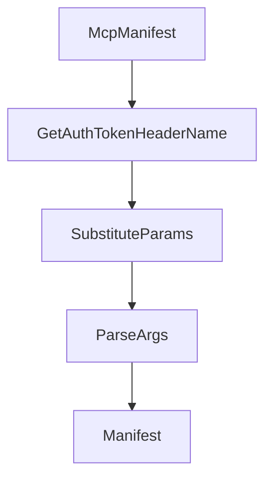

# Chapter 8: Production Governance and Release Strategy

Welcome to **Chapter 8: Production Governance and Release Strategy**. In this part of **GenAI Toolbox Tutorial: MCP-First Database Tooling with Config-Driven Control Planes**, you will build an intuitive mental model first, then move into concrete implementation details and practical production tradeoffs.


This chapter closes with operating discipline for pre-1.0 and post-1.0 evolution.

## Learning Goals

- apply versioning expectations before and after stable release
- maintain security and secret handling standards in config and runtime
- define change-management gates for connector and tool updates
- keep documentation and operational runbooks synchronized

## Governance Playbook

1. pin runtime versions and document upgrade windows
2. gate schema/config changes through staged validation
3. monitor request behavior, failures, and connector-level drift
4. keep incident and rollback procedures tied to specific release versions
5. regularly revisit MCP versus SDK mode assumptions as requirements evolve

## Source References

- [README Versioning](https://github.com/googleapis/genai-toolbox/blob/main/README.md)
- [Developer Guide](https://github.com/googleapis/genai-toolbox/blob/main/DEVELOPER.md)
- [CHANGELOG](https://github.com/googleapis/genai-toolbox/blob/main/CHANGELOG.md)

## Summary

You now have an operational model for running GenAI Toolbox as production MCP database infrastructure.

## Depth Expansion Playbook

## Source Code Walkthrough

### `internal/server/mocks.go`

The `McpManifest` function in [`internal/server/mocks.go`](https://github.com/googleapis/genai-toolbox/blob/HEAD/internal/server/mocks.go) handles a key part of this chapter's functionality:

```go
}

func (t MockTool) McpManifest() tools.McpManifest {
	properties := make(map[string]parameters.ParameterMcpManifest)
	required := make([]string, 0)
	authParams := make(map[string][]string)

	for _, p := range t.Params {
		name := p.GetName()
		paramManifest, authParamList := p.McpManifest()
		properties[name] = paramManifest
		required = append(required, name)

		if len(authParamList) > 0 {
			authParams[name] = authParamList
		}
	}

	toolsSchema := parameters.McpToolsSchema{
		Type:       "object",
		Properties: properties,
		Required:   required,
	}

	mcpManifest := tools.McpManifest{
		Name:        t.Name,
		Description: t.Description,
		InputSchema: toolsSchema,
	}

	if len(authParams) > 0 {
		mcpManifest.Metadata = map[string]any{
```

This function is important because it defines how GenAI Toolbox Tutorial: MCP-First Database Tooling with Config-Driven Control Planes implements the patterns covered in this chapter.

### `internal/server/mocks.go`

The `GetAuthTokenHeaderName` function in [`internal/server/mocks.go`](https://github.com/googleapis/genai-toolbox/blob/HEAD/internal/server/mocks.go) handles a key part of this chapter's functionality:

```go
}

func (t MockTool) GetAuthTokenHeaderName(tools.SourceProvider) (string, error) {
	return "Authorization", nil
}

// MockPrompt is used to mock prompts in tests
type MockPrompt struct {
	Name        string
	Description string
	Args        prompts.Arguments
}

func (p MockPrompt) SubstituteParams(vals parameters.ParamValues) (any, error) {
	return []prompts.Message{
		{
			Role:    "user",
			Content: fmt.Sprintf("substituted %s", p.Name),
		},
	}, nil
}

func (p MockPrompt) ParseArgs(data map[string]any, claimsMap map[string]map[string]any) (parameters.ParamValues, error) {
	var params parameters.Parameters
	for _, arg := range p.Args {
		params = append(params, arg.Parameter)
	}
	return parameters.ParseParams(params, data, claimsMap)
}

func (p MockPrompt) Manifest() prompts.Manifest {
	var argManifests []parameters.ParameterManifest
```

This function is important because it defines how GenAI Toolbox Tutorial: MCP-First Database Tooling with Config-Driven Control Planes implements the patterns covered in this chapter.

### `internal/server/mocks.go`

The `SubstituteParams` function in [`internal/server/mocks.go`](https://github.com/googleapis/genai-toolbox/blob/HEAD/internal/server/mocks.go) handles a key part of this chapter's functionality:

```go
}

func (p MockPrompt) SubstituteParams(vals parameters.ParamValues) (any, error) {
	return []prompts.Message{
		{
			Role:    "user",
			Content: fmt.Sprintf("substituted %s", p.Name),
		},
	}, nil
}

func (p MockPrompt) ParseArgs(data map[string]any, claimsMap map[string]map[string]any) (parameters.ParamValues, error) {
	var params parameters.Parameters
	for _, arg := range p.Args {
		params = append(params, arg.Parameter)
	}
	return parameters.ParseParams(params, data, claimsMap)
}

func (p MockPrompt) Manifest() prompts.Manifest {
	var argManifests []parameters.ParameterManifest
	for _, arg := range p.Args {
		argManifests = append(argManifests, arg.Manifest())
	}
	return prompts.Manifest{
		Description: p.Description,
		Arguments:   argManifests,
	}
}

func (p MockPrompt) McpManifest() prompts.McpManifest {
	return prompts.GetMcpManifest(p.Name, p.Description, p.Args)
```

This function is important because it defines how GenAI Toolbox Tutorial: MCP-First Database Tooling with Config-Driven Control Planes implements the patterns covered in this chapter.

### `internal/server/mocks.go`

The `ParseArgs` function in [`internal/server/mocks.go`](https://github.com/googleapis/genai-toolbox/blob/HEAD/internal/server/mocks.go) handles a key part of this chapter's functionality:

```go
}

func (p MockPrompt) ParseArgs(data map[string]any, claimsMap map[string]map[string]any) (parameters.ParamValues, error) {
	var params parameters.Parameters
	for _, arg := range p.Args {
		params = append(params, arg.Parameter)
	}
	return parameters.ParseParams(params, data, claimsMap)
}

func (p MockPrompt) Manifest() prompts.Manifest {
	var argManifests []parameters.ParameterManifest
	for _, arg := range p.Args {
		argManifests = append(argManifests, arg.Manifest())
	}
	return prompts.Manifest{
		Description: p.Description,
		Arguments:   argManifests,
	}
}

func (p MockPrompt) McpManifest() prompts.McpManifest {
	return prompts.GetMcpManifest(p.Name, p.Description, p.Args)
}

func (p MockPrompt) ToConfig() prompts.PromptConfig {
	return nil
}

```

This function is important because it defines how GenAI Toolbox Tutorial: MCP-First Database Tooling with Config-Driven Control Planes implements the patterns covered in this chapter.


## How These Components Connect


