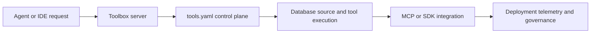

# GenAI Toolbox Tutorial: MCP-First Database Tooling with Config-Driven Control Planes

> Learn how to use `googleapis/genai-toolbox` to expose database tools through MCP and native SDK paths, with stronger configuration discipline, deployment options, and observability controls.

## Why This Track Matters

GenAI Toolbox is one of the highest-signal open-source MCP database servers and a key bridge between agents, IDE hosts, and multi-database tool execution.

This track focuses on:

- using `tools.yaml` as a control plane for sources, tools, toolsets, and prompts
- choosing between MCP transport and native Toolbox SDK integrations
- scaling from local quickstarts to containerized deployment
- operating with telemetry, versioning, and governance discipline

## Current Snapshot (Verified February 12, 2026)

- repository: [`googleapis/genai-toolbox`](https://github.com/googleapis/genai-toolbox)
- stars: about **12.9k**
- latest release: [`v0.26.0`](https://github.com/googleapis/genai-toolbox/releases/tag/v0.26.0) (**January 23, 2026**)
- license: Apache-2.0
- recent activity: updates on **February 12, 2026**
- project positioning: open-source MCP server for databases with native SDK and MCP integration surfaces

## Mental Model

## Chapter Guide

| Chapter | Key Question | Outcome |
|:--------|:-------------|:--------|
| [01 - Getting Started](01-getting-started.md) | How do I launch Toolbox quickly with a real database? | Working baseline |
| [02 - Architecture and Control Plane](02-architecture-and-control-plane.md) | How does Toolbox separate orchestration from data operations? | Better system understanding |
| [03 - `tools.yaml`: Sources, Tools, Toolsets, Prompts](03-tools-yaml-sources-tools-toolsets-prompts.md) | How should config be modeled for maintainability? | Stronger config discipline |
| [04 - MCP Connectivity and Client Integration](04-mcp-connectivity-and-client-integration.md) | When should I use MCP versus native SDKs? | Better integration choices |
| [05 - Prebuilt Connectors and Database Patterns](05-prebuilt-connectors-and-database-patterns.md) | How do I scale connector coverage across databases? | Faster multi-source onboarding |
| [06 - Deployment and Observability Patterns](06-deployment-and-observability-patterns.md) | How do I move from local to container or cloud runtimes safely? | Clear deployment strategy |
| [07 - CLI, Testing, and Development Workflow](07-cli-testing-and-development-workflow.md) | How do I iterate and validate changes without drift? | Safer engineering loop |
| [08 - Production Governance and Release Strategy](08-production-governance-and-release-strategy.md) | How should teams run Toolbox long-term under change? | Operations playbook |

## What You Will Learn

- how to model robust `tools.yaml` contracts for database tooling
- how to combine MCP and SDK integration surfaces deliberately
- how to deploy Toolbox with stronger observability and runtime controls
- how to manage pre-1.0 evolution with lower operational risk

## Source References

- [GenAI Toolbox Repository](https://github.com/googleapis/genai-toolbox)
- [README](https://github.com/googleapis/genai-toolbox/blob/main/README.md)
- [Configuration Guide](https://github.com/googleapis/genai-toolbox/blob/main/docs/en/getting-started/configure.md)
- [Python Local Quickstart](https://github.com/googleapis/genai-toolbox/blob/main/docs/en/getting-started/local_quickstart.md)
- [Connect via MCP](https://github.com/googleapis/genai-toolbox/blob/main/docs/en/how-to/connect_via_mcp.md)
- [CLI Reference](https://github.com/googleapis/genai-toolbox/blob/main/docs/en/reference/cli.md)
- [Deploy with Docker Compose](https://github.com/googleapis/genai-toolbox/blob/main/docs/en/how-to/deploy_docker.md)
- [Developer Guide](https://github.com/googleapis/genai-toolbox/blob/main/DEVELOPER.md)
- [Toolbox Server README](https://github.com/googleapis/genai-toolbox/blob/main/docs/TOOLBOX_README.md)

## Related Tutorials

- [MCP Servers Tutorial](../mcp-servers-tutorial/)
- [FastMCP Tutorial](../fastmcp-tutorial/)
- [MCP Python SDK Tutorial](../mcp-python-sdk-tutorial/)
- [awslabs/mcp Tutorial](../awslabs-mcp-tutorial/)

---

Start with [Chapter 1: Getting Started](01-getting-started.md).
