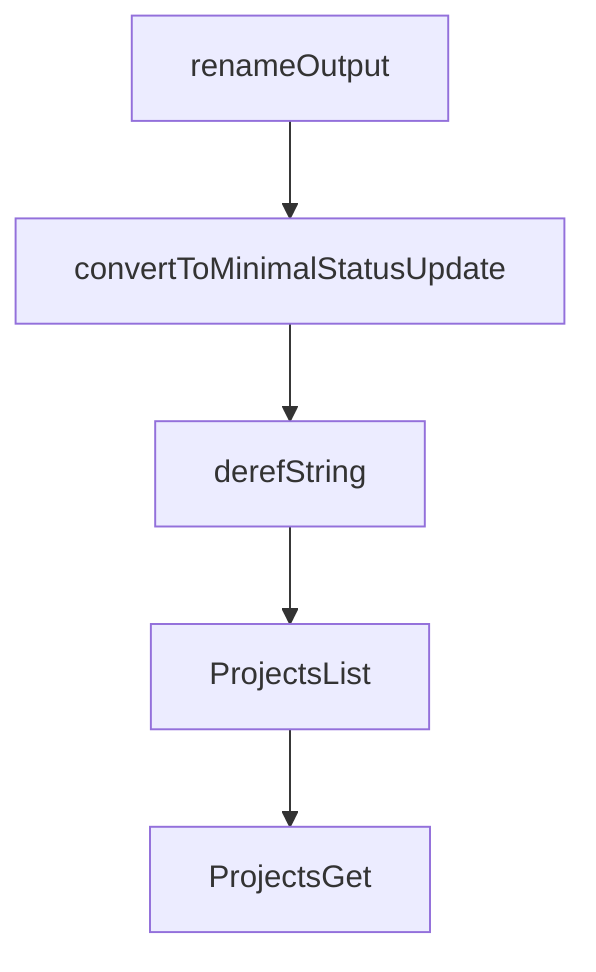

# Chapter 1: Getting Started

Welcome to **Chapter 1: Getting Started**. In this part of **GitHub MCP Server Tutorial: Production GitHub Operations Through MCP**, you will build an intuitive mental model first, then move into concrete implementation details and practical production tradeoffs.


This chapter gets GitHub MCP connected with a minimum-risk initial setup.

## Learning Goals

- choose a quick path for first successful connection
- verify host compatibility and token prerequisites
- run a basic read operation to validate wiring
- avoid over-broad permissions during initial setup

## Fast Start Sequence

1. choose remote or local mode based on host support
2. configure MCP entry in your host with PAT/OAuth
3. run `list` or repository read actions first
4. verify tool visibility before enabling write workflows

## First Validation Checklist

- host sees the `github` MCP server
- auth flow succeeds
- read-only tools execute successfully
- no unexpected write-capable tools are exposed

## Source References

- [README](https://github.com/github/github-mcp-server/blob/main/README.md)
- [Installation Guides Index](https://github.com/github/github-mcp-server/tree/main/docs/installation-guides)

## Summary

You now have a safe baseline connection to GitHub MCP.

Next: [Chapter 2: Remote vs Local Architecture](02-remote-vs-local-architecture.md)

## Depth Expansion Playbook

## Source Code Walkthrough

### `ui/vite.config.ts`

The `renameOutput` function in [`ui/vite.config.ts`](https://github.com/github/github-mcp-server/blob/HEAD/ui/vite.config.ts) handles a key part of this chapter's functionality:

```ts

// Plugin to rename the output file and remove the nested directory structure
function renameOutput(): Plugin {
  return {
    name: "rename-output",
    enforce: "post",
    generateBundle(_, bundle) {
      // Find the HTML file and rename it
      for (const fileName of Object.keys(bundle)) {
        if (fileName.endsWith("index.html")) {
          const chunk = bundle[fileName];
          chunk.fileName = `${app}.html`;
          delete bundle[fileName];
          bundle[`${app}.html`] = chunk;
          break;
        }
      }
    },
  };
}

export default defineConfig({
  plugins: [react(), viteSingleFile(), renameOutput()],
  build: {
    outDir: resolve(__dirname, "../pkg/github/ui_dist"),
    emptyOutDir: false,
    rollupOptions: {
      input: resolve(__dirname, `src/apps/${app}/index.html`),
    },
  },
});

```

This function is important because it defines how GitHub MCP Server Tutorial: Production GitHub Operations Through MCP implements the patterns covered in this chapter.

### `pkg/github/projects.go`

The `convertToMinimalStatusUpdate` function in [`pkg/github/projects.go`](https://github.com/github/github-mcp-server/blob/HEAD/pkg/github/projects.go) handles a key part of this chapter's functionality:

```go
}

func convertToMinimalStatusUpdate(node statusUpdateNode) MinimalProjectStatusUpdate {
	var creator *MinimalUser
	if login := string(node.Creator.Login); login != "" {
		creator = &MinimalUser{Login: login}
	}

	return MinimalProjectStatusUpdate{
		ID:         fmt.Sprintf("%v", node.ID),
		Body:       derefString(node.Body),
		Status:     derefString(node.Status),
		CreatedAt:  node.CreatedAt.Time.Format(time.RFC3339),
		StartDate:  derefString(node.StartDate),
		TargetDate: derefString(node.TargetDate),
		Creator:    creator,
	}
}

func derefString(s *githubv4.String) string {
	if s == nil {
		return ""
	}
	return string(*s)
}

// ProjectsList returns the tool and handler for listing GitHub Projects resources.
func ProjectsList(t translations.TranslationHelperFunc) inventory.ServerTool {
	tool := NewTool(
		ToolsetMetadataProjects,
		mcp.Tool{
			Name: "projects_list",
```

This function is important because it defines how GitHub MCP Server Tutorial: Production GitHub Operations Through MCP implements the patterns covered in this chapter.

### `pkg/github/projects.go`

The `derefString` function in [`pkg/github/projects.go`](https://github.com/github/github-mcp-server/blob/HEAD/pkg/github/projects.go) handles a key part of this chapter's functionality:

```go
	return MinimalProjectStatusUpdate{
		ID:         fmt.Sprintf("%v", node.ID),
		Body:       derefString(node.Body),
		Status:     derefString(node.Status),
		CreatedAt:  node.CreatedAt.Time.Format(time.RFC3339),
		StartDate:  derefString(node.StartDate),
		TargetDate: derefString(node.TargetDate),
		Creator:    creator,
	}
}

func derefString(s *githubv4.String) string {
	if s == nil {
		return ""
	}
	return string(*s)
}

// ProjectsList returns the tool and handler for listing GitHub Projects resources.
func ProjectsList(t translations.TranslationHelperFunc) inventory.ServerTool {
	tool := NewTool(
		ToolsetMetadataProjects,
		mcp.Tool{
			Name: "projects_list",
			Description: t("TOOL_PROJECTS_LIST_DESCRIPTION",
				`Tools for listing GitHub Projects resources.
Use this tool to list projects for a user or organization, or list project fields and items for a specific project.
`),
			Annotations: &mcp.ToolAnnotations{
				Title:        t("TOOL_PROJECTS_LIST_USER_TITLE", "List GitHub Projects resources"),
				ReadOnlyHint: true,
			},
```

This function is important because it defines how GitHub MCP Server Tutorial: Production GitHub Operations Through MCP implements the patterns covered in this chapter.

### `pkg/github/projects.go`

The `ProjectsList` function in [`pkg/github/projects.go`](https://github.com/github/github-mcp-server/blob/HEAD/pkg/github/projects.go) handles a key part of this chapter's functionality:

```go
}

// ProjectsList returns the tool and handler for listing GitHub Projects resources.
func ProjectsList(t translations.TranslationHelperFunc) inventory.ServerTool {
	tool := NewTool(
		ToolsetMetadataProjects,
		mcp.Tool{
			Name: "projects_list",
			Description: t("TOOL_PROJECTS_LIST_DESCRIPTION",
				`Tools for listing GitHub Projects resources.
Use this tool to list projects for a user or organization, or list project fields and items for a specific project.
`),
			Annotations: &mcp.ToolAnnotations{
				Title:        t("TOOL_PROJECTS_LIST_USER_TITLE", "List GitHub Projects resources"),
				ReadOnlyHint: true,
			},
			InputSchema: &jsonschema.Schema{
				Type: "object",
				Properties: map[string]*jsonschema.Schema{
					"method": {
						Type:        "string",
						Description: "The action to perform",
						Enum: []any{
							projectsMethodListProjects,
							projectsMethodListProjectFields,
							projectsMethodListProjectItems,
							projectsMethodListProjectStatusUpdates,
						},
					},
					"owner_type": {
						Type:        "string",
						Description: "Owner type (user or org). If not provided, will automatically try both.",
```

This function is important because it defines how GitHub MCP Server Tutorial: Production GitHub Operations Through MCP implements the patterns covered in this chapter.


## How These Components Connect


