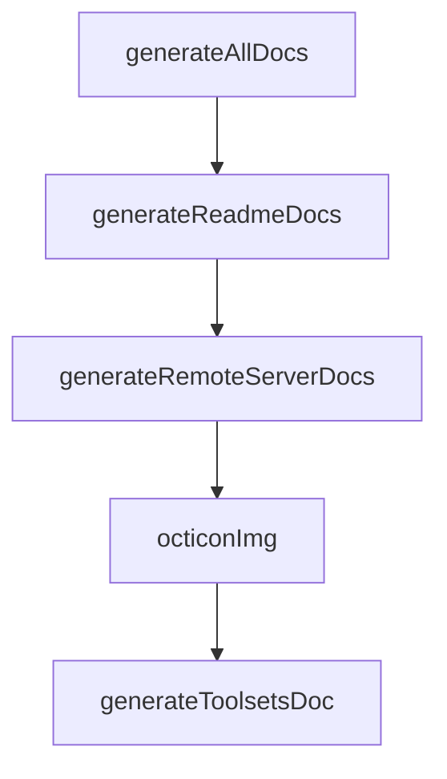

# Chapter 2: Remote vs Local Architecture

Welcome to **Chapter 2: Remote vs Local Architecture**. In this part of **GitHub MCP Server Tutorial: Production GitHub Operations Through MCP**, you will build an intuitive mental model first, then move into concrete implementation details and practical production tradeoffs.


This chapter explains the tradeoffs between the hosted remote server and self-run local server.

## Learning Goals

- understand feature and operational differences by mode
- pick deployment mode based on host and governance needs
- reason about scalability, maintenance, and control boundaries
- avoid configuration mismatches across modes

## Mode Comparison

| Mode | Best For | Key Constraint |
|:-----|:---------|:---------------|
| remote (`https://api.githubcopilot.com/mcp/`) | fastest setup and managed operations | depends on host support for remote MCP/OAuth |
| local (`ghcr.io/github/github-mcp-server`) | strict environment control and custom execution | requires Docker/binary lifecycle management |

## Practical Rule

Use remote mode first when available. Use local mode when host limitations, environment policy, or deeper control requires it.

## Source References

- [README: Remote GitHub MCP Server](https://github.com/github/github-mcp-server/blob/main/README.md#remote-github-mcp-server)
- [README: Local GitHub MCP Server](https://github.com/github/github-mcp-server/blob/main/README.md#local-github-mcp-server)
- [Remote Server Docs](https://github.com/github/github-mcp-server/blob/main/docs/remote-server.md)

## Summary

You now understand the operational boundaries of remote and local modes.

Next: [Chapter 3: Authentication and Token Strategy](03-authentication-and-token-strategy.md)

## Source Code Walkthrough

### `cmd/github-mcp-server/generate_docs.go`

The `generateAllDocs` function in [`cmd/github-mcp-server/generate_docs.go`](https://github.com/github/github-mcp-server/blob/HEAD/cmd/github-mcp-server/generate_docs.go) handles a key part of this chapter's functionality:

```go
	Long:  `Generate the automated sections of README.md and docs/remote-server.md with current tool and toolset information.`,
	RunE: func(_ *cobra.Command, _ []string) error {
		return generateAllDocs()
	},
}

func init() {
	rootCmd.AddCommand(generateDocsCmd)
}

func generateAllDocs() error {
	for _, doc := range []struct {
		path string
		fn   func(string) error
	}{
		// File to edit, function to generate its docs
		{"README.md", generateReadmeDocs},
		{"docs/remote-server.md", generateRemoteServerDocs},
		{"docs/tool-renaming.md", generateDeprecatedAliasesDocs},
	} {
		if err := doc.fn(doc.path); err != nil {
			return fmt.Errorf("failed to generate docs for %s: %w", doc.path, err)
		}
		fmt.Printf("Successfully updated %s with automated documentation\n", doc.path)
	}
	return nil
}

func generateReadmeDocs(readmePath string) error {
	// Create translation helper
	t, _ := translations.TranslationHelper()

```

This function is important because it defines how GitHub MCP Server Tutorial: Production GitHub Operations Through MCP implements the patterns covered in this chapter.

### `cmd/github-mcp-server/generate_docs.go`

The `generateReadmeDocs` function in [`cmd/github-mcp-server/generate_docs.go`](https://github.com/github/github-mcp-server/blob/HEAD/cmd/github-mcp-server/generate_docs.go) handles a key part of this chapter's functionality:

```go
	}{
		// File to edit, function to generate its docs
		{"README.md", generateReadmeDocs},
		{"docs/remote-server.md", generateRemoteServerDocs},
		{"docs/tool-renaming.md", generateDeprecatedAliasesDocs},
	} {
		if err := doc.fn(doc.path); err != nil {
			return fmt.Errorf("failed to generate docs for %s: %w", doc.path, err)
		}
		fmt.Printf("Successfully updated %s with automated documentation\n", doc.path)
	}
	return nil
}

func generateReadmeDocs(readmePath string) error {
	// Create translation helper
	t, _ := translations.TranslationHelper()

	// (not available to regular users) while including tools with FeatureFlagDisable.
	// Build() can only fail if WithTools specifies invalid tools - not used here
	r, _ := github.NewInventory(t).WithToolsets([]string{"all"}).Build()

	// Generate toolsets documentation
	toolsetsDoc := generateToolsetsDoc(r)

	// Generate tools documentation
	toolsDoc := generateToolsDoc(r)

	// Read the current README.md
	// #nosec G304 - readmePath is controlled by command line flag, not user input
	content, err := os.ReadFile(readmePath)
	if err != nil {
```

This function is important because it defines how GitHub MCP Server Tutorial: Production GitHub Operations Through MCP implements the patterns covered in this chapter.

### `cmd/github-mcp-server/generate_docs.go`

The `generateRemoteServerDocs` function in [`cmd/github-mcp-server/generate_docs.go`](https://github.com/github/github-mcp-server/blob/HEAD/cmd/github-mcp-server/generate_docs.go) handles a key part of this chapter's functionality:

```go
		// File to edit, function to generate its docs
		{"README.md", generateReadmeDocs},
		{"docs/remote-server.md", generateRemoteServerDocs},
		{"docs/tool-renaming.md", generateDeprecatedAliasesDocs},
	} {
		if err := doc.fn(doc.path); err != nil {
			return fmt.Errorf("failed to generate docs for %s: %w", doc.path, err)
		}
		fmt.Printf("Successfully updated %s with automated documentation\n", doc.path)
	}
	return nil
}

func generateReadmeDocs(readmePath string) error {
	// Create translation helper
	t, _ := translations.TranslationHelper()

	// (not available to regular users) while including tools with FeatureFlagDisable.
	// Build() can only fail if WithTools specifies invalid tools - not used here
	r, _ := github.NewInventory(t).WithToolsets([]string{"all"}).Build()

	// Generate toolsets documentation
	toolsetsDoc := generateToolsetsDoc(r)

	// Generate tools documentation
	toolsDoc := generateToolsDoc(r)

	// Read the current README.md
	// #nosec G304 - readmePath is controlled by command line flag, not user input
	content, err := os.ReadFile(readmePath)
	if err != nil {
		return fmt.Errorf("failed to read README.md: %w", err)
```

This function is important because it defines how GitHub MCP Server Tutorial: Production GitHub Operations Through MCP implements the patterns covered in this chapter.

### `cmd/github-mcp-server/generate_docs.go`

The `octiconImg` function in [`cmd/github-mcp-server/generate_docs.go`](https://github.com/github/github-mcp-server/blob/HEAD/cmd/github-mcp-server/generate_docs.go) handles a key part of this chapter's functionality:

```go
}

// octiconImg returns an img tag for an Octicon that works with GitHub's light/dark theme.
// Uses picture element with prefers-color-scheme for automatic theme switching.
// References icons from the repo's pkg/octicons/icons directory.
// Optional pathPrefix for files in subdirectories (e.g., "../" for docs/).
func octiconImg(name string, pathPrefix ...string) string {
	if name == "" {
		return ""
	}
	prefix := ""
	if len(pathPrefix) > 0 {
		prefix = pathPrefix[0]
	}
	// Use picture element with media queries for light/dark mode support
	// GitHub renders these correctly in markdown
	lightIcon := fmt.Sprintf("%spkg/octicons/icons/%s-light.png", prefix, name)
	darkIcon := fmt.Sprintf("%spkg/octicons/icons/%s-dark.png", prefix, name)
	return fmt.Sprintf(`<picture><source media="(prefers-color-scheme: dark)" srcset="%s"><source media="(prefers-color-scheme: light)" srcset="%s"></picture>`, darkIcon, lightIcon, lightIcon, name)
}

func generateToolsetsDoc(i *inventory.Inventory) string {
	var buf strings.Builder

	// Add table header and separator (with icon column)
	buf.WriteString("|     | Toolset                 | Description                                                   |\n")
	buf.WriteString("| --- | ----------------------- | ------------------------------------------------------------- |\n")

	// Add the context toolset row with custom description (strongly recommended)
	// Get context toolset for its icon
	contextIcon := octiconImg("person")
	fmt.Fprintf(&buf, "| %s | `context`               | **Strongly recommended**: Tools that provide context about the current user and GitHub context you are operating in |\n", contextIcon)
```

This function is important because it defines how GitHub MCP Server Tutorial: Production GitHub Operations Through MCP implements the patterns covered in this chapter.


## How These Components Connect


