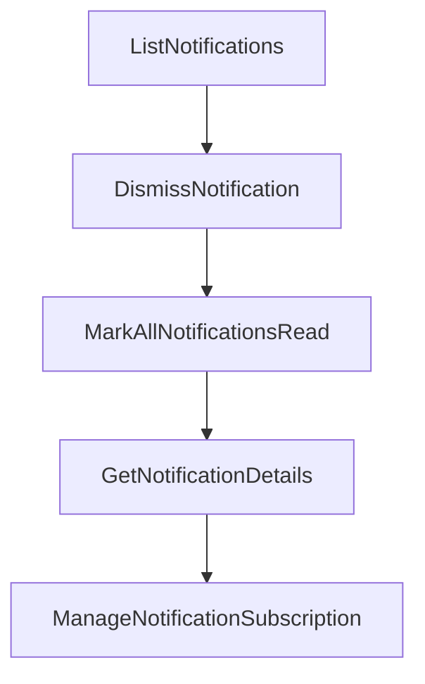

# Chapter 2: Remote vs Local Architecture

Welcome to **Chapter 2: Remote vs Local Architecture**. In this part of **GitHub MCP Server Tutorial: Production GitHub Operations Through MCP**, you will build an intuitive mental model first, then move into concrete implementation details and practical production tradeoffs.


This chapter explains the tradeoffs between the hosted remote server and self-run local server.

## Learning Goals

- understand feature and operational differences by mode
- pick deployment mode based on host and governance needs
- reason about scalability, maintenance, and control boundaries
- avoid configuration mismatches across modes

## Mode Comparison

| Mode | Best For | Key Constraint |
|:-----|:---------|:---------------|
| remote (`https://api.githubcopilot.com/mcp/`) | fastest setup and managed operations | depends on host support for remote MCP/OAuth |
| local (`ghcr.io/github/github-mcp-server`) | strict environment control and custom execution | requires Docker/binary lifecycle management |

## Practical Rule

Use remote mode first when available. Use local mode when host limitations, environment policy, or deeper control requires it.

## Source References

- [README: Remote GitHub MCP Server](https://github.com/github/github-mcp-server/blob/main/README.md#remote-github-mcp-server)
- [README: Local GitHub MCP Server](https://github.com/github/github-mcp-server/blob/main/README.md#local-github-mcp-server)
- [Remote Server Docs](https://github.com/github/github-mcp-server/blob/main/docs/remote-server.md)

## Summary

You now understand the operational boundaries of remote and local modes.

Next: [Chapter 3: Authentication and Token Strategy](03-authentication-and-token-strategy.md)

## Depth Expansion Playbook

## Source Code Walkthrough

### `pkg/github/notifications.go`

The `ListNotifications` function in [`pkg/github/notifications.go`](https://github.com/github/github-mcp-server/blob/HEAD/pkg/github/notifications.go) handles a key part of this chapter's functionality:

```go
)

// ListNotifications creates a tool to list notifications for the current user.
func ListNotifications(t translations.TranslationHelperFunc) inventory.ServerTool {
	return NewTool(
		ToolsetMetadataNotifications,
		mcp.Tool{
			Name:        "list_notifications",
			Description: t("TOOL_LIST_NOTIFICATIONS_DESCRIPTION", "Lists all GitHub notifications for the authenticated user, including unread notifications, mentions, review requests, assignments, and updates on issues or pull requests. Use this tool whenever the user asks what to work on next, requests a summary of their GitHub activity, wants to see pending reviews, or needs to check for new updates or tasks. This tool is the primary way to discover actionable items, reminders, and outstanding work on GitHub. Always call this tool when asked what to work on next, what is pending, or what needs attention in GitHub."),
			Annotations: &mcp.ToolAnnotations{
				Title:        t("TOOL_LIST_NOTIFICATIONS_USER_TITLE", "List notifications"),
				ReadOnlyHint: true,
			},
			InputSchema: WithPagination(&jsonschema.Schema{
				Type: "object",
				Properties: map[string]*jsonschema.Schema{
					"filter": {
						Type:        "string",
						Description: "Filter notifications to, use default unless specified. Read notifications are ones that have already been acknowledged by the user. Participating notifications are those that the user is directly involved in, such as issues or pull requests they have commented on or created.",
						Enum:        []any{FilterDefault, FilterIncludeRead, FilterOnlyParticipating},
					},
					"since": {
						Type:        "string",
						Description: "Only show notifications updated after the given time (ISO 8601 format)",
					},
					"before": {
						Type:        "string",
						Description: "Only show notifications updated before the given time (ISO 8601 format)",
					},
					"owner": {
						Type:        "string",
						Description: "Optional repository owner. If provided with repo, only notifications for this repository are listed.",
```

This function is important because it defines how GitHub MCP Server Tutorial: Production GitHub Operations Through MCP implements the patterns covered in this chapter.

### `pkg/github/notifications.go`

The `DismissNotification` function in [`pkg/github/notifications.go`](https://github.com/github/github-mcp-server/blob/HEAD/pkg/github/notifications.go) handles a key part of this chapter's functionality:

```go
}

// DismissNotification creates a tool to mark a notification as read/done.
func DismissNotification(t translations.TranslationHelperFunc) inventory.ServerTool {
	return NewTool(
		ToolsetMetadataNotifications,
		mcp.Tool{
			Name:        "dismiss_notification",
			Description: t("TOOL_DISMISS_NOTIFICATION_DESCRIPTION", "Dismiss a notification by marking it as read or done"),
			Annotations: &mcp.ToolAnnotations{
				Title:        t("TOOL_DISMISS_NOTIFICATION_USER_TITLE", "Dismiss notification"),
				ReadOnlyHint: false,
			},
			InputSchema: &jsonschema.Schema{
				Type: "object",
				Properties: map[string]*jsonschema.Schema{
					"threadID": {
						Type:        "string",
						Description: "The ID of the notification thread",
					},
					"state": {
						Type:        "string",
						Description: "The new state of the notification (read/done)",
						Enum:        []any{"read", "done"},
					},
				},
				Required: []string{"threadID", "state"},
			},
		},
		[]scopes.Scope{scopes.Notifications},
		func(ctx context.Context, deps ToolDependencies, _ *mcp.CallToolRequest, args map[string]any) (*mcp.CallToolResult, any, error) {
			client, err := deps.GetClient(ctx)
```

This function is important because it defines how GitHub MCP Server Tutorial: Production GitHub Operations Through MCP implements the patterns covered in this chapter.

### `pkg/github/notifications.go`

The `MarkAllNotificationsRead` function in [`pkg/github/notifications.go`](https://github.com/github/github-mcp-server/blob/HEAD/pkg/github/notifications.go) handles a key part of this chapter's functionality:

```go
}

// MarkAllNotificationsRead creates a tool to mark all notifications as read.
func MarkAllNotificationsRead(t translations.TranslationHelperFunc) inventory.ServerTool {
	return NewTool(
		ToolsetMetadataNotifications,
		mcp.Tool{
			Name:        "mark_all_notifications_read",
			Description: t("TOOL_MARK_ALL_NOTIFICATIONS_READ_DESCRIPTION", "Mark all notifications as read"),
			Annotations: &mcp.ToolAnnotations{
				Title:        t("TOOL_MARK_ALL_NOTIFICATIONS_READ_USER_TITLE", "Mark all notifications as read"),
				ReadOnlyHint: false,
			},
			InputSchema: &jsonschema.Schema{
				Type: "object",
				Properties: map[string]*jsonschema.Schema{
					"lastReadAt": {
						Type:        "string",
						Description: "Describes the last point that notifications were checked (optional). Default: Now",
					},
					"owner": {
						Type:        "string",
						Description: "Optional repository owner. If provided with repo, only notifications for this repository are marked as read.",
					},
					"repo": {
						Type:        "string",
						Description: "Optional repository name. If provided with owner, only notifications for this repository are marked as read.",
					},
				},
			},
		},
		[]scopes.Scope{scopes.Notifications},
```

This function is important because it defines how GitHub MCP Server Tutorial: Production GitHub Operations Through MCP implements the patterns covered in this chapter.

### `pkg/github/notifications.go`

The `GetNotificationDetails` function in [`pkg/github/notifications.go`](https://github.com/github/github-mcp-server/blob/HEAD/pkg/github/notifications.go) handles a key part of this chapter's functionality:

```go
}

// GetNotificationDetails creates a tool to get details for a specific notification.
func GetNotificationDetails(t translations.TranslationHelperFunc) inventory.ServerTool {
	return NewTool(
		ToolsetMetadataNotifications,
		mcp.Tool{
			Name:        "get_notification_details",
			Description: t("TOOL_GET_NOTIFICATION_DETAILS_DESCRIPTION", "Get detailed information for a specific GitHub notification, always call this tool when the user asks for details about a specific notification, if you don't know the ID list notifications first."),
			Annotations: &mcp.ToolAnnotations{
				Title:        t("TOOL_GET_NOTIFICATION_DETAILS_USER_TITLE", "Get notification details"),
				ReadOnlyHint: true,
			},
			InputSchema: &jsonschema.Schema{
				Type: "object",
				Properties: map[string]*jsonschema.Schema{
					"notificationID": {
						Type:        "string",
						Description: "The ID of the notification",
					},
				},
				Required: []string{"notificationID"},
			},
		},
		[]scopes.Scope{scopes.Notifications},
		func(ctx context.Context, deps ToolDependencies, _ *mcp.CallToolRequest, args map[string]any) (*mcp.CallToolResult, any, error) {
			client, err := deps.GetClient(ctx)
			if err != nil {
				return utils.NewToolResultErrorFromErr("failed to get GitHub client", err), nil, nil
			}

			notificationID, err := RequiredParam[string](args, "notificationID")
```

This function is important because it defines how GitHub MCP Server Tutorial: Production GitHub Operations Through MCP implements the patterns covered in this chapter.


## How These Components Connect


