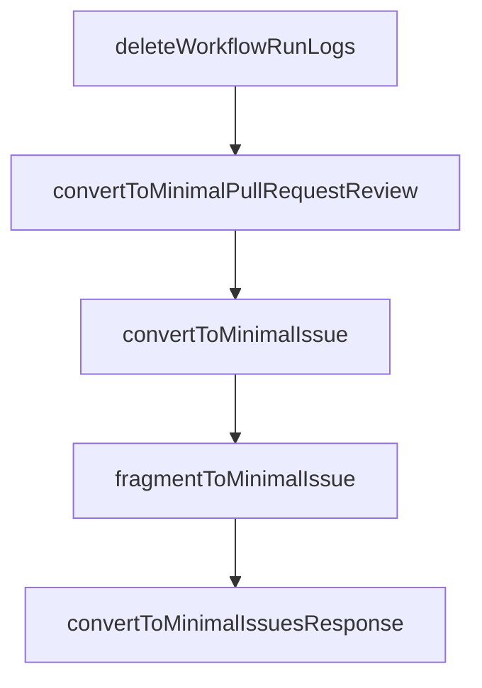

# Chapter 3: Authentication and Token Strategy

Welcome to **Chapter 3: Authentication and Token Strategy**. In this part of **GitHub MCP Server Tutorial: Production GitHub Operations Through MCP**, you will build an intuitive mental model first, then move into concrete implementation details and practical production tradeoffs.


This chapter covers secure authentication choices and scope minimization.

## Learning Goals

- choose between OAuth and PAT approaches by context
- minimize scopes while preserving required functionality
- understand scope filtering behavior in different auth flows
- reduce token handling risk in local and shared environments

## Auth Decision Matrix

| Method | Typical Use | Security Consideration |
|:-------|:------------|:-----------------------|
| OAuth (remote) | interactive hosts with app support | strong user flow, host-dependent behavior |
| fine-grained PAT | local/portable compatibility | scope discipline required |
| classic PAT | legacy compatibility only | broader risk surface |

## Token Hygiene Baseline

- prefer fine-grained PATs
- scope to required repos and operations only
- avoid hardcoding in committed config
- rotate credentials on schedule or incident

## Source References

- [README: Token Security Best Practices](https://github.com/github/github-mcp-server/blob/main/README.md#token-security-best-practices)
- [Server Configuration: Scope Filtering](https://github.com/github/github-mcp-server/blob/main/docs/server-configuration.md#scope-filtering)
- [Policies and Governance](https://github.com/github/github-mcp-server/blob/main/docs/policies-and-governance.md)

## Summary

You now have an authentication strategy that balances compatibility and risk.

Next: [Chapter 4: Toolsets, Tools, and Dynamic Discovery](04-toolsets-tools-and-dynamic-discovery.md)

## Depth Expansion Playbook

## Source Code Walkthrough

### `pkg/github/actions.go`

The `deleteWorkflowRunLogs` function in [`pkg/github/actions.go`](https://github.com/github/github-mcp-server/blob/HEAD/pkg/github/actions.go) handles a key part of this chapter's functionality:

```go
				return cancelWorkflowRun(ctx, client, owner, repo, int64(runID))
			case actionsMethodDeleteWorkflowRunLogs:
				return deleteWorkflowRunLogs(ctx, client, owner, repo, int64(runID))
			default:
				return utils.NewToolResultError(fmt.Sprintf("unknown method: %s", method)), nil, nil
			}
		},
	)
	return tool
}

// ActionsGetJobLogs returns the tool and handler for getting workflow job logs.
func ActionsGetJobLogs(t translations.TranslationHelperFunc) inventory.ServerTool {
	tool := NewTool(
		ToolsetMetadataActions,
		mcp.Tool{
			Name: "get_job_logs",
			Description: t("TOOL_GET_JOB_LOGS_CONSOLIDATED_DESCRIPTION", `Get logs for GitHub Actions workflow jobs.
Use this tool to retrieve logs for a specific job or all failed jobs in a workflow run.
For single job logs, provide job_id. For all failed jobs in a run, provide run_id with failed_only=true.
`),
			Annotations: &mcp.ToolAnnotations{
				Title:        t("TOOL_GET_JOB_LOGS_CONSOLIDATED_USER_TITLE", "Get GitHub Actions workflow job logs"),
				ReadOnlyHint: true,
			},
			InputSchema: &jsonschema.Schema{
				Type: "object",
				Properties: map[string]*jsonschema.Schema{
					"owner": {
						Type:        "string",
						Description: "Repository owner",
					},
```

This function is important because it defines how GitHub MCP Server Tutorial: Production GitHub Operations Through MCP implements the patterns covered in this chapter.

### `pkg/github/minimal_types.go`

The `convertToMinimalPullRequestReview` function in [`pkg/github/minimal_types.go`](https://github.com/github/github-mcp-server/blob/HEAD/pkg/github/minimal_types.go) handles a key part of this chapter's functionality:

```go
// Helper functions

func convertToMinimalPullRequestReview(review *github.PullRequestReview) MinimalPullRequestReview {
	m := MinimalPullRequestReview{
		ID:                review.GetID(),
		State:             review.GetState(),
		Body:              review.GetBody(),
		HTMLURL:           review.GetHTMLURL(),
		User:              convertToMinimalUser(review.GetUser()),
		CommitID:          review.GetCommitID(),
		AuthorAssociation: review.GetAuthorAssociation(),
	}

	if review.SubmittedAt != nil {
		m.SubmittedAt = review.SubmittedAt.Format(time.RFC3339)
	}

	return m
}

func convertToMinimalIssue(issue *github.Issue) MinimalIssue {
	m := MinimalIssue{
		Number:            issue.GetNumber(),
		Title:             issue.GetTitle(),
		Body:              issue.GetBody(),
		State:             issue.GetState(),
		StateReason:       issue.GetStateReason(),
		Draft:             issue.GetDraft(),
		Locked:            issue.GetLocked(),
		HTMLURL:           issue.GetHTMLURL(),
		User:              convertToMinimalUser(issue.GetUser()),
		AuthorAssociation: issue.GetAuthorAssociation(),
```

This function is important because it defines how GitHub MCP Server Tutorial: Production GitHub Operations Through MCP implements the patterns covered in this chapter.

### `pkg/github/minimal_types.go`

The `convertToMinimalIssue` function in [`pkg/github/minimal_types.go`](https://github.com/github/github-mcp-server/blob/HEAD/pkg/github/minimal_types.go) handles a key part of this chapter's functionality:

```go
}

func convertToMinimalIssue(issue *github.Issue) MinimalIssue {
	m := MinimalIssue{
		Number:            issue.GetNumber(),
		Title:             issue.GetTitle(),
		Body:              issue.GetBody(),
		State:             issue.GetState(),
		StateReason:       issue.GetStateReason(),
		Draft:             issue.GetDraft(),
		Locked:            issue.GetLocked(),
		HTMLURL:           issue.GetHTMLURL(),
		User:              convertToMinimalUser(issue.GetUser()),
		AuthorAssociation: issue.GetAuthorAssociation(),
		Comments:          issue.GetComments(),
	}

	if issue.CreatedAt != nil {
		m.CreatedAt = issue.CreatedAt.Format(time.RFC3339)
	}
	if issue.UpdatedAt != nil {
		m.UpdatedAt = issue.UpdatedAt.Format(time.RFC3339)
	}
	if issue.ClosedAt != nil {
		m.ClosedAt = issue.ClosedAt.Format(time.RFC3339)
	}

	for _, label := range issue.Labels {
		if label != nil {
			m.Labels = append(m.Labels, label.GetName())
		}
	}
```

This function is important because it defines how GitHub MCP Server Tutorial: Production GitHub Operations Through MCP implements the patterns covered in this chapter.

### `pkg/github/minimal_types.go`

The `fragmentToMinimalIssue` function in [`pkg/github/minimal_types.go`](https://github.com/github/github-mcp-server/blob/HEAD/pkg/github/minimal_types.go) handles a key part of this chapter's functionality:

```go
}

func fragmentToMinimalIssue(fragment IssueFragment) MinimalIssue {
	m := MinimalIssue{
		Number:    int(fragment.Number),
		Title:     sanitize.Sanitize(string(fragment.Title)),
		Body:      sanitize.Sanitize(string(fragment.Body)),
		State:     string(fragment.State),
		Comments:  int(fragment.Comments.TotalCount),
		CreatedAt: fragment.CreatedAt.Format(time.RFC3339),
		UpdatedAt: fragment.UpdatedAt.Format(time.RFC3339),
		User: &MinimalUser{
			Login: string(fragment.Author.Login),
		},
	}

	for _, label := range fragment.Labels.Nodes {
		m.Labels = append(m.Labels, string(label.Name))
	}

	return m
}

func convertToMinimalIssuesResponse(fragment IssueQueryFragment) MinimalIssuesResponse {
	minimalIssues := make([]MinimalIssue, 0, len(fragment.Nodes))
	for _, issue := range fragment.Nodes {
		minimalIssues = append(minimalIssues, fragmentToMinimalIssue(issue))
	}

	return MinimalIssuesResponse{
		Issues:     minimalIssues,
		TotalCount: fragment.TotalCount,
```

This function is important because it defines how GitHub MCP Server Tutorial: Production GitHub Operations Through MCP implements the patterns covered in this chapter.


## How These Components Connect


