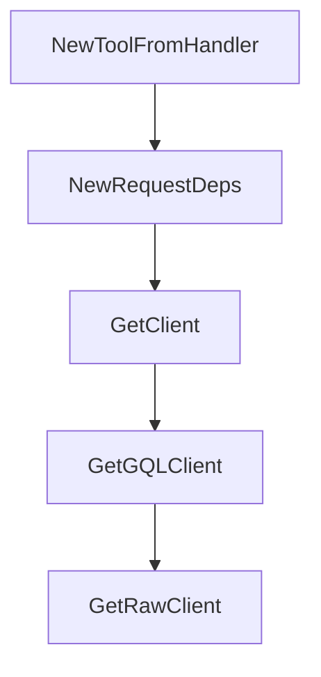

# Chapter 3: Authentication and Token Strategy

Welcome to **Chapter 3: Authentication and Token Strategy**. In this part of **GitHub MCP Server Tutorial: Production GitHub Operations Through MCP**, you will build an intuitive mental model first, then move into concrete implementation details and practical production tradeoffs.


This chapter covers secure authentication choices and scope minimization.

## Learning Goals

- choose between OAuth and PAT approaches by context
- minimize scopes while preserving required functionality
- understand scope filtering behavior in different auth flows
- reduce token handling risk in local and shared environments

## Auth Decision Matrix

| Method | Typical Use | Security Consideration |
|:-------|:------------|:-----------------------|
| OAuth (remote) | interactive hosts with app support | strong user flow, host-dependent behavior |
| fine-grained PAT | local/portable compatibility | scope discipline required |
| classic PAT | legacy compatibility only | broader risk surface |

## Token Hygiene Baseline

- prefer fine-grained PATs
- scope to required repos and operations only
- avoid hardcoding in committed config
- rotate credentials on schedule or incident

## Source References

- [README: Token Security Best Practices](https://github.com/github/github-mcp-server/blob/main/README.md#token-security-best-practices)
- [Server Configuration: Scope Filtering](https://github.com/github/github-mcp-server/blob/main/docs/server-configuration.md#scope-filtering)
- [Policies and Governance](https://github.com/github/github-mcp-server/blob/main/docs/policies-and-governance.md)

## Summary

You now have an authentication strategy that balances compatibility and risk.

Next: [Chapter 4: Toolsets, Tools, and Dynamic Discovery](04-toolsets-tools-and-dynamic-discovery.md)

## Source Code Walkthrough

### `pkg/github/dependencies.go`

The `NewToolFromHandler` function in [`pkg/github/dependencies.go`](https://github.com/github/github-mcp-server/blob/HEAD/pkg/github/dependencies.go) handles a key part of this chapter's functionality:

```go
}

// NewToolFromHandler creates a ServerTool that retrieves ToolDependencies from context at call time.
// Use this when you have a handler that conforms to mcp.ToolHandler directly.
//
// The handler function receives deps extracted from context via MustDepsFromContext.
// Ensure ContextWithDeps is called to inject deps before any tool handlers are invoked.
//
// requiredScopes specifies the minimum OAuth scopes needed for this tool.
// AcceptedScopes are automatically derived using the scope hierarchy.
func NewToolFromHandler(
	toolset inventory.ToolsetMetadata,
	tool mcp.Tool,
	requiredScopes []scopes.Scope,
	handler func(ctx context.Context, deps ToolDependencies, req *mcp.CallToolRequest) (*mcp.CallToolResult, error),
) inventory.ServerTool {
	st := inventory.NewServerToolWithRawContextHandler(tool, toolset, func(ctx context.Context, req *mcp.CallToolRequest) (*mcp.CallToolResult, error) {
		deps := MustDepsFromContext(ctx)
		return handler(ctx, deps, req)
	})
	st.RequiredScopes = scopes.ToStringSlice(requiredScopes...)
	st.AcceptedScopes = scopes.ExpandScopes(requiredScopes...)
	return st
}

type RequestDeps struct {
	// Static dependencies
	apiHosts          utils.APIHostResolver
	version           string
	lockdownMode      bool
	RepoAccessOpts    []lockdown.RepoAccessOption
	T                 translations.TranslationHelperFunc
```

This function is important because it defines how GitHub MCP Server Tutorial: Production GitHub Operations Through MCP implements the patterns covered in this chapter.

### `pkg/github/dependencies.go`

The `NewRequestDeps` function in [`pkg/github/dependencies.go`](https://github.com/github/github-mcp-server/blob/HEAD/pkg/github/dependencies.go) handles a key part of this chapter's functionality:

```go
}

// NewRequestDeps creates a RequestDeps with the provided clients and configuration.
func NewRequestDeps(
	apiHosts utils.APIHostResolver,
	version string,
	lockdownMode bool,
	repoAccessOpts []lockdown.RepoAccessOption,
	t translations.TranslationHelperFunc,
	contentWindowSize int,
	featureChecker inventory.FeatureFlagChecker,
	obsv observability.Exporters,
) *RequestDeps {
	return &RequestDeps{
		apiHosts:          apiHosts,
		version:           version,
		lockdownMode:      lockdownMode,
		RepoAccessOpts:    repoAccessOpts,
		T:                 t,
		ContentWindowSize: contentWindowSize,
		featureChecker:    featureChecker,
		obsv:              obsv,
	}
}

// GetClient implements ToolDependencies.
func (d *RequestDeps) GetClient(ctx context.Context) (*gogithub.Client, error) {
	// extract the token from the context
	tokenInfo, ok := ghcontext.GetTokenInfo(ctx)
	if !ok {
		return nil, fmt.Errorf("no token info in context")
	}
```

This function is important because it defines how GitHub MCP Server Tutorial: Production GitHub Operations Through MCP implements the patterns covered in this chapter.

### `pkg/github/dependencies.go`

The `GetClient` function in [`pkg/github/dependencies.go`](https://github.com/github/github-mcp-server/blob/HEAD/pkg/github/dependencies.go) handles a key part of this chapter's functionality:

```go
// The toolsets package uses `any` for deps and tool handlers type-assert to this interface.
type ToolDependencies interface {
	// GetClient returns a GitHub REST API client
	GetClient(ctx context.Context) (*gogithub.Client, error)

	// GetGQLClient returns a GitHub GraphQL client
	GetGQLClient(ctx context.Context) (*githubv4.Client, error)

	// GetRawClient returns a raw content client for GitHub
	GetRawClient(ctx context.Context) (*raw.Client, error)

	// GetRepoAccessCache returns the lockdown mode repo access cache
	GetRepoAccessCache(ctx context.Context) (*lockdown.RepoAccessCache, error)

	// GetT returns the translation helper function
	GetT() translations.TranslationHelperFunc

	// GetFlags returns feature flags
	GetFlags(ctx context.Context) FeatureFlags

	// GetContentWindowSize returns the content window size for log truncation
	GetContentWindowSize() int

	// IsFeatureEnabled checks if a feature flag is enabled.
	IsFeatureEnabled(ctx context.Context, flagName string) bool

	// Logger returns the structured logger, optionally enriched with
	// request-scoped data from ctx. Integrators provide their own slog.Handler
	// to control where logs are sent.
	Logger(ctx context.Context) *slog.Logger

	// Metrics returns the metrics client
```

This function is important because it defines how GitHub MCP Server Tutorial: Production GitHub Operations Through MCP implements the patterns covered in this chapter.

### `pkg/github/dependencies.go`

The `GetGQLClient` function in [`pkg/github/dependencies.go`](https://github.com/github/github-mcp-server/blob/HEAD/pkg/github/dependencies.go) handles a key part of this chapter's functionality:

```go
	GetClient(ctx context.Context) (*gogithub.Client, error)

	// GetGQLClient returns a GitHub GraphQL client
	GetGQLClient(ctx context.Context) (*githubv4.Client, error)

	// GetRawClient returns a raw content client for GitHub
	GetRawClient(ctx context.Context) (*raw.Client, error)

	// GetRepoAccessCache returns the lockdown mode repo access cache
	GetRepoAccessCache(ctx context.Context) (*lockdown.RepoAccessCache, error)

	// GetT returns the translation helper function
	GetT() translations.TranslationHelperFunc

	// GetFlags returns feature flags
	GetFlags(ctx context.Context) FeatureFlags

	// GetContentWindowSize returns the content window size for log truncation
	GetContentWindowSize() int

	// IsFeatureEnabled checks if a feature flag is enabled.
	IsFeatureEnabled(ctx context.Context, flagName string) bool

	// Logger returns the structured logger, optionally enriched with
	// request-scoped data from ctx. Integrators provide their own slog.Handler
	// to control where logs are sent.
	Logger(ctx context.Context) *slog.Logger

	// Metrics returns the metrics client
	Metrics(ctx context.Context) metrics.Metrics
}

```

This function is important because it defines how GitHub MCP Server Tutorial: Production GitHub Operations Through MCP implements the patterns covered in this chapter.


## How These Components Connect


