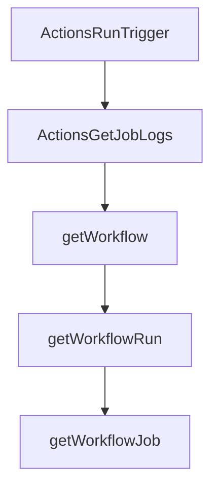

# Chapter 4: Toolsets, Tools, and Dynamic Discovery

Welcome to **Chapter 4: Toolsets, Tools, and Dynamic Discovery**. In this part of **GitHub MCP Server Tutorial: Production GitHub Operations Through MCP**, you will build an intuitive mental model first, then move into concrete implementation details and practical production tradeoffs.


This chapter explains how to precisely shape the server capability surface for better reliability and safety.

## Learning Goals

- constrain tools using toolsets and explicit tool allow-lists
- use dynamic discovery to limit initial tool overload
- combine read-only mode with selective tool exposure
- prevent accidental write operations in exploratory sessions

## Control Surface Options

| Control | Local | Remote |
|:--------|:------|:-------|
| toolsets | `--toolsets` / `GITHUB_TOOLSETS` | URL + `X-MCP-Toolsets` |
| individual tools | `--tools` / `GITHUB_TOOLS` | header-based filtering |
| read-only | `--read-only` / `GITHUB_READ_ONLY` | `/readonly` or `X-MCP-Readonly` |
| dynamic discovery | `--dynamic-toolsets` | not available |
| lockdown mode | `--lockdown-mode` | `X-MCP-Lockdown` |

## Source References

- [README: Tool Configuration](https://github.com/github/github-mcp-server/blob/main/README.md#tool-configuration)
- [Server Configuration Guide](https://github.com/github/github-mcp-server/blob/main/docs/server-configuration.md)
- [Remote Server Docs: Headers](https://github.com/github/github-mcp-server/blob/main/docs/remote-server.md#headers)

## Summary

You now know how to expose just enough capability for each task context.

Next: [Chapter 5: Host Integration Patterns](05-host-integration-patterns.md)

## Source Code Walkthrough

### `pkg/github/actions.go`

The `ActionsRunTrigger` function in [`pkg/github/actions.go`](https://github.com/github/github-mcp-server/blob/HEAD/pkg/github/actions.go) handles a key part of this chapter's functionality:

```go
}

// ActionsRunTrigger returns the tool and handler for triggering GitHub Actions workflows.
func ActionsRunTrigger(t translations.TranslationHelperFunc) inventory.ServerTool {
	tool := NewTool(
		ToolsetMetadataActions,
		mcp.Tool{
			Name:        "actions_run_trigger",
			Description: t("TOOL_ACTIONS_RUN_TRIGGER_DESCRIPTION", "Trigger GitHub Actions workflow operations, including running, re-running, cancelling workflow runs, and deleting workflow run logs."),
			Annotations: &mcp.ToolAnnotations{
				Title:           t("TOOL_ACTIONS_RUN_TRIGGER_USER_TITLE", "Trigger GitHub Actions workflow actions"),
				ReadOnlyHint:    false,
				DestructiveHint: jsonschema.Ptr(true),
			},
			InputSchema: &jsonschema.Schema{
				Type: "object",
				Properties: map[string]*jsonschema.Schema{
					"method": {
						Type:        "string",
						Description: "The method to execute",
						Enum: []any{
							actionsMethodRunWorkflow,
							actionsMethodRerunWorkflowRun,
							actionsMethodRerunFailedJobs,
							actionsMethodCancelWorkflowRun,
							actionsMethodDeleteWorkflowRunLogs,
						},
					},
					"owner": {
						Type:        "string",
						Description: "Repository owner",
					},
```

This function is important because it defines how GitHub MCP Server Tutorial: Production GitHub Operations Through MCP implements the patterns covered in this chapter.

### `pkg/github/actions.go`

The `ActionsGetJobLogs` function in [`pkg/github/actions.go`](https://github.com/github/github-mcp-server/blob/HEAD/pkg/github/actions.go) handles a key part of this chapter's functionality:

```go
}

// ActionsGetJobLogs returns the tool and handler for getting workflow job logs.
func ActionsGetJobLogs(t translations.TranslationHelperFunc) inventory.ServerTool {
	tool := NewTool(
		ToolsetMetadataActions,
		mcp.Tool{
			Name: "get_job_logs",
			Description: t("TOOL_GET_JOB_LOGS_CONSOLIDATED_DESCRIPTION", `Get logs for GitHub Actions workflow jobs.
Use this tool to retrieve logs for a specific job or all failed jobs in a workflow run.
For single job logs, provide job_id. For all failed jobs in a run, provide run_id with failed_only=true.
`),
			Annotations: &mcp.ToolAnnotations{
				Title:        t("TOOL_GET_JOB_LOGS_CONSOLIDATED_USER_TITLE", "Get GitHub Actions workflow job logs"),
				ReadOnlyHint: true,
			},
			InputSchema: &jsonschema.Schema{
				Type: "object",
				Properties: map[string]*jsonschema.Schema{
					"owner": {
						Type:        "string",
						Description: "Repository owner",
					},
					"repo": {
						Type:        "string",
						Description: "Repository name",
					},
					"job_id": {
						Type:        "number",
						Description: "The unique identifier of the workflow job. Required when getting logs for a single job.",
					},
					"run_id": {
```

This function is important because it defines how GitHub MCP Server Tutorial: Production GitHub Operations Through MCP implements the patterns covered in this chapter.

### `pkg/github/actions.go`

The `getWorkflow` function in [`pkg/github/actions.go`](https://github.com/github/github-mcp-server/blob/HEAD/pkg/github/actions.go) handles a key part of this chapter's functionality:

```go
			switch method {
			case actionsMethodGetWorkflow:
				return getWorkflow(ctx, client, owner, repo, resourceID)
			case actionsMethodGetWorkflowRun:
				return getWorkflowRun(ctx, client, owner, repo, resourceIDInt)
			case actionsMethodGetWorkflowJob:
				return getWorkflowJob(ctx, client, owner, repo, resourceIDInt)
			case actionsMethodDownloadWorkflowArtifact:
				return downloadWorkflowArtifact(ctx, client, owner, repo, resourceIDInt)
			case actionsMethodGetWorkflowRunUsage:
				return getWorkflowRunUsage(ctx, client, owner, repo, resourceIDInt)
			case actionsMethodGetWorkflowRunLogsURL:
				return getWorkflowRunLogsURL(ctx, client, owner, repo, resourceIDInt)
			default:
				return utils.NewToolResultError(fmt.Sprintf("unknown method: %s", method)), nil, nil
			}
		},
	)
	return tool
}

// ActionsRunTrigger returns the tool and handler for triggering GitHub Actions workflows.
func ActionsRunTrigger(t translations.TranslationHelperFunc) inventory.ServerTool {
	tool := NewTool(
		ToolsetMetadataActions,
		mcp.Tool{
			Name:        "actions_run_trigger",
			Description: t("TOOL_ACTIONS_RUN_TRIGGER_DESCRIPTION", "Trigger GitHub Actions workflow operations, including running, re-running, cancelling workflow runs, and deleting workflow run logs."),
			Annotations: &mcp.ToolAnnotations{
				Title:           t("TOOL_ACTIONS_RUN_TRIGGER_USER_TITLE", "Trigger GitHub Actions workflow actions"),
				ReadOnlyHint:    false,
				DestructiveHint: jsonschema.Ptr(true),
```

This function is important because it defines how GitHub MCP Server Tutorial: Production GitHub Operations Through MCP implements the patterns covered in this chapter.

### `pkg/github/actions.go`

The `getWorkflowRun` function in [`pkg/github/actions.go`](https://github.com/github/github-mcp-server/blob/HEAD/pkg/github/actions.go) handles a key part of this chapter's functionality:

```go
				return getWorkflow(ctx, client, owner, repo, resourceID)
			case actionsMethodGetWorkflowRun:
				return getWorkflowRun(ctx, client, owner, repo, resourceIDInt)
			case actionsMethodGetWorkflowJob:
				return getWorkflowJob(ctx, client, owner, repo, resourceIDInt)
			case actionsMethodDownloadWorkflowArtifact:
				return downloadWorkflowArtifact(ctx, client, owner, repo, resourceIDInt)
			case actionsMethodGetWorkflowRunUsage:
				return getWorkflowRunUsage(ctx, client, owner, repo, resourceIDInt)
			case actionsMethodGetWorkflowRunLogsURL:
				return getWorkflowRunLogsURL(ctx, client, owner, repo, resourceIDInt)
			default:
				return utils.NewToolResultError(fmt.Sprintf("unknown method: %s", method)), nil, nil
			}
		},
	)
	return tool
}

// ActionsRunTrigger returns the tool and handler for triggering GitHub Actions workflows.
func ActionsRunTrigger(t translations.TranslationHelperFunc) inventory.ServerTool {
	tool := NewTool(
		ToolsetMetadataActions,
		mcp.Tool{
			Name:        "actions_run_trigger",
			Description: t("TOOL_ACTIONS_RUN_TRIGGER_DESCRIPTION", "Trigger GitHub Actions workflow operations, including running, re-running, cancelling workflow runs, and deleting workflow run logs."),
			Annotations: &mcp.ToolAnnotations{
				Title:           t("TOOL_ACTIONS_RUN_TRIGGER_USER_TITLE", "Trigger GitHub Actions workflow actions"),
				ReadOnlyHint:    false,
				DestructiveHint: jsonschema.Ptr(true),
			},
			InputSchema: &jsonschema.Schema{
```

This function is important because it defines how GitHub MCP Server Tutorial: Production GitHub Operations Through MCP implements the patterns covered in this chapter.


## How These Components Connect


