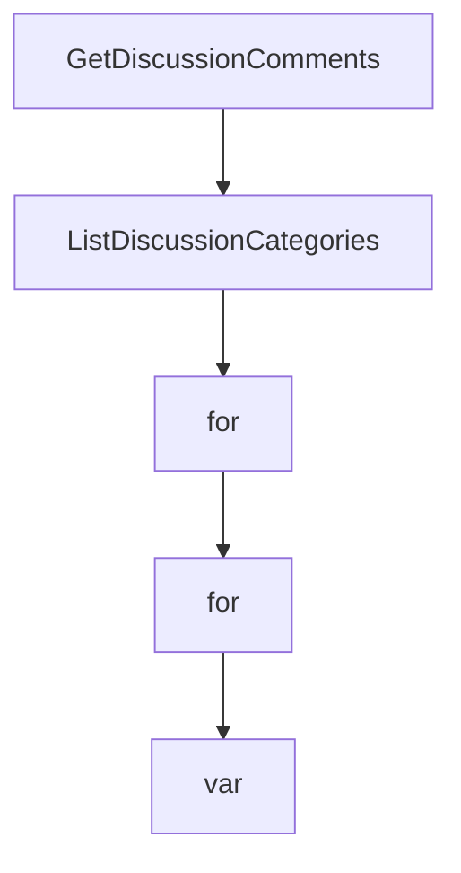

# Chapter 4: Toolsets, Tools, and Dynamic Discovery

Welcome to **Chapter 4: Toolsets, Tools, and Dynamic Discovery**. In this part of **GitHub MCP Server Tutorial: Production GitHub Operations Through MCP**, you will build an intuitive mental model first, then move into concrete implementation details and practical production tradeoffs.


This chapter explains how to precisely shape the server capability surface for better reliability and safety.

## Learning Goals

- constrain tools using toolsets and explicit tool allow-lists
- use dynamic discovery to limit initial tool overload
- combine read-only mode with selective tool exposure
- prevent accidental write operations in exploratory sessions

## Control Surface Options

| Control | Local | Remote |
|:--------|:------|:-------|
| toolsets | `--toolsets` / `GITHUB_TOOLSETS` | URL + `X-MCP-Toolsets` |
| individual tools | `--tools` / `GITHUB_TOOLS` | header-based filtering |
| read-only | `--read-only` / `GITHUB_READ_ONLY` | `/readonly` or `X-MCP-Readonly` |
| dynamic discovery | `--dynamic-toolsets` | not available |
| lockdown mode | `--lockdown-mode` | `X-MCP-Lockdown` |

## Source References

- [README: Tool Configuration](https://github.com/github/github-mcp-server/blob/main/README.md#tool-configuration)
- [Server Configuration Guide](https://github.com/github/github-mcp-server/blob/main/docs/server-configuration.md)
- [Remote Server Docs: Headers](https://github.com/github/github-mcp-server/blob/main/docs/remote-server.md#headers)

## Summary

You now know how to expose just enough capability for each task context.

Next: [Chapter 5: Host Integration Patterns](05-host-integration-patterns.md)

## Depth Expansion Playbook

## Source Code Walkthrough

### `pkg/github/discussions.go`

The `GetDiscussionComments` function in [`pkg/github/discussions.go`](https://github.com/github/github-mcp-server/blob/HEAD/pkg/github/discussions.go) handles a key part of this chapter's functionality:

```go
			// The go-github library's Discussion type lacks isAnswered and answerChosenAt fields,
			// so we use map[string]interface{} for the response (consistent with other functions
			// like ListDiscussions and GetDiscussionComments).
			response := map[string]any{
				"number":     int(d.Number),
				"title":      string(d.Title),
				"body":       string(d.Body),
				"url":        string(d.URL),
				"closed":     bool(d.Closed),
				"isAnswered": bool(d.IsAnswered),
				"createdAt":  d.CreatedAt.Time,
				"category": map[string]any{
					"name": string(d.Category.Name),
				},
			}

			// Add optional timestamp fields if present
			if d.AnswerChosenAt != nil {
				response["answerChosenAt"] = d.AnswerChosenAt.Time
			}

			out, err := json.Marshal(response)
			if err != nil {
				return nil, nil, fmt.Errorf("failed to marshal discussion: %w", err)
			}

			return utils.NewToolResultText(string(out)), nil, nil
		},
	)
}

func GetDiscussionComments(t translations.TranslationHelperFunc) inventory.ServerTool {
```

This function is important because it defines how GitHub MCP Server Tutorial: Production GitHub Operations Through MCP implements the patterns covered in this chapter.

### `pkg/github/discussions.go`

The `ListDiscussionCategories` function in [`pkg/github/discussions.go`](https://github.com/github/github-mcp-server/blob/HEAD/pkg/github/discussions.go) handles a key part of this chapter's functionality:

```go
}

func ListDiscussionCategories(t translations.TranslationHelperFunc) inventory.ServerTool {
	return NewTool(
		ToolsetMetadataDiscussions,
		mcp.Tool{
			Name:        "list_discussion_categories",
			Description: t("TOOL_LIST_DISCUSSION_CATEGORIES_DESCRIPTION", "List discussion categories with their id and name, for a repository or organisation."),
			Annotations: &mcp.ToolAnnotations{
				Title:        t("TOOL_LIST_DISCUSSION_CATEGORIES_USER_TITLE", "List discussion categories"),
				ReadOnlyHint: true,
			},
			InputSchema: &jsonschema.Schema{
				Type: "object",
				Properties: map[string]*jsonschema.Schema{
					"owner": {
						Type:        "string",
						Description: "Repository owner",
					},
					"repo": {
						Type:        "string",
						Description: "Repository name. If not provided, discussion categories will be queried at the organisation level.",
					},
				},
				Required: []string{"owner"},
			},
		},
		[]scopes.Scope{scopes.Repo},
		func(ctx context.Context, deps ToolDependencies, _ *mcp.CallToolRequest, args map[string]any) (*mcp.CallToolResult, any, error) {
			owner, err := RequiredParam[string](args, "owner")
			if err != nil {
				return utils.NewToolResultError(err.Error()), nil, nil
```

This function is important because it defines how GitHub MCP Server Tutorial: Production GitHub Operations Through MCP implements the patterns covered in this chapter.

### `pkg/github/discussions.go`

The `for` interface in [`pkg/github/discussions.go`](https://github.com/github/github-mcp-server/blob/HEAD/pkg/github/discussions.go) handles a key part of this chapter's functionality:

```go
const DefaultGraphQLPageSize = 30

// Common interface for all discussion query types
type DiscussionQueryResult interface {
	GetDiscussionFragment() DiscussionFragment
}

// Implement the interface for all query types
func (q *BasicNoOrder) GetDiscussionFragment() DiscussionFragment {
	return q.Repository.Discussions
}

func (q *BasicWithOrder) GetDiscussionFragment() DiscussionFragment {
	return q.Repository.Discussions
}

func (q *WithCategoryAndOrder) GetDiscussionFragment() DiscussionFragment {
	return q.Repository.Discussions
}

func (q *WithCategoryNoOrder) GetDiscussionFragment() DiscussionFragment {
	return q.Repository.Discussions
}

type DiscussionFragment struct {
	Nodes      []NodeFragment
	PageInfo   PageInfoFragment
	TotalCount githubv4.Int
}

type NodeFragment struct {
	Number         githubv4.Int
```

This interface is important because it defines how GitHub MCP Server Tutorial: Production GitHub Operations Through MCP implements the patterns covered in this chapter.

### `pkg/github/discussions.go`

The `for` interface in [`pkg/github/discussions.go`](https://github.com/github/github-mcp-server/blob/HEAD/pkg/github/discussions.go) handles a key part of this chapter's functionality:

```go
const DefaultGraphQLPageSize = 30

// Common interface for all discussion query types
type DiscussionQueryResult interface {
	GetDiscussionFragment() DiscussionFragment
}

// Implement the interface for all query types
func (q *BasicNoOrder) GetDiscussionFragment() DiscussionFragment {
	return q.Repository.Discussions
}

func (q *BasicWithOrder) GetDiscussionFragment() DiscussionFragment {
	return q.Repository.Discussions
}

func (q *WithCategoryAndOrder) GetDiscussionFragment() DiscussionFragment {
	return q.Repository.Discussions
}

func (q *WithCategoryNoOrder) GetDiscussionFragment() DiscussionFragment {
	return q.Repository.Discussions
}

type DiscussionFragment struct {
	Nodes      []NodeFragment
	PageInfo   PageInfoFragment
	TotalCount githubv4.Int
}

type NodeFragment struct {
	Number         githubv4.Int
```

This interface is important because it defines how GitHub MCP Server Tutorial: Production GitHub Operations Through MCP implements the patterns covered in this chapter.


## How These Components Connect


