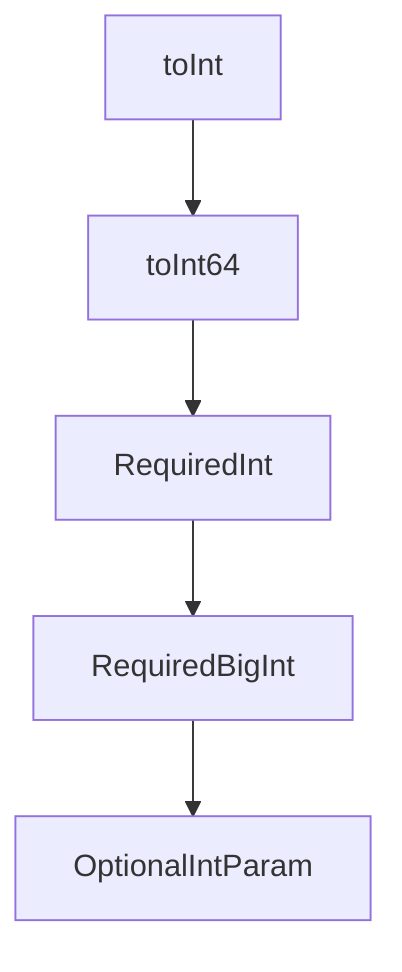

# Chapter 5: Host Integration Patterns

Welcome to **Chapter 5: Host Integration Patterns**. In this part of **GitHub MCP Server Tutorial: Production GitHub Operations Through MCP**, you will build an intuitive mental model first, then move into concrete implementation details and practical production tradeoffs.


This chapter maps integration patterns across major MCP hosts.

## Learning Goals

- identify host-specific installation nuances quickly
- standardize configuration practices across teams
- avoid brittle host assumptions during rollout
- maintain one conceptual model with host-specific syntax

## Common Host Targets

- Claude Code and Claude Desktop
- Codex
- Cursor and Windsurf
- Copilot CLI and other Copilot IDE surfaces

## Integration Principle

Keep one canonical server policy (toolsets, read-only defaults, auth model), then adapt host syntax only at the configuration boundary.

## Source References

- [Installation Guides](https://github.com/github/github-mcp-server/tree/main/docs/installation-guides)
- [Install in Claude Applications](https://github.com/github/github-mcp-server/blob/main/docs/installation-guides/install-claude.md)
- [Install in Codex](https://github.com/github/github-mcp-server/blob/main/docs/installation-guides/install-codex.md)

## Summary

You now have a host-portable integration strategy for GitHub MCP.

Next: [Chapter 6: Security, Governance, and Enterprise Controls](06-security-governance-and-enterprise-controls.md)

## Depth Expansion Playbook

## Source Code Walkthrough

### `pkg/github/params.go`

The `toInt` function in [`pkg/github/params.go`](https://github.com/github/github-mcp-server/blob/HEAD/pkg/github/params.go) handles a key part of this chapter's functionality:

```go
}

// toInt converts a value to int, handling both float64 and string representations.
// Some MCP clients send numeric values as strings. It rejects NaN, ±Inf,
// fractional values, and values outside the int range.
func toInt(val any) (int, error) {
	var f float64
	switch v := val.(type) {
	case float64:
		f = v
	case string:
		var err error
		f, err = strconv.ParseFloat(v, 64)
		if err != nil {
			return 0, fmt.Errorf("invalid numeric value: %s", v)
		}
	default:
		return 0, fmt.Errorf("expected number, got %T", val)
	}
	if math.IsNaN(f) || math.IsInf(f, 0) {
		return 0, fmt.Errorf("non-finite numeric value")
	}
	if f != math.Trunc(f) {
		return 0, fmt.Errorf("non-integer numeric value: %v", f)
	}
	if f > math.MaxInt || f < math.MinInt {
		return 0, fmt.Errorf("numeric value out of int range: %v", f)
	}
	return int(f), nil
}

// toInt64 converts a value to int64, handling both float64 and string representations.
```

This function is important because it defines how GitHub MCP Server Tutorial: Production GitHub Operations Through MCP implements the patterns covered in this chapter.

### `pkg/github/params.go`

The `toInt64` function in [`pkg/github/params.go`](https://github.com/github/github-mcp-server/blob/HEAD/pkg/github/params.go) handles a key part of this chapter's functionality:

```go
}

// toInt64 converts a value to int64, handling both float64 and string representations.
// Some MCP clients send numeric values as strings. It rejects NaN, ±Inf,
// fractional values, and values that lose precision in the float64→int64 conversion.
func toInt64(val any) (int64, error) {
	var f float64
	switch v := val.(type) {
	case float64:
		f = v
	case string:
		var err error
		f, err = strconv.ParseFloat(v, 64)
		if err != nil {
			return 0, fmt.Errorf("invalid numeric value: %s", v)
		}
	default:
		return 0, fmt.Errorf("expected number, got %T", val)
	}
	if math.IsNaN(f) || math.IsInf(f, 0) {
		return 0, fmt.Errorf("non-finite numeric value")
	}
	if f != math.Trunc(f) {
		return 0, fmt.Errorf("non-integer numeric value: %v", f)
	}
	result := int64(f)
	// Check round-trip to detect precision loss for large int64 values
	if float64(result) != f {
		return 0, fmt.Errorf("numeric value %v is too large to fit in int64", f)
	}
	return result, nil
}
```

This function is important because it defines how GitHub MCP Server Tutorial: Production GitHub Operations Through MCP implements the patterns covered in this chapter.

### `pkg/github/params.go`

The `RequiredInt` function in [`pkg/github/params.go`](https://github.com/github/github-mcp-server/blob/HEAD/pkg/github/params.go) handles a key part of this chapter's functionality:

```go
}

// RequiredInt is a helper function that can be used to fetch a requested parameter from the request.
// It does the following checks:
// 1. Checks if the parameter is present in the request.
// 2. Checks if the parameter is of the expected type (float64 or numeric string).
// 3. Checks if the parameter is not empty, i.e: non-zero value
func RequiredInt(args map[string]any, p string) (int, error) {
	v, ok := args[p]
	if !ok {
		return 0, fmt.Errorf("missing required parameter: %s", p)
	}

	result, err := toInt(v)
	if err != nil {
		return 0, fmt.Errorf("parameter %s is not a valid number: %w", p, err)
	}

	if result == 0 {
		return 0, fmt.Errorf("missing required parameter: %s", p)
	}

	return result, nil
}

// RequiredBigInt is a helper function that can be used to fetch a requested parameter from the request.
// It does the following checks:
// 1. Checks if the parameter is present in the request.
// 2. Checks if the parameter is of the expected type (float64 or numeric string).
// 3. Checks if the parameter is not empty, i.e: non-zero value.
// 4. Validates that the float64 value can be safely converted to int64 without truncation.
func RequiredBigInt(args map[string]any, p string) (int64, error) {
```

This function is important because it defines how GitHub MCP Server Tutorial: Production GitHub Operations Through MCP implements the patterns covered in this chapter.

### `pkg/github/params.go`

The `RequiredBigInt` function in [`pkg/github/params.go`](https://github.com/github/github-mcp-server/blob/HEAD/pkg/github/params.go) handles a key part of this chapter's functionality:

```go
}

// RequiredBigInt is a helper function that can be used to fetch a requested parameter from the request.
// It does the following checks:
// 1. Checks if the parameter is present in the request.
// 2. Checks if the parameter is of the expected type (float64 or numeric string).
// 3. Checks if the parameter is not empty, i.e: non-zero value.
// 4. Validates that the float64 value can be safely converted to int64 without truncation.
func RequiredBigInt(args map[string]any, p string) (int64, error) {
	val, ok := args[p]
	if !ok {
		return 0, fmt.Errorf("missing required parameter: %s", p)
	}

	result, err := toInt64(val)
	if err != nil {
		return 0, fmt.Errorf("parameter %s is not a valid number: %w", p, err)
	}

	if result == 0 {
		return 0, fmt.Errorf("missing required parameter: %s", p)
	}

	return result, nil
}

// OptionalParam is a helper function that can be used to fetch a requested parameter from the request.
// It does the following checks:
// 1. Checks if the parameter is present in the request, if not, it returns its zero-value
// 2. If it is present, it checks if the parameter is of the expected type and returns it
func OptionalParam[T any](args map[string]any, p string) (T, error) {
	var zero T
```

This function is important because it defines how GitHub MCP Server Tutorial: Production GitHub Operations Through MCP implements the patterns covered in this chapter.


## How These Components Connect


