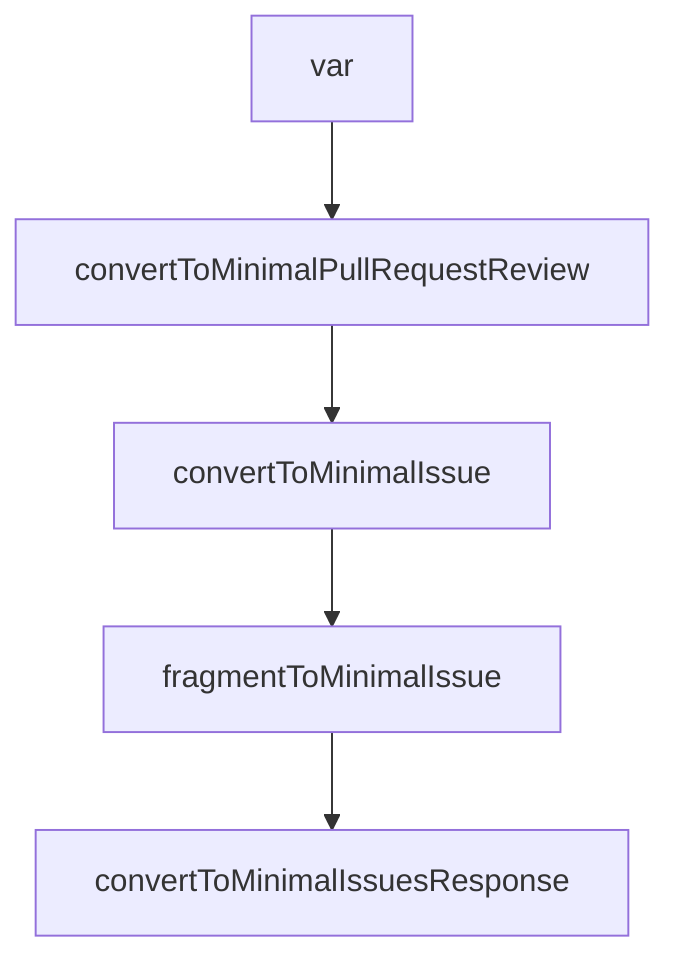

# Chapter 5: Host Integration Patterns

Welcome to **Chapter 5: Host Integration Patterns**. In this part of **GitHub MCP Server Tutorial: Production GitHub Operations Through MCP**, you will build an intuitive mental model first, then move into concrete implementation details and practical production tradeoffs.


This chapter maps integration patterns across major MCP hosts.

## Learning Goals

- identify host-specific installation nuances quickly
- standardize configuration practices across teams
- avoid brittle host assumptions during rollout
- maintain one conceptual model with host-specific syntax

## Common Host Targets

- Claude Code and Claude Desktop
- Codex
- Cursor and Windsurf
- Copilot CLI and other Copilot IDE surfaces

## Integration Principle

Keep one canonical server policy (toolsets, read-only defaults, auth model), then adapt host syntax only at the configuration boundary.

## Source References

- [Installation Guides](https://github.com/github/github-mcp-server/tree/main/docs/installation-guides)
- [Install in Claude Applications](https://github.com/github/github-mcp-server/blob/main/docs/installation-guides/install-claude.md)
- [Install in Codex](https://github.com/github/github-mcp-server/blob/main/docs/installation-guides/install-codex.md)

## Summary

You now have a host-portable integration strategy for GitHub MCP.

Next: [Chapter 6: Security, Governance, and Enterprise Controls](06-security-governance-and-enterprise-controls.md)

## Source Code Walkthrough

### `pkg/github/discussions.go`

The `var` interface in [`pkg/github/discussions.go`](https://github.com/github/github-mcp-server/blob/HEAD/pkg/github/discussions.go) handles a key part of this chapter's functionality:

```go
			}

			var categoryID *githubv4.ID
			if category != "" {
				id := githubv4.ID(category)
				categoryID = &id
			}

			vars := map[string]any{
				"owner": githubv4.String(owner),
				"repo":  githubv4.String(repo),
				"first": githubv4.Int(*paginationParams.First),
			}
			if paginationParams.After != nil {
				vars["after"] = githubv4.String(*paginationParams.After)
			} else {
				vars["after"] = (*githubv4.String)(nil)
			}

			// this is an extra check in case the tool description is misinterpreted, because
			// we shouldn't use ordering unless both a 'field' and 'direction' are provided
			useOrdering := orderBy != "" && direction != ""
			if useOrdering {
				vars["orderByField"] = githubv4.DiscussionOrderField(orderBy)
				vars["orderByDirection"] = githubv4.OrderDirection(direction)
			}

			if categoryID != nil {
				vars["categoryId"] = *categoryID
			}

			discussionQuery := getQueryType(useOrdering, categoryID)
```

This interface is important because it defines how GitHub MCP Server Tutorial: Production GitHub Operations Through MCP implements the patterns covered in this chapter.

### `pkg/github/minimal_types.go`

The `convertToMinimalPullRequestReview` function in [`pkg/github/minimal_types.go`](https://github.com/github/github-mcp-server/blob/HEAD/pkg/github/minimal_types.go) handles a key part of this chapter's functionality:

```go
// Helper functions

func convertToMinimalPullRequestReview(review *github.PullRequestReview) MinimalPullRequestReview {
	m := MinimalPullRequestReview{
		ID:                review.GetID(),
		State:             review.GetState(),
		Body:              review.GetBody(),
		HTMLURL:           review.GetHTMLURL(),
		User:              convertToMinimalUser(review.GetUser()),
		CommitID:          review.GetCommitID(),
		AuthorAssociation: review.GetAuthorAssociation(),
	}

	if review.SubmittedAt != nil {
		m.SubmittedAt = review.SubmittedAt.Format(time.RFC3339)
	}

	return m
}

func convertToMinimalIssue(issue *github.Issue) MinimalIssue {
	m := MinimalIssue{
		Number:            issue.GetNumber(),
		Title:             issue.GetTitle(),
		Body:              issue.GetBody(),
		State:             issue.GetState(),
		StateReason:       issue.GetStateReason(),
		Draft:             issue.GetDraft(),
		Locked:            issue.GetLocked(),
		HTMLURL:           issue.GetHTMLURL(),
		User:              convertToMinimalUser(issue.GetUser()),
		AuthorAssociation: issue.GetAuthorAssociation(),
```

This function is important because it defines how GitHub MCP Server Tutorial: Production GitHub Operations Through MCP implements the patterns covered in this chapter.

### `pkg/github/minimal_types.go`

The `convertToMinimalIssue` function in [`pkg/github/minimal_types.go`](https://github.com/github/github-mcp-server/blob/HEAD/pkg/github/minimal_types.go) handles a key part of this chapter's functionality:

```go
}

func convertToMinimalIssue(issue *github.Issue) MinimalIssue {
	m := MinimalIssue{
		Number:            issue.GetNumber(),
		Title:             issue.GetTitle(),
		Body:              issue.GetBody(),
		State:             issue.GetState(),
		StateReason:       issue.GetStateReason(),
		Draft:             issue.GetDraft(),
		Locked:            issue.GetLocked(),
		HTMLURL:           issue.GetHTMLURL(),
		User:              convertToMinimalUser(issue.GetUser()),
		AuthorAssociation: issue.GetAuthorAssociation(),
		Comments:          issue.GetComments(),
	}

	if issue.CreatedAt != nil {
		m.CreatedAt = issue.CreatedAt.Format(time.RFC3339)
	}
	if issue.UpdatedAt != nil {
		m.UpdatedAt = issue.UpdatedAt.Format(time.RFC3339)
	}
	if issue.ClosedAt != nil {
		m.ClosedAt = issue.ClosedAt.Format(time.RFC3339)
	}

	for _, label := range issue.Labels {
		if label != nil {
			m.Labels = append(m.Labels, label.GetName())
		}
	}
```

This function is important because it defines how GitHub MCP Server Tutorial: Production GitHub Operations Through MCP implements the patterns covered in this chapter.

### `pkg/github/minimal_types.go`

The `fragmentToMinimalIssue` function in [`pkg/github/minimal_types.go`](https://github.com/github/github-mcp-server/blob/HEAD/pkg/github/minimal_types.go) handles a key part of this chapter's functionality:

```go
}

func fragmentToMinimalIssue(fragment IssueFragment) MinimalIssue {
	m := MinimalIssue{
		Number:    int(fragment.Number),
		Title:     sanitize.Sanitize(string(fragment.Title)),
		Body:      sanitize.Sanitize(string(fragment.Body)),
		State:     string(fragment.State),
		Comments:  int(fragment.Comments.TotalCount),
		CreatedAt: fragment.CreatedAt.Format(time.RFC3339),
		UpdatedAt: fragment.UpdatedAt.Format(time.RFC3339),
		User: &MinimalUser{
			Login: string(fragment.Author.Login),
		},
	}

	for _, label := range fragment.Labels.Nodes {
		m.Labels = append(m.Labels, string(label.Name))
	}

	return m
}

func convertToMinimalIssuesResponse(fragment IssueQueryFragment) MinimalIssuesResponse {
	minimalIssues := make([]MinimalIssue, 0, len(fragment.Nodes))
	for _, issue := range fragment.Nodes {
		minimalIssues = append(minimalIssues, fragmentToMinimalIssue(issue))
	}

	return MinimalIssuesResponse{
		Issues:     minimalIssues,
		TotalCount: fragment.TotalCount,
```

This function is important because it defines how GitHub MCP Server Tutorial: Production GitHub Operations Through MCP implements the patterns covered in this chapter.


## How These Components Connect


