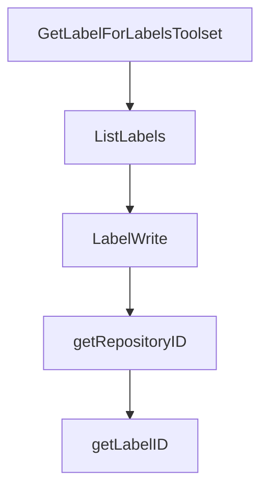

# Chapter 6: Security, Governance, and Enterprise Controls

Welcome to **Chapter 6: Security, Governance, and Enterprise Controls**. In this part of **GitHub MCP Server Tutorial: Production GitHub Operations Through MCP**, you will build an intuitive mental model first, then move into concrete implementation details and practical production tradeoffs.


This chapter covers policy and governance controls needed for enterprise adoption.

## Learning Goals

- map GitHub MCP usage to organization policy controls
- understand where OAuth app, GitHub App, and PAT policies apply
- enforce SSO and least-privilege defaults
- separate first-party and third-party host governance implications

## Governance Layers

| Layer | Control Examples |
|:------|:------------------|
| host policy | MCP enable/disable controls in supported editors |
| app policy | OAuth app or GitHub App restrictions |
| token policy | fine-grained PAT restrictions and expiration |
| org enforcement | SSO and installation governance |

## Source References

- [Policies and Governance](https://github.com/github/github-mcp-server/blob/main/docs/policies-and-governance.md)
- [README: Token Security Best Practices](https://github.com/github/github-mcp-server/blob/main/README.md#token-security-best-practices)
- [GitHub Security Policy](https://github.com/github/github-mcp-server/blob/main/SECURITY.md)

## Summary

You now have a governance model for secure, policy-aligned GitHub MCP usage.

Next: [Chapter 7: Troubleshooting, Read-Only, and Lockdown Operations](07-troubleshooting-read-only-and-lockdown-operations.md)

## Depth Expansion Playbook

## Source Code Walkthrough

### `pkg/github/labels.go`

The `GetLabelForLabelsToolset` function in [`pkg/github/labels.go`](https://github.com/github/github-mcp-server/blob/HEAD/pkg/github/labels.go) handles a key part of this chapter's functionality:

```go
}

// GetLabelForLabelsToolset returns the same GetLabel tool but registered in the labels toolset.
// This provides conformance with the original behavior where get_label was in both toolsets.
func GetLabelForLabelsToolset(t translations.TranslationHelperFunc) inventory.ServerTool {
	tool := GetLabel(t)
	tool.Toolset = ToolsetLabels
	return tool
}

// ListLabels lists labels from a repository
func ListLabels(t translations.TranslationHelperFunc) inventory.ServerTool {
	return NewTool(
		ToolsetLabels,
		mcp.Tool{
			Name:        "list_label",
			Description: t("TOOL_LIST_LABEL_DESCRIPTION", "List labels from a repository"),
			Annotations: &mcp.ToolAnnotations{
				Title:        t("TOOL_LIST_LABEL_DESCRIPTION", "List labels from a repository."),
				ReadOnlyHint: true,
			},
			InputSchema: &jsonschema.Schema{
				Type: "object",
				Properties: map[string]*jsonschema.Schema{
					"owner": {
						Type:        "string",
						Description: "Repository owner (username or organization name) - required for all operations",
					},
					"repo": {
						Type:        "string",
						Description: "Repository name - required for all operations",
					},
```

This function is important because it defines how GitHub MCP Server Tutorial: Production GitHub Operations Through MCP implements the patterns covered in this chapter.

### `pkg/github/labels.go`

The `ListLabels` function in [`pkg/github/labels.go`](https://github.com/github/github-mcp-server/blob/HEAD/pkg/github/labels.go) handles a key part of this chapter's functionality:

```go
}

// ListLabels lists labels from a repository
func ListLabels(t translations.TranslationHelperFunc) inventory.ServerTool {
	return NewTool(
		ToolsetLabels,
		mcp.Tool{
			Name:        "list_label",
			Description: t("TOOL_LIST_LABEL_DESCRIPTION", "List labels from a repository"),
			Annotations: &mcp.ToolAnnotations{
				Title:        t("TOOL_LIST_LABEL_DESCRIPTION", "List labels from a repository."),
				ReadOnlyHint: true,
			},
			InputSchema: &jsonschema.Schema{
				Type: "object",
				Properties: map[string]*jsonschema.Schema{
					"owner": {
						Type:        "string",
						Description: "Repository owner (username or organization name) - required for all operations",
					},
					"repo": {
						Type:        "string",
						Description: "Repository name - required for all operations",
					},
				},
				Required: []string{"owner", "repo"},
			},
		},
		[]scopes.Scope{scopes.Repo},
		func(ctx context.Context, deps ToolDependencies, _ *mcp.CallToolRequest, args map[string]any) (*mcp.CallToolResult, any, error) {
			owner, err := RequiredParam[string](args, "owner")
			if err != nil {
```

This function is important because it defines how GitHub MCP Server Tutorial: Production GitHub Operations Through MCP implements the patterns covered in this chapter.

### `pkg/github/labels.go`

The `LabelWrite` function in [`pkg/github/labels.go`](https://github.com/github/github-mcp-server/blob/HEAD/pkg/github/labels.go) handles a key part of this chapter's functionality:

```go
}

// LabelWrite handles create, update, and delete operations for GitHub labels
func LabelWrite(t translations.TranslationHelperFunc) inventory.ServerTool {
	return NewTool(
		ToolsetLabels,
		mcp.Tool{
			Name:        "label_write",
			Description: t("TOOL_LABEL_WRITE_DESCRIPTION", "Perform write operations on repository labels. To set labels on issues, use the 'update_issue' tool."),
			Annotations: &mcp.ToolAnnotations{
				Title:        t("TOOL_LABEL_WRITE_TITLE", "Write operations on repository labels."),
				ReadOnlyHint: false,
			},
			InputSchema: &jsonschema.Schema{
				Type: "object",
				Properties: map[string]*jsonschema.Schema{
					"method": {
						Type:        "string",
						Description: "Operation to perform: 'create', 'update', or 'delete'",
						Enum:        []any{"create", "update", "delete"},
					},
					"owner": {
						Type:        "string",
						Description: "Repository owner (username or organization name)",
					},
					"repo": {
						Type:        "string",
						Description: "Repository name",
					},
					"name": {
						Type:        "string",
						Description: "Label name - required for all operations",
```

This function is important because it defines how GitHub MCP Server Tutorial: Production GitHub Operations Through MCP implements the patterns covered in this chapter.

### `pkg/github/labels.go`

The `getRepositoryID` function in [`pkg/github/labels.go`](https://github.com/github/github-mcp-server/blob/HEAD/pkg/github/labels.go) handles a key part of this chapter's functionality:

```go

				// Get repository ID
				repoID, err := getRepositoryID(ctx, client, owner, repo)
				if err != nil {
					return ghErrors.NewGitHubGraphQLErrorResponse(ctx, "Failed to find repository", err), nil, nil
				}

				input := githubv4.CreateLabelInput{
					RepositoryID: repoID,
					Name:         githubv4.String(name),
					Color:        githubv4.String(color),
				}
				if description != "" {
					d := githubv4.String(description)
					input.Description = &d
				}

				var mutation struct {
					CreateLabel struct {
						Label struct {
							Name githubv4.String
							ID   githubv4.ID
						}
					} `graphql:"createLabel(input: $input)"`
				}

				if err := client.Mutate(ctx, &mutation, input, nil); err != nil {
					return ghErrors.NewGitHubGraphQLErrorResponse(ctx, "Failed to create label", err), nil, nil
				}

				return utils.NewToolResultText(fmt.Sprintf("label '%s' created successfully", mutation.CreateLabel.Label.Name)), nil, nil

```

This function is important because it defines how GitHub MCP Server Tutorial: Production GitHub Operations Through MCP implements the patterns covered in this chapter.


## How These Components Connect


