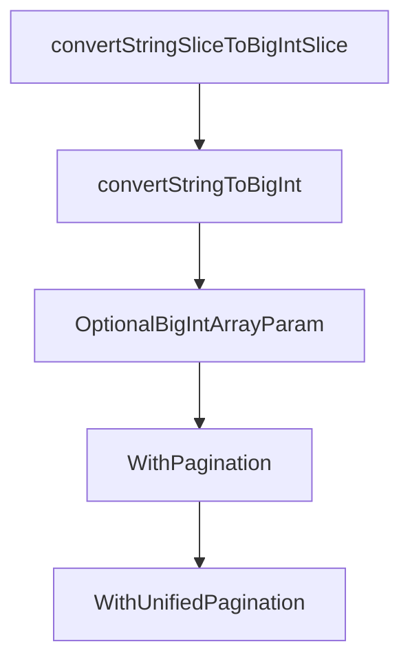

# Chapter 6: Security, Governance, and Enterprise Controls

Welcome to **Chapter 6: Security, Governance, and Enterprise Controls**. In this part of **GitHub MCP Server Tutorial: Production GitHub Operations Through MCP**, you will build an intuitive mental model first, then move into concrete implementation details and practical production tradeoffs.


This chapter covers policy and governance controls needed for enterprise adoption.

## Learning Goals

- map GitHub MCP usage to organization policy controls
- understand where OAuth app, GitHub App, and PAT policies apply
- enforce SSO and least-privilege defaults
- separate first-party and third-party host governance implications

## Governance Layers

| Layer | Control Examples |
|:------|:------------------|
| host policy | MCP enable/disable controls in supported editors |
| app policy | OAuth app or GitHub App restrictions |
| token policy | fine-grained PAT restrictions and expiration |
| org enforcement | SSO and installation governance |

## Source References

- [Policies and Governance](https://github.com/github/github-mcp-server/blob/main/docs/policies-and-governance.md)
- [README: Token Security Best Practices](https://github.com/github/github-mcp-server/blob/main/README.md#token-security-best-practices)
- [GitHub Security Policy](https://github.com/github/github-mcp-server/blob/main/SECURITY.md)

## Summary

You now have a governance model for secure, policy-aligned GitHub MCP usage.

Next: [Chapter 7: Troubleshooting, Read-Only, and Lockdown Operations](07-troubleshooting-read-only-and-lockdown-operations.md)

## Source Code Walkthrough

### `pkg/github/params.go`

The `convertStringSliceToBigIntSlice` function in [`pkg/github/params.go`](https://github.com/github/github-mcp-server/blob/HEAD/pkg/github/params.go) handles a key part of this chapter's functionality:

```go
}

func convertStringSliceToBigIntSlice(s []string) ([]int64, error) {
	int64Slice := make([]int64, len(s))
	for i, str := range s {
		val, err := convertStringToBigInt(str, 0)
		if err != nil {
			return nil, fmt.Errorf("failed to convert element %d (%s) to int64: %w", i, str, err)
		}
		int64Slice[i] = val
	}
	return int64Slice, nil
}

func convertStringToBigInt(s string, def int64) (int64, error) {
	v, err := strconv.ParseInt(s, 10, 64)
	if err != nil {
		return def, fmt.Errorf("failed to convert string %s to int64: %w", s, err)
	}
	return v, nil
}

// OptionalBigIntArrayParam is a helper function that can be used to fetch a requested parameter from the request.
// It does the following checks:
// 1. Checks if the parameter is present in the request, if not, it returns an empty slice
// 2. If it is present, iterates the elements, checks each is a string, and converts them to int64 values
func OptionalBigIntArrayParam(args map[string]any, p string) ([]int64, error) {
	// Check if the parameter is present in the request
	if _, ok := args[p]; !ok {
		return []int64{}, nil
	}

```

This function is important because it defines how GitHub MCP Server Tutorial: Production GitHub Operations Through MCP implements the patterns covered in this chapter.

### `pkg/github/params.go`

The `convertStringToBigInt` function in [`pkg/github/params.go`](https://github.com/github/github-mcp-server/blob/HEAD/pkg/github/params.go) handles a key part of this chapter's functionality:

```go
	int64Slice := make([]int64, len(s))
	for i, str := range s {
		val, err := convertStringToBigInt(str, 0)
		if err != nil {
			return nil, fmt.Errorf("failed to convert element %d (%s) to int64: %w", i, str, err)
		}
		int64Slice[i] = val
	}
	return int64Slice, nil
}

func convertStringToBigInt(s string, def int64) (int64, error) {
	v, err := strconv.ParseInt(s, 10, 64)
	if err != nil {
		return def, fmt.Errorf("failed to convert string %s to int64: %w", s, err)
	}
	return v, nil
}

// OptionalBigIntArrayParam is a helper function that can be used to fetch a requested parameter from the request.
// It does the following checks:
// 1. Checks if the parameter is present in the request, if not, it returns an empty slice
// 2. If it is present, iterates the elements, checks each is a string, and converts them to int64 values
func OptionalBigIntArrayParam(args map[string]any, p string) ([]int64, error) {
	// Check if the parameter is present in the request
	if _, ok := args[p]; !ok {
		return []int64{}, nil
	}

	switch v := args[p].(type) {
	case nil:
		return []int64{}, nil
```

This function is important because it defines how GitHub MCP Server Tutorial: Production GitHub Operations Through MCP implements the patterns covered in this chapter.

### `pkg/github/params.go`

The `OptionalBigIntArrayParam` function in [`pkg/github/params.go`](https://github.com/github/github-mcp-server/blob/HEAD/pkg/github/params.go) handles a key part of this chapter's functionality:

```go
}

// OptionalBigIntArrayParam is a helper function that can be used to fetch a requested parameter from the request.
// It does the following checks:
// 1. Checks if the parameter is present in the request, if not, it returns an empty slice
// 2. If it is present, iterates the elements, checks each is a string, and converts them to int64 values
func OptionalBigIntArrayParam(args map[string]any, p string) ([]int64, error) {
	// Check if the parameter is present in the request
	if _, ok := args[p]; !ok {
		return []int64{}, nil
	}

	switch v := args[p].(type) {
	case nil:
		return []int64{}, nil
	case []string:
		return convertStringSliceToBigIntSlice(v)
	case []any:
		int64Slice := make([]int64, len(v))
		for i, v := range v {
			s, ok := v.(string)
			if !ok {
				return []int64{}, fmt.Errorf("parameter %s is not of type string, is %T", p, v)
			}
			val, err := convertStringToBigInt(s, 0)
			if err != nil {
				return []int64{}, fmt.Errorf("parameter %s: failed to convert element %d (%s) to int64: %w", p, i, s, err)
			}
			int64Slice[i] = val
		}
		return int64Slice, nil
	default:
```

This function is important because it defines how GitHub MCP Server Tutorial: Production GitHub Operations Through MCP implements the patterns covered in this chapter.

### `pkg/github/params.go`

The `WithPagination` function in [`pkg/github/params.go`](https://github.com/github/github-mcp-server/blob/HEAD/pkg/github/params.go) handles a key part of this chapter's functionality:

```go
}

// WithPagination adds REST API pagination parameters to a tool.
// https://docs.github.com/en/rest/using-the-rest-api/using-pagination-in-the-rest-api
func WithPagination(schema *jsonschema.Schema) *jsonschema.Schema {
	schema.Properties["page"] = &jsonschema.Schema{
		Type:        "number",
		Description: "Page number for pagination (min 1)",
		Minimum:     jsonschema.Ptr(1.0),
	}

	schema.Properties["perPage"] = &jsonschema.Schema{
		Type:        "number",
		Description: "Results per page for pagination (min 1, max 100)",
		Minimum:     jsonschema.Ptr(1.0),
		Maximum:     jsonschema.Ptr(100.0),
	}

	return schema
}

// WithUnifiedPagination adds REST API pagination parameters to a tool.
// GraphQL tools will use this and convert page/perPage to GraphQL cursor parameters internally.
func WithUnifiedPagination(schema *jsonschema.Schema) *jsonschema.Schema {
	schema.Properties["page"] = &jsonschema.Schema{
		Type:        "number",
		Description: "Page number for pagination (min 1)",
		Minimum:     jsonschema.Ptr(1.0),
	}

	schema.Properties["perPage"] = &jsonschema.Schema{
		Type:        "number",
```

This function is important because it defines how GitHub MCP Server Tutorial: Production GitHub Operations Through MCP implements the patterns covered in this chapter.


## How These Components Connect


