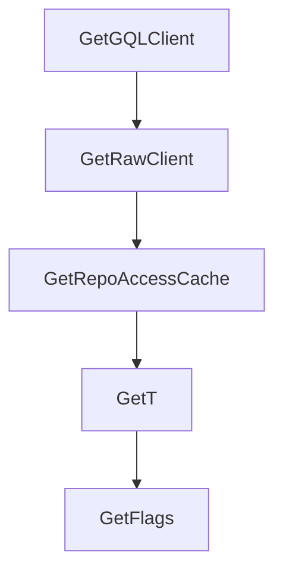

# Chapter 7: Troubleshooting, Read-Only, and Lockdown Operations

Welcome to **Chapter 7: Troubleshooting, Read-Only, and Lockdown Operations**. In this part of **GitHub MCP Server Tutorial: Production GitHub Operations Through MCP**, you will build an intuitive mental model first, then move into concrete implementation details and practical production tradeoffs.


This chapter provides practical recovery patterns for operational issues.

## Learning Goals

- diagnose missing tools and permission mismatches
- fix common read-only and scope-related failures
- use lockdown mode where public-content filtering is required
- recover quickly when host/server config drifts

## Common Failure Triage

| Symptom | Likely Cause | First Fix |
|:--------|:-------------|:----------|
| expected tool missing | toolset not enabled or filtered by scope | expand toolset or verify token scopes |
| write operations blocked | read-only mode enabled | remove `readonly` configuration for write workflows |
| dynamic mode not working | running remote mode | use local server for dynamic discovery |
| unexpected content limits | lockdown mode active | verify `lockdown` header/flag intent |

## Source References

- [Server Configuration Troubleshooting](https://github.com/github/github-mcp-server/blob/main/docs/server-configuration.md#troubleshooting)
- [Remote Server URL and Header Modes](https://github.com/github/github-mcp-server/blob/main/docs/remote-server.md)
- [README: Read-Only Mode](https://github.com/github/github-mcp-server/blob/main/README.md#read-only-mode)

## Summary

You now have a troubleshooting runbook for stable GitHub MCP operations.

Next: [Chapter 8: Contribution and Upgrade Workflow](08-contribution-and-upgrade-workflow.md)

## Depth Expansion Playbook

## Source Code Walkthrough

### `pkg/github/dependencies.go`

The `GetGQLClient` function in [`pkg/github/dependencies.go`](https://github.com/github/github-mcp-server/blob/HEAD/pkg/github/dependencies.go) handles a key part of this chapter's functionality:

```go
	GetClient(ctx context.Context) (*gogithub.Client, error)

	// GetGQLClient returns a GitHub GraphQL client
	GetGQLClient(ctx context.Context) (*githubv4.Client, error)

	// GetRawClient returns a raw content client for GitHub
	GetRawClient(ctx context.Context) (*raw.Client, error)

	// GetRepoAccessCache returns the lockdown mode repo access cache
	GetRepoAccessCache(ctx context.Context) (*lockdown.RepoAccessCache, error)

	// GetT returns the translation helper function
	GetT() translations.TranslationHelperFunc

	// GetFlags returns feature flags
	GetFlags(ctx context.Context) FeatureFlags

	// GetContentWindowSize returns the content window size for log truncation
	GetContentWindowSize() int

	// IsFeatureEnabled checks if a feature flag is enabled.
	IsFeatureEnabled(ctx context.Context, flagName string) bool
}

// BaseDeps is the standard implementation of ToolDependencies for the local server.
// It stores pre-created clients. The remote server can create its own struct
// implementing ToolDependencies with different client creation strategies.
type BaseDeps struct {
	// Pre-created clients
	Client    *gogithub.Client
	GQLClient *githubv4.Client
	RawClient *raw.Client
```

This function is important because it defines how GitHub MCP Server Tutorial: Production GitHub Operations Through MCP implements the patterns covered in this chapter.

### `pkg/github/dependencies.go`

The `GetRawClient` function in [`pkg/github/dependencies.go`](https://github.com/github/github-mcp-server/blob/HEAD/pkg/github/dependencies.go) handles a key part of this chapter's functionality:

```go
	GetGQLClient(ctx context.Context) (*githubv4.Client, error)

	// GetRawClient returns a raw content client for GitHub
	GetRawClient(ctx context.Context) (*raw.Client, error)

	// GetRepoAccessCache returns the lockdown mode repo access cache
	GetRepoAccessCache(ctx context.Context) (*lockdown.RepoAccessCache, error)

	// GetT returns the translation helper function
	GetT() translations.TranslationHelperFunc

	// GetFlags returns feature flags
	GetFlags(ctx context.Context) FeatureFlags

	// GetContentWindowSize returns the content window size for log truncation
	GetContentWindowSize() int

	// IsFeatureEnabled checks if a feature flag is enabled.
	IsFeatureEnabled(ctx context.Context, flagName string) bool
}

// BaseDeps is the standard implementation of ToolDependencies for the local server.
// It stores pre-created clients. The remote server can create its own struct
// implementing ToolDependencies with different client creation strategies.
type BaseDeps struct {
	// Pre-created clients
	Client    *gogithub.Client
	GQLClient *githubv4.Client
	RawClient *raw.Client

	// Static dependencies
	RepoAccessCache   *lockdown.RepoAccessCache
```

This function is important because it defines how GitHub MCP Server Tutorial: Production GitHub Operations Through MCP implements the patterns covered in this chapter.

### `pkg/github/dependencies.go`

The `GetRepoAccessCache` function in [`pkg/github/dependencies.go`](https://github.com/github/github-mcp-server/blob/HEAD/pkg/github/dependencies.go) handles a key part of this chapter's functionality:

```go
	GetRawClient(ctx context.Context) (*raw.Client, error)

	// GetRepoAccessCache returns the lockdown mode repo access cache
	GetRepoAccessCache(ctx context.Context) (*lockdown.RepoAccessCache, error)

	// GetT returns the translation helper function
	GetT() translations.TranslationHelperFunc

	// GetFlags returns feature flags
	GetFlags(ctx context.Context) FeatureFlags

	// GetContentWindowSize returns the content window size for log truncation
	GetContentWindowSize() int

	// IsFeatureEnabled checks if a feature flag is enabled.
	IsFeatureEnabled(ctx context.Context, flagName string) bool
}

// BaseDeps is the standard implementation of ToolDependencies for the local server.
// It stores pre-created clients. The remote server can create its own struct
// implementing ToolDependencies with different client creation strategies.
type BaseDeps struct {
	// Pre-created clients
	Client    *gogithub.Client
	GQLClient *githubv4.Client
	RawClient *raw.Client

	// Static dependencies
	RepoAccessCache   *lockdown.RepoAccessCache
	T                 translations.TranslationHelperFunc
	Flags             FeatureFlags
	ContentWindowSize int
```

This function is important because it defines how GitHub MCP Server Tutorial: Production GitHub Operations Through MCP implements the patterns covered in this chapter.

### `pkg/github/dependencies.go`

The `GetT` function in [`pkg/github/dependencies.go`](https://github.com/github/github-mcp-server/blob/HEAD/pkg/github/dependencies.go) handles a key part of this chapter's functionality:

```go
	GetRepoAccessCache(ctx context.Context) (*lockdown.RepoAccessCache, error)

	// GetT returns the translation helper function
	GetT() translations.TranslationHelperFunc

	// GetFlags returns feature flags
	GetFlags(ctx context.Context) FeatureFlags

	// GetContentWindowSize returns the content window size for log truncation
	GetContentWindowSize() int

	// IsFeatureEnabled checks if a feature flag is enabled.
	IsFeatureEnabled(ctx context.Context, flagName string) bool
}

// BaseDeps is the standard implementation of ToolDependencies for the local server.
// It stores pre-created clients. The remote server can create its own struct
// implementing ToolDependencies with different client creation strategies.
type BaseDeps struct {
	// Pre-created clients
	Client    *gogithub.Client
	GQLClient *githubv4.Client
	RawClient *raw.Client

	// Static dependencies
	RepoAccessCache   *lockdown.RepoAccessCache
	T                 translations.TranslationHelperFunc
	Flags             FeatureFlags
	ContentWindowSize int

	// Feature flag checker for runtime checks
	featureChecker inventory.FeatureFlagChecker
```

This function is important because it defines how GitHub MCP Server Tutorial: Production GitHub Operations Through MCP implements the patterns covered in this chapter.


## How These Components Connect


