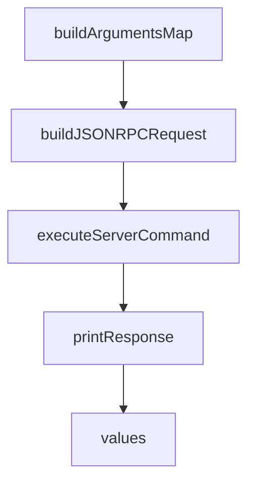

# Chapter 7: Troubleshooting, Read-Only, and Lockdown Operations

Welcome to **Chapter 7: Troubleshooting, Read-Only, and Lockdown Operations**. In this part of **GitHub MCP Server Tutorial: Production GitHub Operations Through MCP**, you will build an intuitive mental model first, then move into concrete implementation details and practical production tradeoffs.


This chapter provides practical recovery patterns for operational issues.

## Learning Goals

- diagnose missing tools and permission mismatches
- fix common read-only and scope-related failures
- use lockdown mode where public-content filtering is required
- recover quickly when host/server config drifts

## Common Failure Triage

| Symptom | Likely Cause | First Fix |
|:--------|:-------------|:----------|
| expected tool missing | toolset not enabled or filtered by scope | expand toolset or verify token scopes |
| write operations blocked | read-only mode enabled | remove `readonly` configuration for write workflows |
| dynamic mode not working | running remote mode | use local server for dynamic discovery |
| unexpected content limits | lockdown mode active | verify `lockdown` header/flag intent |

## Source References

- [Server Configuration Troubleshooting](https://github.com/github/github-mcp-server/blob/main/docs/server-configuration.md#troubleshooting)
- [Remote Server URL and Header Modes](https://github.com/github/github-mcp-server/blob/main/docs/remote-server.md)
- [README: Read-Only Mode](https://github.com/github/github-mcp-server/blob/main/README.md#read-only-mode)

## Summary

You now have a troubleshooting runbook for stable GitHub MCP operations.

Next: [Chapter 8: Contribution and Upgrade Workflow](08-contribution-and-upgrade-workflow.md)

## Source Code Walkthrough

### `cmd/mcpcurl/main.go`

The `buildArgumentsMap` function in [`cmd/mcpcurl/main.go`](https://github.com/github/github-mcp-server/blob/HEAD/cmd/mcpcurl/main.go) handles a key part of this chapter's functionality:

```go
		Run: func(cmd *cobra.Command, _ []string) {
			// Build a map of arguments from flags
			arguments, err := buildArgumentsMap(cmd, tool)
			if err != nil {
				_, _ = fmt.Fprintf(os.Stderr, "failed to build arguments map: %v\n", err)
				return
			}

			jsonData, err := buildJSONRPCRequest("tools/call", tool.Name, arguments)
			if err != nil {
				_, _ = fmt.Fprintf(os.Stderr, "failed to build JSONRPC request: %v\n", err)
				return
			}

			// Execute the server command
			serverCmd, err := cmd.Flags().GetString("stdio-server-cmd")
			if err != nil {
				_, _ = fmt.Fprintf(os.Stderr, "failed to get stdio-server-cmd: %v\n", err)
				return
			}
			response, err := executeServerCommand(serverCmd, jsonData)
			if err != nil {
				_, _ = fmt.Fprintf(os.Stderr, "error executing server command: %v\n", err)
				return
			}
			if err := printResponse(response, prettyPrint); err != nil {
				_, _ = fmt.Fprintf(os.Stderr, "error printing response: %v\n", err)
				return
			}
		},
	}

```

This function is important because it defines how GitHub MCP Server Tutorial: Production GitHub Operations Through MCP implements the patterns covered in this chapter.

### `cmd/mcpcurl/main.go`

The `buildJSONRPCRequest` function in [`cmd/mcpcurl/main.go`](https://github.com/github/github-mcp-server/blob/HEAD/cmd/mcpcurl/main.go) handles a key part of this chapter's functionality:

```go

			// Build the JSON-RPC request for tools/list
			jsonRequest, err := buildJSONRPCRequest("tools/list", "", nil)
			if err != nil {
				return fmt.Errorf("failed to build JSON-RPC request: %w", err)
			}

			// Execute the server command and pass the JSON-RPC request
			response, err := executeServerCommand(serverCmd, jsonRequest)
			if err != nil {
				return fmt.Errorf("error executing server command: %w", err)
			}

			// Output the response
			fmt.Println(response)
			return nil
		},
	}

	// Create the tools command
	toolsCmd = &cobra.Command{
		Use:   "tools",
		Short: "Access available tools",
		Long:  "Contains all dynamically generated tool commands from the schema",
	}
)

func main() {
	rootCmd.AddCommand(schemaCmd)

	// Add global flag for stdio server command
	rootCmd.PersistentFlags().String("stdio-server-cmd", "", "Shell command to invoke MCP server via stdio (required)")
```

This function is important because it defines how GitHub MCP Server Tutorial: Production GitHub Operations Through MCP implements the patterns covered in this chapter.

### `cmd/mcpcurl/main.go`

The `executeServerCommand` function in [`cmd/mcpcurl/main.go`](https://github.com/github/github-mcp-server/blob/HEAD/cmd/mcpcurl/main.go) handles a key part of this chapter's functionality:

```go

			// Execute the server command and pass the JSON-RPC request
			response, err := executeServerCommand(serverCmd, jsonRequest)
			if err != nil {
				return fmt.Errorf("error executing server command: %w", err)
			}

			// Output the response
			fmt.Println(response)
			return nil
		},
	}

	// Create the tools command
	toolsCmd = &cobra.Command{
		Use:   "tools",
		Short: "Access available tools",
		Long:  "Contains all dynamically generated tool commands from the schema",
	}
)

func main() {
	rootCmd.AddCommand(schemaCmd)

	// Add global flag for stdio server command
	rootCmd.PersistentFlags().String("stdio-server-cmd", "", "Shell command to invoke MCP server via stdio (required)")
	_ = rootCmd.MarkPersistentFlagRequired("stdio-server-cmd")

	// Add global flag for pretty printing
	rootCmd.PersistentFlags().Bool("pretty", true, "Pretty print MCP response (only for JSON or JSONL responses)")

	// Add the tools command to the root command
```

This function is important because it defines how GitHub MCP Server Tutorial: Production GitHub Operations Through MCP implements the patterns covered in this chapter.

### `cmd/mcpcurl/main.go`

The `printResponse` function in [`cmd/mcpcurl/main.go`](https://github.com/github/github-mcp-server/blob/HEAD/cmd/mcpcurl/main.go) handles a key part of this chapter's functionality:

```go
				return
			}
			if err := printResponse(response, prettyPrint); err != nil {
				_, _ = fmt.Fprintf(os.Stderr, "error printing response: %v\n", err)
				return
			}
		},
	}

	// Initialize viper for this command
	viperInit := func() {
		viper.Reset()
		viper.AutomaticEnv()
		viper.SetEnvPrefix(strings.ToUpper(tool.Name))
		viper.SetEnvKeyReplacer(strings.NewReplacer("-", "_"))
	}

	// We'll call the init function directly instead of with cobra.OnInitialize
	// to avoid conflicts between commands
	viperInit()

	// Add flags based on schema properties
	for name, prop := range tool.InputSchema.Properties {
		isRequired := slices.Contains(tool.InputSchema.Required, name)

		// Enhance description to indicate if parameter is optional
		description := prop.Description
		if !isRequired {
			description += " (optional)"
		}

		switch prop.Type {
```

This function is important because it defines how GitHub MCP Server Tutorial: Production GitHub Operations Through MCP implements the patterns covered in this chapter.


## How These Components Connect


