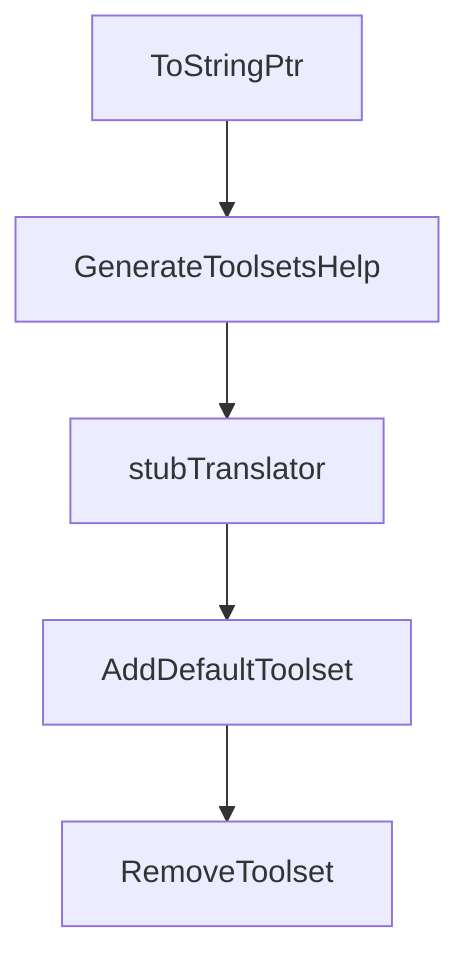

# Chapter 8: Contribution and Upgrade Workflow

Welcome to **Chapter 8: Contribution and Upgrade Workflow**. In this part of **GitHub MCP Server Tutorial: Production GitHub Operations Through MCP**, you will build an intuitive mental model first, then move into concrete implementation details and practical production tradeoffs.


This chapter covers sustainable change management for teams using GitHub MCP in production.

## Learning Goals

- track release changes without destabilizing workflows
- validate updates in constrained environments first
- contribute issues and fixes with useful repro context
- maintain internal runbooks aligned to upstream evolution

## Upgrade Discipline

1. monitor release notes and high-impact docs changes
2. test updates in read-only first
3. stage toolset expansion only after validation
4. document host-specific config deltas for your team

## Source References

- [Releases](https://github.com/github/github-mcp-server/releases)
- [Contributing Guide](https://github.com/github/github-mcp-server/blob/main/CONTRIBUTING.md)
- [Testing Docs](https://github.com/github/github-mcp-server/blob/main/docs/testing.md)

## Summary

You now have an end-to-end model for operating GitHub MCP with stronger control, security, and maintainability.

Next steps:

- define a default read-only profile for exploratory tasks
- define a narrow write-enabled profile for planned automation
- run quarterly review of toolsets, scopes, and host policy alignment

## Depth Expansion Playbook

## Source Code Walkthrough

### `pkg/github/tools.go`

The `ToStringPtr` function in [`pkg/github/tools.go`](https://github.com/github/github-mcp-server/blob/HEAD/pkg/github/tools.go) handles a key part of this chapter's functionality:

```go
}

// ToStringPtr converts a string to a *string pointer.
// Returns nil if the string is empty.
func ToStringPtr(s string) *string {
	if s == "" {
		return nil
	}
	return &s
}

// GenerateToolsetsHelp generates the help text for the toolsets flag
func GenerateToolsetsHelp() string {
	// Get toolset group to derive defaults and available toolsets
	// Build() can only fail if WithTools specifies invalid tools - not used here
	r, _ := NewInventory(stubTranslator).Build()

	// Format default tools from metadata using strings.Builder
	var defaultBuf strings.Builder
	defaultIDs := r.DefaultToolsetIDs()
	for i, id := range defaultIDs {
		if i > 0 {
			defaultBuf.WriteString(", ")
		}
		defaultBuf.WriteString(string(id))
	}

	// Get all available toolsets (excludes context and dynamic for display)
	allToolsets := r.AvailableToolsets("context", "dynamic")
	var availableBuf strings.Builder
	const maxLineLength = 70
	currentLine := ""
```

This function is important because it defines how GitHub MCP Server Tutorial: Production GitHub Operations Through MCP implements the patterns covered in this chapter.

### `pkg/github/tools.go`

The `GenerateToolsetsHelp` function in [`pkg/github/tools.go`](https://github.com/github/github-mcp-server/blob/HEAD/pkg/github/tools.go) handles a key part of this chapter's functionality:

```go
}

// GenerateToolsetsHelp generates the help text for the toolsets flag
func GenerateToolsetsHelp() string {
	// Get toolset group to derive defaults and available toolsets
	// Build() can only fail if WithTools specifies invalid tools - not used here
	r, _ := NewInventory(stubTranslator).Build()

	// Format default tools from metadata using strings.Builder
	var defaultBuf strings.Builder
	defaultIDs := r.DefaultToolsetIDs()
	for i, id := range defaultIDs {
		if i > 0 {
			defaultBuf.WriteString(", ")
		}
		defaultBuf.WriteString(string(id))
	}

	// Get all available toolsets (excludes context and dynamic for display)
	allToolsets := r.AvailableToolsets("context", "dynamic")
	var availableBuf strings.Builder
	const maxLineLength = 70
	currentLine := ""

	for i, toolset := range allToolsets {
		id := string(toolset.ID)
		switch {
		case i == 0:
			currentLine = id
		case len(currentLine)+len(id)+2 <= maxLineLength:
			currentLine += ", " + id
		default:
```

This function is important because it defines how GitHub MCP Server Tutorial: Production GitHub Operations Through MCP implements the patterns covered in this chapter.

### `pkg/github/tools.go`

The `stubTranslator` function in [`pkg/github/tools.go`](https://github.com/github/github-mcp-server/blob/HEAD/pkg/github/tools.go) handles a key part of this chapter's functionality:

```go
	// Get toolset group to derive defaults and available toolsets
	// Build() can only fail if WithTools specifies invalid tools - not used here
	r, _ := NewInventory(stubTranslator).Build()

	// Format default tools from metadata using strings.Builder
	var defaultBuf strings.Builder
	defaultIDs := r.DefaultToolsetIDs()
	for i, id := range defaultIDs {
		if i > 0 {
			defaultBuf.WriteString(", ")
		}
		defaultBuf.WriteString(string(id))
	}

	// Get all available toolsets (excludes context and dynamic for display)
	allToolsets := r.AvailableToolsets("context", "dynamic")
	var availableBuf strings.Builder
	const maxLineLength = 70
	currentLine := ""

	for i, toolset := range allToolsets {
		id := string(toolset.ID)
		switch {
		case i == 0:
			currentLine = id
		case len(currentLine)+len(id)+2 <= maxLineLength:
			currentLine += ", " + id
		default:
			if availableBuf.Len() > 0 {
				availableBuf.WriteString(",\n\t     ")
			}
			availableBuf.WriteString(currentLine)
```

This function is important because it defines how GitHub MCP Server Tutorial: Production GitHub Operations Through MCP implements the patterns covered in this chapter.

### `pkg/github/tools.go`

The `AddDefaultToolset` function in [`pkg/github/tools.go`](https://github.com/github/github-mcp-server/blob/HEAD/pkg/github/tools.go) handles a key part of this chapter's functionality:

```go
func stubTranslator(_, fallback string) string { return fallback }

// AddDefaultToolset removes the default toolset and expands it to the actual default toolset IDs
func AddDefaultToolset(result []string) []string {
	hasDefault := false
	seen := make(map[string]bool)
	for _, toolset := range result {
		seen[toolset] = true
		if toolset == string(ToolsetMetadataDefault.ID) {
			hasDefault = true
		}
	}

	// Only expand if "default" keyword was found
	if !hasDefault {
		return result
	}

	result = RemoveToolset(result, string(ToolsetMetadataDefault.ID))

	// Get default toolset IDs from the Inventory
	// Build() can only fail if WithTools specifies invalid tools - not used here
	r, _ := NewInventory(stubTranslator).Build()
	for _, id := range r.DefaultToolsetIDs() {
		if !seen[string(id)] {
			result = append(result, string(id))
		}
	}
	return result
}

func RemoveToolset(tools []string, toRemove string) []string {
```

This function is important because it defines how GitHub MCP Server Tutorial: Production GitHub Operations Through MCP implements the patterns covered in this chapter.


## How These Components Connect


