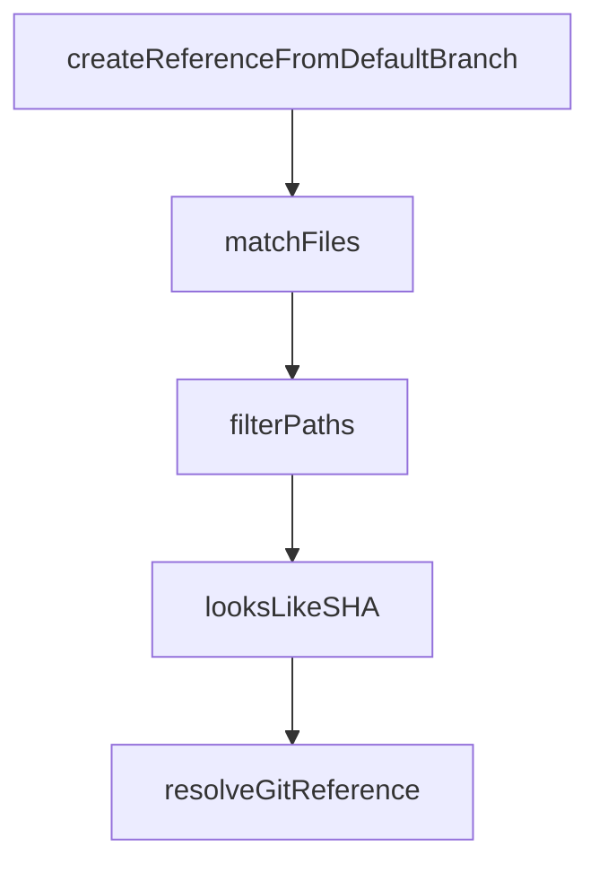

# Chapter 8: Contribution and Upgrade Workflow

Welcome to **Chapter 8: Contribution and Upgrade Workflow**. In this part of **GitHub MCP Server Tutorial: Production GitHub Operations Through MCP**, you will build an intuitive mental model first, then move into concrete implementation details and practical production tradeoffs.


This chapter covers sustainable change management for teams using GitHub MCP in production.

## Learning Goals

- track release changes without destabilizing workflows
- validate updates in constrained environments first
- contribute issues and fixes with useful repro context
- maintain internal runbooks aligned to upstream evolution

## Upgrade Discipline

1. monitor release notes and high-impact docs changes
2. test updates in read-only first
3. stage toolset expansion only after validation
4. document host-specific config deltas for your team

## Source References

- [Releases](https://github.com/github/github-mcp-server/releases)
- [Contributing Guide](https://github.com/github/github-mcp-server/blob/main/CONTRIBUTING.md)
- [Testing Docs](https://github.com/github/github-mcp-server/blob/main/docs/testing.md)

## Summary

You now have an end-to-end model for operating GitHub MCP with stronger control, security, and maintainability.

Next steps:

- define a default read-only profile for exploratory tasks
- define a narrow write-enabled profile for planned automation
- run quarterly review of toolsets, scopes, and host policy alignment

## Source Code Walkthrough

### `pkg/github/repositories_helper.go`

The `createReferenceFromDefaultBranch` function in [`pkg/github/repositories_helper.go`](https://github.com/github/github-mcp-server/blob/HEAD/pkg/github/repositories_helper.go) handles a key part of this chapter's functionality:

```go
}

// createReferenceFromDefaultBranch creates a new branch reference from the repository's default branch
func createReferenceFromDefaultBranch(ctx context.Context, client *github.Client, owner, repo, branch string) (*github.Reference, error) {
	defaultRef, err := resolveDefaultBranch(ctx, client, owner, repo)
	if err != nil {
		_, _ = ghErrors.NewGitHubAPIErrorToCtx(ctx, "failed to resolve default branch", nil, err)
		return nil, fmt.Errorf("failed to resolve default branch: %w", err)
	}

	// Create the new branch reference
	createdRef, resp, err := client.Git.CreateRef(ctx, owner, repo, github.CreateRef{
		Ref: "refs/heads/" + branch,
		SHA: *defaultRef.Object.SHA,
	})
	if err != nil {
		_, _ = ghErrors.NewGitHubAPIErrorToCtx(ctx, "failed to create new branch reference", resp, err)
		return nil, fmt.Errorf("failed to create new branch reference: %w", err)
	}
	if resp != nil && resp.Body != nil {
		defer func() { _ = resp.Body.Close() }()
	}

	return createdRef, nil
}

// matchFiles searches for files in the Git tree that match the given path.
// It's used when GetContents fails or returns unexpected results.
func matchFiles(ctx context.Context, client *github.Client, owner, repo, ref, path string, rawOpts *raw.ContentOpts, rawAPIResponseCode int) (*mcp.CallToolResult, any, error) {
	// Step 1: Get Git Tree recursively
	tree, response, err := client.Git.GetTree(ctx, owner, repo, ref, true)
	if err != nil {
```

This function is important because it defines how GitHub MCP Server Tutorial: Production GitHub Operations Through MCP implements the patterns covered in this chapter.

### `pkg/github/repositories_helper.go`

The `matchFiles` function in [`pkg/github/repositories_helper.go`](https://github.com/github/github-mcp-server/blob/HEAD/pkg/github/repositories_helper.go) handles a key part of this chapter's functionality:

```go
}

// matchFiles searches for files in the Git tree that match the given path.
// It's used when GetContents fails or returns unexpected results.
func matchFiles(ctx context.Context, client *github.Client, owner, repo, ref, path string, rawOpts *raw.ContentOpts, rawAPIResponseCode int) (*mcp.CallToolResult, any, error) {
	// Step 1: Get Git Tree recursively
	tree, response, err := client.Git.GetTree(ctx, owner, repo, ref, true)
	if err != nil {
		return ghErrors.NewGitHubAPIErrorResponse(ctx,
			"failed to get git tree",
			response,
			err,
		), nil, nil
	}
	defer func() { _ = response.Body.Close() }()

	// Step 2: Filter tree for matching paths
	const maxMatchingFiles = 3
	matchingFiles := filterPaths(tree.Entries, path, maxMatchingFiles)
	if len(matchingFiles) > 0 {
		matchingFilesJSON, err := json.Marshal(matchingFiles)
		if err != nil {
			return utils.NewToolResultError(fmt.Sprintf("failed to marshal matching files: %s", err)), nil, nil
		}
		resolvedRefs, err := json.Marshal(rawOpts)
		if err != nil {
			return utils.NewToolResultError(fmt.Sprintf("failed to marshal resolved refs: %s", err)), nil, nil
		}
		if rawAPIResponseCode > 0 {
			return utils.NewToolResultText(fmt.Sprintf("Resolved potential matches in the repository tree (resolved refs: %s, matching files: %s), but the content API returned an unexpected status code %d.", string(resolvedRefs), string(matchingFilesJSON), rawAPIResponseCode)), nil, nil
		}
		return utils.NewToolResultText(fmt.Sprintf("Resolved potential matches in the repository tree (resolved refs: %s, matching files: %s).", string(resolvedRefs), string(matchingFilesJSON))), nil, nil
```

This function is important because it defines how GitHub MCP Server Tutorial: Production GitHub Operations Through MCP implements the patterns covered in this chapter.

### `pkg/github/repositories_helper.go`

The `filterPaths` function in [`pkg/github/repositories_helper.go`](https://github.com/github/github-mcp-server/blob/HEAD/pkg/github/repositories_helper.go) handles a key part of this chapter's functionality:

```go
	// Step 2: Filter tree for matching paths
	const maxMatchingFiles = 3
	matchingFiles := filterPaths(tree.Entries, path, maxMatchingFiles)
	if len(matchingFiles) > 0 {
		matchingFilesJSON, err := json.Marshal(matchingFiles)
		if err != nil {
			return utils.NewToolResultError(fmt.Sprintf("failed to marshal matching files: %s", err)), nil, nil
		}
		resolvedRefs, err := json.Marshal(rawOpts)
		if err != nil {
			return utils.NewToolResultError(fmt.Sprintf("failed to marshal resolved refs: %s", err)), nil, nil
		}
		if rawAPIResponseCode > 0 {
			return utils.NewToolResultText(fmt.Sprintf("Resolved potential matches in the repository tree (resolved refs: %s, matching files: %s), but the content API returned an unexpected status code %d.", string(resolvedRefs), string(matchingFilesJSON), rawAPIResponseCode)), nil, nil
		}
		return utils.NewToolResultText(fmt.Sprintf("Resolved potential matches in the repository tree (resolved refs: %s, matching files: %s).", string(resolvedRefs), string(matchingFilesJSON))), nil, nil
	}
	return utils.NewToolResultError("Failed to get file contents. The path does not point to a file or directory, or the file does not exist in the repository."), nil, nil
}

// filterPaths filters the entries in a GitHub tree to find paths that
// match the given suffix.
// maxResults limits the number of results returned to first maxResults entries,
// a maxResults of -1 means no limit.
// It returns a slice of strings containing the matching paths.
// Directories are returned with a trailing slash.
func filterPaths(entries []*github.TreeEntry, path string, maxResults int) []string {
	// Remove trailing slash for matching purposes, but flag whether we
	// only want directories.
	dirOnly := false
	if strings.HasSuffix(path, "/") {
		dirOnly = true
```

This function is important because it defines how GitHub MCP Server Tutorial: Production GitHub Operations Through MCP implements the patterns covered in this chapter.

### `pkg/github/repositories_helper.go`

The `looksLikeSHA` function in [`pkg/github/repositories_helper.go`](https://github.com/github/github-mcp-server/blob/HEAD/pkg/github/repositories_helper.go) handles a key part of this chapter's functionality:

```go
}

// looksLikeSHA returns true if the string appears to be a Git commit SHA.
// A SHA is a 40-character hexadecimal string.
func looksLikeSHA(s string) bool {
	if len(s) != 40 {
		return false
	}
	for _, c := range s {
		if (c < '0' || c > '9') && (c < 'a' || c > 'f') && (c < 'A' || c > 'F') {
			return false
		}
	}
	return true
}

// resolveGitReference takes a user-provided ref and sha and resolves them into a
// definitive commit SHA and its corresponding fully-qualified reference.
//
// The resolution logic follows a clear priority:
//
//  1. If a specific commit `sha` is provided, it takes precedence and is used directly,
//     and all reference resolution is skipped.
//
//     1a. If `sha` is empty but `ref` looks like a commit SHA (40 hexadecimal characters),
//     it is returned as-is without any API calls or reference resolution.
//
//  2. If no `sha` is provided and `ref` does not look like a SHA, the function resolves
//     the `ref` string into a fully-qualified format (e.g., "refs/heads/main") by trying
//     the following steps in order:
//     a). **Empty Ref:** If `ref` is empty, the repository's default branch is used.
//     b). **Fully-Qualified:** If `ref` already starts with "refs/", it's considered fully
```

This function is important because it defines how GitHub MCP Server Tutorial: Production GitHub Operations Through MCP implements the patterns covered in this chapter.


## How These Components Connect


