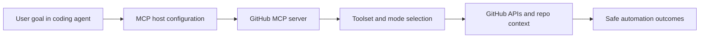

# GitHub MCP Server Tutorial: Production GitHub Operations Through MCP

> Learn how to use `github/github-mcp-server` to connect coding agents directly to repositories, issues, pull requests, actions, and code security workflows with stronger control.

## Why This Track Matters

`github-mcp-server` is the official GitHub MCP implementation and one of the highest-leverage integrations for coding agents that must reason over real repository state.

This track focuses on:

- choosing the right deployment mode (remote vs local)
- controlling capability surface through toolsets and read-only safeguards
- integrating reliably across Claude Code, Codex, Cursor, and Copilot hosts
- applying enterprise governance and security controls without blocking velocity

## Current Snapshot (Verified February 12, 2026)

- repository: [`github/github-mcp-server`](https://github.com/github/github-mcp-server)
- stars: about **26.9k**
- latest release: [`v0.30.3`](https://github.com/github/github-mcp-server/releases/tag/v0.30.3)
- recent activity: updates on **February 11, 2026**
- project positioning: official GitHub MCP server for repository-aware AI automation

## Mental Model

## Chapter Guide

| Chapter | Key Question | Outcome |
|:--------|:-------------|:--------|
| [01 - Getting Started](01-getting-started.md) | How do I get connected quickly? | Working baseline |
| [02 - Remote vs Local Architecture](02-remote-vs-local-architecture.md) | When should I use hosted vs local server modes? | Better deployment decisions |
| [03 - Authentication and Token Strategy](03-authentication-and-token-strategy.md) | How should I choose OAuth, PAT, and scope settings? | Safer auth model |
| [04 - Toolsets, Tools, and Dynamic Discovery](04-toolsets-tools-and-dynamic-discovery.md) | How do I constrain and shape available capabilities? | Better control over agent actions |
| [05 - Host Integration Patterns](05-host-integration-patterns.md) | How do integrations differ by MCP host? | Lower setup friction |
| [06 - Security, Governance, and Enterprise Controls](06-security-governance-and-enterprise-controls.md) | How do organizations enforce policy safely? | Governance-ready rollout |
| [07 - Troubleshooting, Read-Only, and Lockdown Operations](07-troubleshooting-read-only-and-lockdown-operations.md) | How do I debug and harden production usage? | Reliability runbook |
| [08 - Contribution and Upgrade Workflow](08-contribution-and-upgrade-workflow.md) | How do I track changes and contribute safely? | Maintainer-level fluency |

## What You Will Learn

- how to run GitHub MCP in secure, constrained, task-appropriate modes
- how to tune capability exposure for better tool choice and lower risk
- how to integrate across modern MCP host clients with less ambiguity
- how to handle governance and enterprise policy requirements pragmatically

## Source References

- [GitHub MCP Server Repository](https://github.com/github/github-mcp-server)
- [README](https://github.com/github/github-mcp-server/blob/main/README.md)
- [Remote Server Docs](https://github.com/github/github-mcp-server/blob/main/docs/remote-server.md)
- [Server Configuration Guide](https://github.com/github/github-mcp-server/blob/main/docs/server-configuration.md)
- [Policies and Governance](https://github.com/github/github-mcp-server/blob/main/docs/policies-and-governance.md)

## Related Tutorials

- [MCP Servers Tutorial](../mcp-servers-tutorial/)
- [Chrome DevTools MCP Tutorial](../chrome-devtools-mcp-tutorial/)
- [Claude Code Tutorial](../claude-code-tutorial/)
- [Codex CLI Tutorial](../codex-cli-tutorial/)

---

Start with [Chapter 1: Getting Started](01-getting-started.md).
