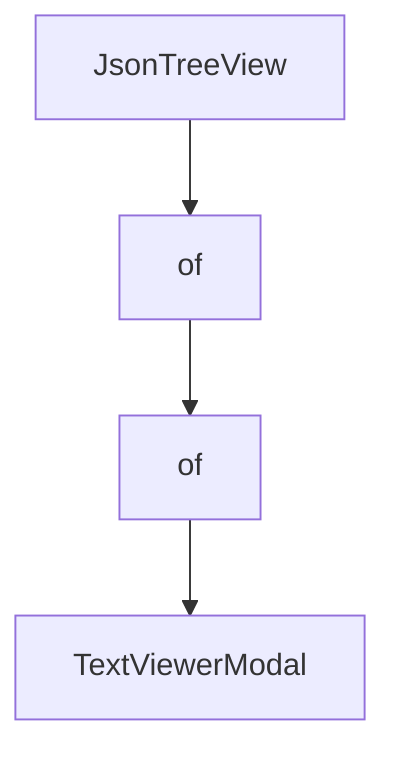

# Chapter 1: Getting Started

Welcome to **Chapter 1: Getting Started**. In this part of **Goose Tutorial: Extensible Open-Source AI Agent for Real Engineering Work**, you will build an intuitive mental model first, then move into concrete implementation details and practical production tradeoffs.


This chapter establishes a clean Goose baseline so you can move into advanced workflows without setup drift.

## Learning Goals

- install Goose Desktop or CLI on your platform
- configure your first LLM provider
- run your first session in a target repository
- identify common startup failures and quick fixes

## Installation Paths

| Path | Command / Flow | Best For |
|:-----|:---------------|:---------|
| Desktop app | Download from Goose releases and launch | Visual workflows and session management in UI |
| CLI install script | `curl -fsSL https://github.com/block/goose/releases/download/stable/download_cli.sh \| bash` | Fast terminal bootstrap |
| Homebrew CLI | `brew install block-goose-cli` | macOS/Linux environments using package managers |

## First Configuration Checklist

1. run `goose configure`
2. select a provider and authenticate
3. choose a model suitable for tool calling
4. start a session from your working directory
5. run a low-risk task (for example, repo summary + TODO extraction)

## First Session Flow

```bash
cd /path/to/repo
goose session
```

Inside the session, start with a scoped prompt such as:

- "Summarize this repo structure and propose a 3-step refactor plan."

## Early Failure Triage

| Symptom | Likely Cause | First Fix |
|:--------|:-------------|:----------|
| no model response | provider not configured correctly | rerun `goose configure` and re-authenticate |
| tool calls fail unexpectedly | permission mode mismatch | switch mode or adjust per-tool permissions |
| noisy or irrelevant context | wrong working directory | restart session from repo root |

## Source References

- [Goose Quickstart](https://block.github.io/goose/docs/quickstart)
- [Install goose](https://block.github.io/goose/docs/getting-started/installation)
- [Configure LLM Provider](https://block.github.io/goose/docs/getting-started/providers)

## Summary

You now have Goose installed, configured, and running in a real project context.

Next: [Chapter 2: Architecture and Agent Loop](02-architecture-and-agent-loop.md)

## Depth Expansion Playbook

## Source Code Walkthrough

### `scripts/diagnostics-viewer.py`

The `JsonTreeView` class in [`scripts/diagnostics-viewer.py`](https://github.com/block/goose/blob/HEAD/scripts/diagnostics-viewer.py) handles a key part of this chapter's functionality:

```py


class JsonTreeView(Tree):
    """A tree widget for displaying collapsible JSON."""

    BINDINGS = [
        Binding("ctrl+o", "toggle_all", "Toggle All", show=True),
    ]

    def __init__(self, *args, **kwargs):
        super().__init__(*args, **kwargs)
        self.json_data = None
        self.show_root = False
        self.all_expanded = False

    def load_json(self, data: Any, label: str = "JSON"):
        """Load JSON data into the tree."""
        self.json_data = data
        self.clear()
        self.root.label = label
        self._build_tree(self.root, data)
        # Expand all nodes by default
        self.root.expand_all()

    def action_toggle_all(self):
        """Toggle expansion of all nodes."""
        self.all_expanded = not self.all_expanded
        if self.all_expanded:
            self.root.expand_all()
        else:
            self.root.collapse_all()
            self.root.expand()  # Keep root expanded
```

This class is important because it defines how Goose Tutorial: Extensible Open-Source AI Agent for Real Engineering Work implements the patterns covered in this chapter.

### `scripts/diagnostics-viewer.py`

The `of` class in [`scripts/diagnostics-viewer.py`](https://github.com/block/goose/blob/HEAD/scripts/diagnostics-viewer.py) handles a key part of this chapter's functionality:

```py

    def action_toggle_all(self):
        """Toggle expansion of all nodes."""
        self.all_expanded = not self.all_expanded
        if self.all_expanded:
            self.root.expand_all()
        else:
            self.root.collapse_all()
            self.root.expand()  # Keep root expanded

    def on_tree_node_selected(self, event: Tree.NodeSelected):
        """Handle node selection - show modal for truncated strings."""
        node = event.node

        # Check if this is a truncated string node
        if node.data and isinstance(node.data, dict) and node.data.get("truncated"):
            key = node.data["key"]
            value = node.data["value"]

            # Show the full string in a modal
            title = f"Full String Value for '{key}'"
            self.app.push_screen(TextViewerModal(title, value))

            # Prevent default tree expansion behavior
            event.stop()

    def _build_tree(self, node, data, max_depth=10, current_depth=0):
        """Recursively build the tree from JSON data."""
        if current_depth > max_depth:
            node.add_leaf("[dim]...[/dim]")
            return

```

This class is important because it defines how Goose Tutorial: Extensible Open-Source AI Agent for Real Engineering Work implements the patterns covered in this chapter.

### `scripts/diagnostics-viewer.py`

The `of` class in [`scripts/diagnostics-viewer.py`](https://github.com/block/goose/blob/HEAD/scripts/diagnostics-viewer.py) handles a key part of this chapter's functionality:

```py

    def action_toggle_all(self):
        """Toggle expansion of all nodes."""
        self.all_expanded = not self.all_expanded
        if self.all_expanded:
            self.root.expand_all()
        else:
            self.root.collapse_all()
            self.root.expand()  # Keep root expanded

    def on_tree_node_selected(self, event: Tree.NodeSelected):
        """Handle node selection - show modal for truncated strings."""
        node = event.node

        # Check if this is a truncated string node
        if node.data and isinstance(node.data, dict) and node.data.get("truncated"):
            key = node.data["key"]
            value = node.data["value"]

            # Show the full string in a modal
            title = f"Full String Value for '{key}'"
            self.app.push_screen(TextViewerModal(title, value))

            # Prevent default tree expansion behavior
            event.stop()

    def _build_tree(self, node, data, max_depth=10, current_depth=0):
        """Recursively build the tree from JSON data."""
        if current_depth > max_depth:
            node.add_leaf("[dim]...[/dim]")
            return

```

This class is important because it defines how Goose Tutorial: Extensible Open-Source AI Agent for Real Engineering Work implements the patterns covered in this chapter.

### `scripts/diagnostics-viewer.py`

The `TextViewerModal` class in [`scripts/diagnostics-viewer.py`](https://github.com/block/goose/blob/HEAD/scripts/diagnostics-viewer.py) handles a key part of this chapter's functionality:

```py
            # Show the full string in a modal
            title = f"Full String Value for '{key}'"
            self.app.push_screen(TextViewerModal(title, value))

            # Prevent default tree expansion behavior
            event.stop()

    def _build_tree(self, node, data, max_depth=10, current_depth=0):
        """Recursively build the tree from JSON data."""
        if current_depth > max_depth:
            node.add_leaf("[dim]...[/dim]")
            return

        if isinstance(data, dict):
            for key, value in data.items():
                if isinstance(value, (dict, list)) and value:
                    # Expand first level by default
                    child = node.add(f"[cyan]{key}[/cyan]: {{...}}" if isinstance(value, dict) else f"[cyan]{key}[/cyan]: [...]", expand=(current_depth == 0))
                    child.data = {"key": key, "value": value, "type": type(value).__name__, "expandable": False}
                    self._build_tree(child, value, max_depth, current_depth + 1)
                elif isinstance(value, str):
                    truncated = truncate_string(value)
                    if truncated != value:
                        # Make truncated strings expandable
                        child = node.add(f"[cyan]{key}[/cyan]: [green]\"{truncated}\"[/green]", expand=False)
                        child.data = {"key": key, "value": value, "type": "str", "truncated": True, "expandable": True}
                        child.allow_expand = False  # Don't show expand icon initially
                    else:
                        node.add_leaf(f"[cyan]{key}[/cyan]: [green]\"{value}\"[/green]")
                elif isinstance(value, bool):
                    # Check bool before int/float since bool is a subclass of int
                    node.add_leaf(f"[cyan]{key}[/cyan]: [magenta]{str(value).lower()}[/magenta]")
```

This class is important because it defines how Goose Tutorial: Extensible Open-Source AI Agent for Real Engineering Work implements the patterns covered in this chapter.


## How These Components Connect


